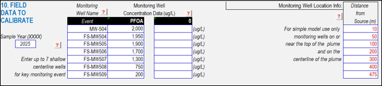
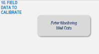
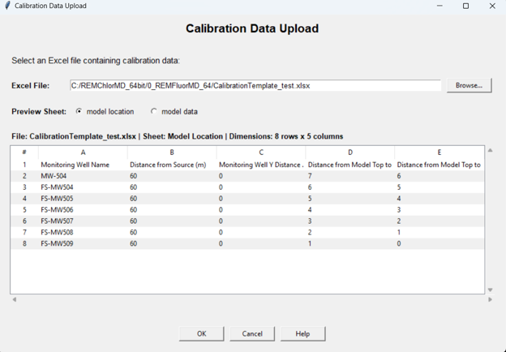

*Contributors: Hort, Singh*

**OVERVIEW**

The approach for entering field data depends on the level of complexity selected for calibration. Two options are available: **Simple** and **Detailed**. Each option differs in the type and amount of field data required, as well as how the data are incorporated into the calibration process.

**SIMPLE OPTION**

Under the Simple option, the user is required to enter the **monitoring well name**, the **measured concentration (µg/L)**, and the **distance from the source**. Only **one data point per well**, sampled within a **single year**, can be used for calibration. This approach is intended to represent general site conditions rather than temporal trends.

In the Simple option, the spatial configuration of monitoring wells is also simplified. All wells are assumed to be located **along the plume centerline extending from the source**, regardless of their actual lateral position. As a result, the distance from the source is treated as a one-dimensional parameter, which reduces spatial complexity and facilitates rapid calibration.

{fig-alt="10.1" width=600px}

**DETAILED OPTION**

Under the **Detailed** option, monitoring well data are entered using a standardized **Excel template**. After clicking the **Enter Monitoring Well Data** button, the **Calibration Data Upload** dialog box appears, allowing the user to select the Excel file (e.g., *CalibrationTemplate_test.xlsx*) from their local directory.

{fig-alt="10.2" width=100px}

The Excel template contains **two worksheets**: **Model Location** and **Model Data**. The **Model Location** worksheet defines the spatial configuration of monitoring wells and includes the following required fields:

- Monitoring well name

- Distance from the source

- Monitoring well Y-distance

- Distance from model top to screen top (m)

- Distance from model top to screen bottom (m)

Unlike the Simple option, the Detailed option allows the user to account for **spatial variability** in lateral position and **well screen depth**. If calibration is focused on a specific screened interval, the model grid should be discretized in the vertical (z) direction to align with the screen top and bottom depths provided in the template.

The **Model Data** worksheet contains the monitoring results and includes:

- Sampling date (month, day, and year)

- Monitoring well name

- Analyte

- Measured concentration

- Unit

Analyte names can be **any valid name except for the reserved fields "PFAA 1-able" and "PFAA 2-able"**. The concentration **unit must always be µg/L**. Unlike the Simple option, the Detailed option allows **multiple sampling dates per well**, enabling evaluation of **temporal trends** in PFAS concentrations.

{fig-alt="10.3" width=600px}