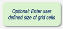

*Contributors: Hort, Falta, Singh*

**FINITE-DIFFERENCE GRID STRUCTURE AND CELL SIZE SELECTION**

REMFluor-MD employs a structured, three-dimensional finite-difference grid to represent advective–dispersive transport with matrix diffusion in groundwater systems. Model discretization is defined independently in the longitudinal (x), transverse (y), and vertical (z) directions. The selection of model dimensions and corresponding cell sizes directly controls numerical accuracy, computational stability, and the ability of the model to reproduce physically meaningful dispersion behavior.

**Model Domain Dimensions**

The overall extent of the model domain is specified by three parameters describing the extent of the modeled system:

*Model Size in the Direction of Groundwater Flow (X Direction)*

The x-direction represents the primary direction of groundwater flow. The model length should generally extend from the source area to the farthest downgradient monitoring location or to a potential receptor such as a surface-water body or water-supply well. Typical values range from 1 to 10,000 ft (0.3 to 3,000 m), depending on plume length and site-specific hydrogeologic conditions.

*Model Width Perpendicular to Flow (Y Direction)*

The y-direction defines the lateral extent of the modeled plume. The model is symmetric about y = 0, with equal width on either side of the centerline. Typical values range from 10 to 1,000 ft (3 to 300 m). Plume maps are commonly used to define this dimension. Generally the model width should be at least as wide as the downgradient plume; or use a simple rule that the model width should be about 2X as wide as the source width.

*Model Depth Below the Water Table (Z Direction)*

The z-direction represents the vertical thickness of the modeled saturated interval below the water table. Typical values range from 1 to 60 ft (0.3 to 20 m), based on plume cross sections, screened intervals, or known stratigraphy.

**Default Finite-Difference Grid Configuration – Detailed Model**

REMFluor-MD provides a default finite-difference discretization intended to be suitable for most screening- and intermediate-level applications.

The maximum number of cells in the model in the X, Y, and Z directions are:

- Maximum number of cells in the X-direction is **2,000 cells** (X is in the direction of groundwater flow)
- Maximum number of cells in the Y-direction on either side of Y = 0 is **100 cells**
  (i.e., the model width cannot be more than 200 cells wide). Minimum number of cells in the Y-direction is **5 cells**.
- Maximum number of cells in the Z-direction is **50 cells**

The default uniform grid cells for the model are defined this way:

- **Δx = 5 m (or 10 ft)** (depending on which units are selected)
  - X of cells in X-direction = Model Length ÷ 5 meters (or 10 ft)
- **#y cells = 5 cells** in the Y-direction (model is symmetric about y = 0, so this gives 5 cells in the +y direction)
- **#z cells = 10 cells** in the Z-direction

All cell sizes must be greater than zero. **Users may override the default values by selecting the option to enter user-defined grid cell sizes in the x, y, and z directions, but they must follow the rule below for the cell size in the x-direction.**      

**Default Finite-Difference Grid Configuration – Simple Model**

For the simple version of REMFluor-MD, everything is the same except there are only five grid cells in the Y-direction so that only centerline plume concentrations can be modeled.

**PRACTICAL EXAMPLES**

Consider a default model with the following configuration:

- Model size in the x-direction = **2,000 meters long**
- Default **Δx = 5 m**
- You will have **400 cells** in the X-direction
- No problem!

**Vertical Discretization Constraint**

The number of grid cells in the z-direction is limited by design. The ratio of model depth to vertical cell size must not exceed 50 total cells. If the model depth is increased or finer vertical resolution is required, the vertical cell size must be adjusted accordingly.

**Effect of Cell Number on Run Time**

The model run time is directly affected by the total number of cells in the computational grid. Each cell requires calculations during the simulation, so as the number of cells increases, the computational demand and running time also increase.

The total number of cells can be calculated as:

$$
\text{Total cells} = (\text{Number of cells in X}) \times (\text{Number of cells in Y}) \times (\text{Number of cells in Z})
$$

To ensure efficient model performance, it is recommended to limit the total number of cells to approximately **1,000 or fewer**. Keeping the cell count within this range typically results in a run time of **about 1 minute or less** for a standard simulation. Exceeding this limit may significantly increase computational time.

Balancing **grid resolution** and **run time** is important: finer grids provide more spatial detail but require more cells, while coarser grids reduce computational effort but may oversimplify spatial variability. Users should adjust the number of cells in each direction (X, Y, Z) carefully to optimize both model accuracy and efficiency.

**Numerical Dispersion and Grid Discretization**

**Numerical dispersion** is an artificial smearing of solute concentrations that occurs in numerical models, causing the plume to appear more spread out than the true physical process would predict. It is a byproduct of how the transport equations are solved on a discretized grid.

In groundwater models, numerical dispersion typically occurs when:

- The grid cells are too large relative to the scale of the plume or reactive features.
- The time step is too large relative to the flow velocity (related to a high Courant number).

To minimize numerical dispersion, careful attention must be given to **cell sizes and time step**. The **Courant number (C)** is a key dimensionless parameter for evaluating numerical stability and dispersion using the ratio of solute transport over a time step to the size of a grid cell.

$$
C = \frac{v \cdot \Delta t}{\Delta x}
$$

Where:

- $v$ = groundwater velocity (length/time)
- $\Delta t$ = model time step
- $\Delta x$ = cell length in the direction of flow

Large Courant numbers can lead to numerical instability or excessive dispersion, while keeping C small enough ensures stable, accurate transport calculations and minimizes artificial spreading.

To confirm the accuracy of the numerical solution, the model should be rerun using refined spatial discretization, smaller time steps, or alternative advection schemes to verify solution convergence, and the results should be compared to ensure they remain essentially unchanged.

**Permeable Sorption Barrier Grid Discretization**

Because REMFluor-MD uses an implicit solution approach rather than an explicit one, it provides flexibility in grid spacing, allowing users to define different cell sizes in the x-direction within the PSB barrier. In principle, the grid spacing in the PSB barrier can be set to other values, provided the Courant number remains sufficiently small. The optimal grid spacing within the PSB barrier is therefore problem specific. In addition, to minimize numerical dispersion near the PSB barrier, grid spacing is reduced approaching the barrier and gradually increased away from it. The code calculates geometric factors to shrink the grid from the model left boundary to the wall and to expand it from the wall end to the model right boundary. This uses the specified number of cells before and after the wall, along with the wall grid spacing. Based on the cases examined to date, grid spacings on the order of 0.5 to 1 m have performed well, with no observed benefit from using finer discretization.
