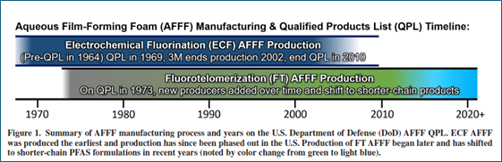
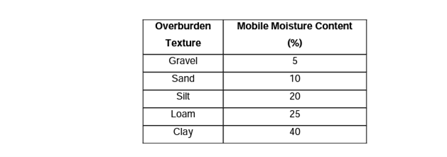

*Contributors: Newell, Carey, Cook, Stockwell*

**WHAT IS THE MODEL STARTING YEAR?**

REMFluor-MD is a groundwater saturated zone model, and therefore does not simulate the migration of PFAS from the original release through the vadose zone to groundwater. Therefore, an analysis of the following two factors may be needed:

1. When was PFAS first released to the vadose zone?
2. How long did it take this PFAS to travel through the vadose zone to groundwater?

In summary, the REMFluor-MD starting year for the simulation is when PFAS first entered groundwater in the source zone.

**HOW TO ESTIMATE WHEN PFAS WAS FIRST RELEASED TO THE SOIL**

*REMFluor-MD vs. REMChlor-MD*

Previous groundwater models have primarily focused on dense non-aqueous phase liquids (DNAPLs) such as chlorinated solvents. However, PFAS sources exhibit significantly different behavior compared to LNAPL and DNAPL sources in terms of their transport through the subsurface and establishment of groundwater contamination. DNAPL, being denser than water and often present as a separate phase, tends to migrate rapidly through the unsaturated zone, potentially reaching groundwater shortly after release. This results in the relatively quick establishment of a significant source concentration in the saturated zone.

In contrast, PFAS contamination typically originates from surface releases and is transported vertically through the unsaturated zone primarily by dissolved-phase movement in infiltrating water. The rate of this vertical transport is heavily influenced by factors such as soil properties, depth to groundwater, and recharge rates.

*PFAS Usage History*

The first step in estimating a REMFluor-MD model start time is to evaluate the site history and estimate the year the PFAS first likely entered the subsurface (i.e., into surface soils). Given that many PFAS sites involve releases that occurred 30 to 50 years ago, this year is most often determined from site historical records, such as *"fire training activities at FTA-1 started in 1972."* When available, site historical records provide the best estimates of when PFAS first likely entered the subsurface at a given location.

*General Rules*

If no detailed site records are available, then an evaluation of the PFAS site chemistry may provide some additional clues about the date of first PFAA use at a site. Gamlin et al. (2024, open access) provides more detail on when different types of Aqueous Film Forming Foams (AFFFs) were manufactured (see Figure 2.2.1 below). If a site appears to be dominated by the electrochemical fluorination (ECF) type AFFF (e.g., mostly PFOS and PFHxS), then the earliest potential release time would be about 1968. For sites dominated by Fluorotelomer (FT) type AFFF (in general, mostly PFOA and/or shorter chain carboxylates), then the earliest potential release time would be about 1972, but *"After 3M, Inc.'s announcement to phase out manufacturing of PFOS-based products in 2000, the primary supply of AFFF became fluorotelomer-based. By 2015, manufacturers of fluorotelomer AFFF replaced long-chain fluorosurfactants with short-chain fluorosurfactants"* (Alaska DEC, n.d.). Note the number of new sources of PFOS and PFOA likely went down by the 2010s due to the decision to stop production of long-chain PFAAs in the early 2000s.

{fig-alt="Figure 2.2.1. AFFF Timeline (Gamlin et al., 2024)." width=700px}

*Figure 2.2.1. AFFF Timeline (Gamlin et al., 2024).*

**Conceptual AFFF PFAS Use/Release Model (1965–2030)**

Table 2.2.1 provides considerations for inferring the most likely AFFF purchase period and source type at a given site based on which PFAS analyte(s) dominate the groundwater or source zone signature. The two key AFFF manufacturing chemistries: i) electrochemical fluorination (ECF, used exclusively by 3M) and ii) fluorotelomerization (FT, used by all other manufacturers) produce fundamentally different PFAS signatures that can be used to attribute releases to specific product generations and purchase periods.

*Table 2.2.1. Most likely purchase period for PFAS at sites dominated by a particular PFAS.*

| Dominant Indicator at Site | AFFF Source Type | Most Likely Purchase Period | Basis |
|---|---|---|---|
| **PFOS** | ECF (3M Lightwater) | 1965–2002 | PFOS constituted 85–90% of perfluoroalkyl sulfonates in 3M Lightwater, the sole or primary DoD AFFF from 1962 through 2001. PFHxS were typically co-present at ~7–12% as an ECF co-product. Branched isomers (~30% of total PFOS) confirm ECF origin. 3M ceased PFOS production in 2002. |
| **PFOA** | Long-chain FT AFFF | 2000–2009 | PFOA is the terminal degradation product of 8:2 fluorotelomer precursors used in long-chain FT AFFF formulations (mid-1970s through ~2010). Elevated PFOA relative to PFOS strongly suggests C8 fluorotelomer AFFF as a primary source, particularly after 3M exited the market in 2002. 6:2 FTS is typically co-present as a fluorotelomer marker. |
| **PFHxS** | ECF (3M Lightwater) | 1965–2002 | PFHxS is produced exclusively by the ECF process as a co-product of PFOS manufacturing. It is not a product or degradation product of fluorotelomer chemistry. If PFHxS dominates over PFOS at a monitoring point, it may reflect differential transport (PFHxS is more mobile than PFOS) rather than a different source. |
| **6:2 FTS** | FT AFFF (all generations) | 2000–2019 | 6:2 FTS is the diagnostic marker of FT-based AFFF and is not produced by ECF chemistry. If co-present with elevated PFOA, the source is likely long-chain (C8) FT AFFF from the 2000–2009 era. If 6:2 FTS dominates with low PFOA, the source is likely modern short-chain (C6) FT AFFF from the 2010–2019 era. |
| **PFHxA** | FT AFFF (esp. C6) | 2005–2024 | PFHxA is the terminal degradation product of 6:2 fluorotelomer precursors. It is not a significant component of legacy ECF formulations. PFHxA tracks 6:2 FTS presence but may appear later due to subsurface precursor transformation (years to possibly decades depending on conditions). Particularly diagnostic of post-2010 C6 FT AFFF where 6:2 precursors dominate. |

The purchase periods above represent AFFF as manufactured, not the date of environmental release. AFFF concentrates have shelf lives of 20+ years, and legacy PFOS-containing stocks remained in active DoD inventories well into the 2020s. The potential lag between purchase and release may vary with site use intensity as shown below:

- **High-throughput training sites** (FTAs, burn pads): potentially 1–5 year lag. Rapid turnover from recurring training exercises; purchase period closely approximates release. (Higher confidence).
- **Moderate-use sites** (hangars, flight lines, fire/rescue stations): potentially 5–10 year lag. Releases primarily from system testing, maintenance, and occasional emergencies.
- **Low-use / emergency-only sites** (weapons storage, petroleum storage, remote installations): potentially 10–20 year lag. Stocks stored for decades; PFAS signature may reflect AFFF manufactured 10–20 years before release. (Lower confidence).

These stockpile lag estimates are order-of-magnitude approximations based on several lines of evidence. AFFF concentrates carry manufacturer-rated shelf lives of 20+ years under Military Specification (MIL-SPEC) storage requirements, establishing the upper bound for residence time in low-use inventories. At the lower bound, active fire training areas conducted exercises on weekly to monthly schedules, consuming and replenishing AFFF stocks rapidly. For moderate-use facilities, standards require periodic testing and discharge of fixed fire suppression systems in hangars and ARFF vehicles, implying intermediate turnover rates. The plausibility of extended stockpiling is confirmed by DoD reporting that approximately 3 million gallons of legacy AFFF concentrate remained in active inventories in the early 2020s (Liberty Mutual, 2023), and that the U.S. Air Force alone replaced 418,000 gallons of legacy AFFF in fire trucks and stockpiles during 2016–2017, more than a decade after 3M ceased PFOS production (US AFCEC, 2017). While precise site-level throughput data are generally not available in the published literature, these ranges are consistent with the available inventory and procurement evidence.

Therefore, the estimated release window to the environment could be shifted forward from the purchase period by the appropriate lag. For example, PFOS-dominated signatures at low-use sites could reflect stockpiled ECF AFFF released as early as 1965, or as late as the early 2020s.

**METHODS TO ESTIMATE VADOSE ZONE TRAVEL TIME**

If it is possible to ascertain the approximate year that PFAS were released to the environment at a particular site, then the travel time through the vadose zone to groundwater may need to be assessed. For REMFluor-MD modeling, the travel time can be important for determining the lag between the initial release date and the date at which the plume begins to spread horizontally through groundwater, rather than vertically down through the unsaturated soil. For these purposes, at least a basic estimate of the unsaturated zone travel time is helpful to decide whether a more in-depth analysis is needed, and to calculate an appropriate start date and time step for the model.

This section presents a summary of some simplified methods to estimate the time it takes for a contaminant to travel through the unsaturated (vadose) zone and reach the water table.

**Fast Travel Time Assumption**

If the PFAS travel time to groundwater is unknown, one option is to assume relatively fast travel time due to the effects of preferential vertical transport pathways. Trying to develop more refined travel time estimates may not be worth the reduction in model uncertainty; sensitivity tests on the model starting time can help resolve this uncertainty.

**SAAT Method Overview**

As presented in Sousa et al. (2013), the simplest available way to estimate the unsaturated zone travel time is the Surface to Aquifer Advection Time (SAAT) method from the Province of Ontario (2006). This method can be accomplished with basic knowledge of the site subsurface, as opposed to the more technical methods in Sousa et al., which require estimations of saturation as a function of depth and pressure head. Using SAAT, the unsaturated zone travel time is approximated as:

$$
t_u = \frac{\bar{\theta}\, L}{R}
\tag{1}
$$

Where $t_u$ is the unsaturated zone travel time (T), $\bar{\theta}$ is the dimensionless average mobile moisture content, L is the depth from the source to the water table (L), and R is the groundwater recharge (L/T). Typical values of $\bar{\theta}$ are presented in Table 2.2.2 below. Estimations of $\bar{\theta}$ for mixed soils can be made using this table; for example, Koch (2009) used the average of the $\bar{\theta}$ values for silt and sand as the $\bar{\theta}$ value for silty sand.

*Table 2.2.2. Mobile moisture content estimates for typical soil types, from Koch (2009).*

{fig-alt="Mobile moisture content" width=700px}

Meanwhile, there are many methods for calculating groundwater recharge, as outlined in Scanlon et al. (2002). Physical measurements at the site of hydraulic parameters in Darcy's law, large-scale water balances (from existing long-term data or through installation of lysimeters), and chemical tracer applications are some possible methods mentioned.

**Other Travel Time Methods**

Another simplified model mentioned by Sousa et al. (2013), the "No flow" van Genuchten method, uses the assumption of no-flow conditions in the unsaturated zone to give a simplified estimate for the saturation as a function of depth. This saturation factors into a formula for downward groundwater velocity that can then be integrated to find the travel time.

Szymkiewicz et al. (2018) also provides an approximation for the estimated vadose zone travel time:

$$
t_u = \frac{L \, n_e}{\sqrt[3]{R^2 k_s}}
\tag{2}
$$

Where $n_\mathrm{e}$ is the effective porosity and $k_s$ is the hydraulic conductivity at saturation, which can both be estimated from literature or soil sample analysis. The parameters involved are very similar to the SAAT method and would require a similar amount of effort.

**PFAS Vadose Zone Models**

Alternatively, a more sophisticated approach incorporates unsaturated zone modeling. Options include using simple hydrologic methods (see below) or PFAS specific approaches such as ESTCP's PFAS-Leach Tool (ESTCP, 2025) to estimate the travel time more accurately. This method can provide a more realistic representation of the delay between surface release and groundwater impact, especially for sites with deep water tables or low recharge rates. To inform these models and improve estimates of PFAS flux to groundwater, practitioners can refer to resources like Newell et al. (2023), which offers guidance on estimating recharge rates. This information helps quantify the annual water flux through unsaturated zone PFAS sources, a critical factor in determining contaminant transport to groundwater. By considering these approaches, modelers can better account for the unique characteristics of PFAS transport.

**REFERENCES**

Alaska Department of Environmental Conservation. (n.d.). *Aqueous film forming foam (AFFF)*. Division of Spill Prevention and Response, Contaminated Sites Program. <https://dec.alaska.gov/spar/csp/pfas/firefighting-foam/>

Buck, R. C., Franklin, J., Berger, U., Conder, J. M., Cousins, I. T., de Voogt, P., … van Leeuwen, S. P. J. (2011). Perfluoroalkyl and polyfluoroalkyl substances in the environment: Terminology, classification, and origins. *Integrated Environmental Assessment and Management*, 7(4), 513–541.

ESTCP. (2025). *A Comprehensive Decision Support Platform for Predicting PFAS Leaching in Source Zones.* Environmental Security and Technology Certification Program Project ER21-5041. <https://serdp-estcp.org/projects/details/7b8e05de-6446-4992-adc2-c7e632972991>

Gamlin, J., Newell, C. J., Holton, C., Kulkarni, P. R., Skaggs, J., Adamson, D. T., Blotevogel, J., & Higgins, C. P. (2024). Data Evaluation Framework for Refining PFAS Conceptual Site Models. *Groundwater Monitoring & Remediation*, 44(4), 53–66. <https://doi.org/10.1111/gwmr.12666>

Interstate Technology & Regulatory Council (ITRC). (2020). *PFAS technical and regulatory guidance document*. Washington, DC. <https://pfas-1.itrcweb.org/>

Koch, J. (2009). *Evaluating Regional Aquifer Vulnerability and BMP Performance in an Agricultural Environment Using A Multi-Scale Data Integration Approach*. Library and Archives Canada.

Liberty Mutual Insurance. (2023). *Firefighting foams, aqueous film-forming foam (AFFF), and PFAS: Environmental and regulatory considerations*. <https://business.libertymutual.com/wp-content/uploads/2023/03/67-5662_AFFFWhitepaper_FINAL.pdf>

Moody, C. A., & Field, J. A. (2000). Perfluorinated surfactants and the environmental implications of their use in fire-fighting foams. *Environmental Science & Technology*, 34(18), 3864–3870.

Newell, C. J., Stockwell, E. B., Alanis, J., Adamson, D. T., Walker, K. L., & Anderson, R. H. (2023). Determining groundwater recharge for quantifying PFAS mass discharge from unsaturated source zones. *Vadose Zone Journal*, 22(4), e20262. <https://doi.org/10.1002/vzj2.20262>

Scanlon, B. R., Healy, R. W., & Cook, P. G. (2002). Choosing appropriate techniques for quantifying groundwater recharge. *Hydrogeology Journal*, 10(1), 18–39. <https://doi.org/10.1007/s10040-001-0176-2>

Sousa, M. R., Jones, J. P., Frind, E. O., & Rudolph, D. L. (2013). A simple method to assess unsaturated zone time lag in the travel time from ground surface to receptor. *Journal of Contaminant Hydrology*, 144(1), 138–151. <https://doi.org/10.1016/j.jconhyd.2012.10.007>

Szymkiewicz, A., Gumuła-Kawęcka, A., Potrykus, D., Jaworska-Szulc, B., Pruszkowska-Caceres, M., & Gorczewska-Langner, W. (2018). Estimation of Conservative Contaminant Travel Time through Vadose Zone Based on Transient and Steady Flow Approaches. *Water*, 10(10). <https://doi.org/10.3390/w10101417>

U.S. Air Force Civil Engineer Center. (2017). *Aqueous film forming foam (AFFF) replacement and containment: Frequently asked questions*. U.S. Air Force. <https://www.afcec.af.mil/Portals/17/documents/Environment/AFFF%20FAQ%20replacement%20and%20containment.pdf>

U.S. Congress. (2019). *National Defense Authorization Act for Fiscal Year 2020*, Pub. L. No. 116-92, Section 322. 133 Stat. 1198.

U.S. Department of Defense. (2023). *Interim guidance on aqueous film-forming foam (AFFF) disposal and transition*. Washington, DC.

U.S. Environmental Protection Agency. (2006). *2010/2015 PFOA stewardship program*. Washington, DC.

U.S. Government Accountability Office. (2021). *DoD has begun to address PFAS contamination but additional actions are needed* (GAO-21-421). Washington, DC.

**Conceptual Model References:**

Backe, W. J., Day, T. C., & Field, J. A. (2013). Zwitterionic, cationic, and anionic fluorinated chemicals in aqueous film forming foam formulations and groundwater from U.S. military bases by nonaqueous large-volume injection HPLC-MS/MS. *Environmental Science & Technology*, 47(10), 5226–5234. <https://doi.org/10.1021/es3034999>

Barzen-Hanson, K. A., Roberts, S. C., Choyke, S., Oetjen, K., McAlees, A., Riddell, N., McCrindle, R., Ferguson, P. L., Higgins, C. P., & Field, J. A. (2017). Discovery of 40 classes of per- and polyfluoroalkyl substances in historical aqueous film-forming foams (AFFFs) and AFFF-impacted groundwater. *Environmental Science & Technology*, 51(4), 2047–2057. <https://doi.org/10.1021/acs.est.6b05843>

Interstate Technology and Regulatory Council (ITRC). (2023). *Per- and polyfluoroalkyl substances technical and regulatory guidance*. <https://pfas-1.itrcweb.org/>

Place, B. J., & Field, J. A. (2012). Identification of novel fluorochemicals in aqueous film-forming foams used by the US military. *Environmental Science & Technology*, 46(13), 7120–7127. <https://doi.org/10.1021/es301465n>

Ruyle, B. J., Thackray, C. P., McCord, J. P., Strynar, M. J., Mauge-Lewis, K. A., Fenton, S. E., & Sunderland, E. M. (2021). Reconstructing the composition of per- and polyfluoroalkyl substances in contemporary aqueous film-forming foams. *Environmental Science & Technology Letters*, 8(1), 59–65. <https://doi.org/10.1021/acs.estlett.0c00798>

Schultz, M. M., Barofsky, D. F., & Field, J. A. (2006). Quantitative determination of fluorotelomer sulfonates in groundwater by LC MS/MS. *Environmental Science & Technology*, 40(1), 289–295. <https://doi.org/10.1021/es051420a>

Stockwell, E. B., Adamson, D. T., Gamlin, J. D., Kulkarni, P. R., Singh, A., Falta, R. W., & Newell, C. J. (2026). Modeling per- and polyfluoroalkyl substance precursor transformation in groundwater at a well-characterized site. *Journal of Contaminant Hydrology*, 276, 104766. <https://doi.org/10.1016/j.jconhyd.2025.104766>

U.S. Air Force Civil Engineer Center (AFCEC). (2017). *AFFF replacement and containment: Frequently asked questions*. <https://www.afcec.af.mil/>

U.S. Government Accountability Office (GAO). (2024). *Firefighting foam: DOD is working to address challenges to transitioning to fluorine-free alternatives* (GAO-24-107322). <https://www.gao.gov/assets/gao-24-107322.pdf>
