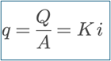
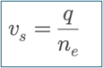
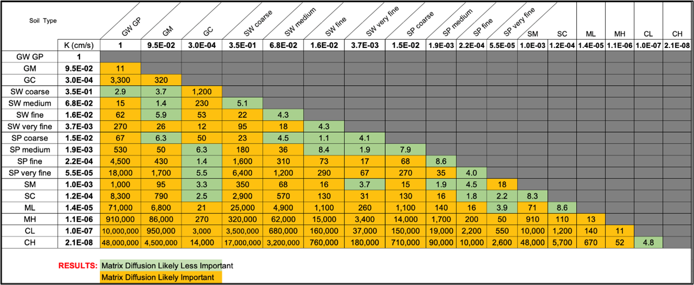

Contributors:  Newell, Cook

**TWO TYPES OF GROUNDWATER VELOCITIES**

Groundwater velocity is a key modeling parameter that can be obtained two ways, but it comes in two forms:  1) Darcy velocity, and 2) the seepage velocity:  

1. <strong>Darcy velocity</strong>, also known as specific discharge, Darcy flux, or volumetric flux, represents the volumetric flow rate of groundwater per unit total cross-sectional area of the porous medium (including both solids and pores). It is calculated using the expression shown to the right as hydraulic conductivity (K) × hydraulic gradient (“i”; dh/dx) where Q is discharge, A is total area, K is hydraulic conductivity, and i is the hydraulic gradient.

    <strong>REMFluor-MD requires the Darcy velocity (specific discharge) as the model input here</strong>, not seepage velocity, because the seepage velocity is calculated when you enter the effective porosity into the interface.

2. In contrast, <strong>seepage velocity</strong>, also called average linear velocity, pore-water velocity, or interstitial velocity, represents the actual velocity of water moving through the pore spaces and is higher than the Darcy velocity because flow occurs only through the connected porosity. It is calculated using the expression shown, where $n_\mathrm{e}$ is the effective porosity. <strong>Do not enter the seepage velocity into REMFluor-MD;</strong> this parameter is calculated internally.

**DETERMINING HYDRAULIC CONDUCTIVITIES**

**Literature Values**

While not suggested for detailed planning, literature values can be used to estimate hydraulic conductivities.  Values used in the previous REMChlor model are shown below:

- Gravels: $3\times 10^{-2}$ to $3.0$ cm/s
- Coarse Sand: $9\times 10^{-5}$ to $6\times 10^{-1}$ cm/s
- Medium Sand: $9\times 10^{-5}$ to $5\times 10^{-2}$ cm/s
- Fine Sand: $2\times 10^{-5}$ to $2\times 10^{-2}$ cm/s
- Sand: $1\times 10^{-3}$ to $1$ cm/s

(Newell *et al.*, 1996; Domenico and Schwartz, 1990.)

Another source are hydraulic conductivity data compiled for this REMFluor-MD project  of values for all Unified Soil Classification System (USCS) soil types cross-referenced against each other so the relative hydraulic conductivity between the two groundwater can be compared for matrix diffusion purposes (see Appendix 4.1).  These data are shown in Table 1.

**Table 1. ** Hydraulic conductivity (K) ratios.   K ratios are shown for every USCS soil pair.  
Green indicates matrix diffusion is likely to be a factor in groundwater transport and 
therefore represents a transmissive/low-k interface using a 10X ratio metric.

{fig-alt="K Ratios" width=700px}

**Slug Tests and Pump Tests**

One of the most common methods to estimate hydraulic conductivity is slug tests. While detailed data are not available, a general rule of thumb that some practitioners apply is that a single slug test provides an estimate of hydraulic conductivity that is within an order of magnitude of the true value, and under ideal conditions, they might achieve accuracy within a factor of 2 to 3 of the actual value. Pump tests are generally the highest quality type hydraulic conductivity information, but are the costliest to acquire.

**Alternative Methods**

The Groundwater Velocity book (Devlin, 2020), developed as part of The Groundwater Project, describes ten alternative ways to estimate groundwater velocity including inter-well tracer tests, in-well techniques, and techniques that involve direct contact with aquifer material. Even when these methods to estimate groundwater velocity are used as a basis for the Darcy’s Law data in the model, the hydraulic conductivity and to a lesser extent the effective porosity are two key initial input parameters that are adjusted to calibrate the model.

**Model Calibration**

This uncertainty makes hydraulic conductivity a key calibration parameter for REMFluor-MD and groundwater models in general. In general, hydraulic gradient estimates have much less uncertainty than hydraulic conductivity. Fortunately, REMFluor-MD has a new automatic calibration feature that makes the model calibration step much easier.

**REFERENCES**

Devlin, J.F. (2020). <a href="https://doi.org/10.21083/978-1-77470-000-6" target="_blank">Groundwater Velocity</a>. The Groundwater Project.

