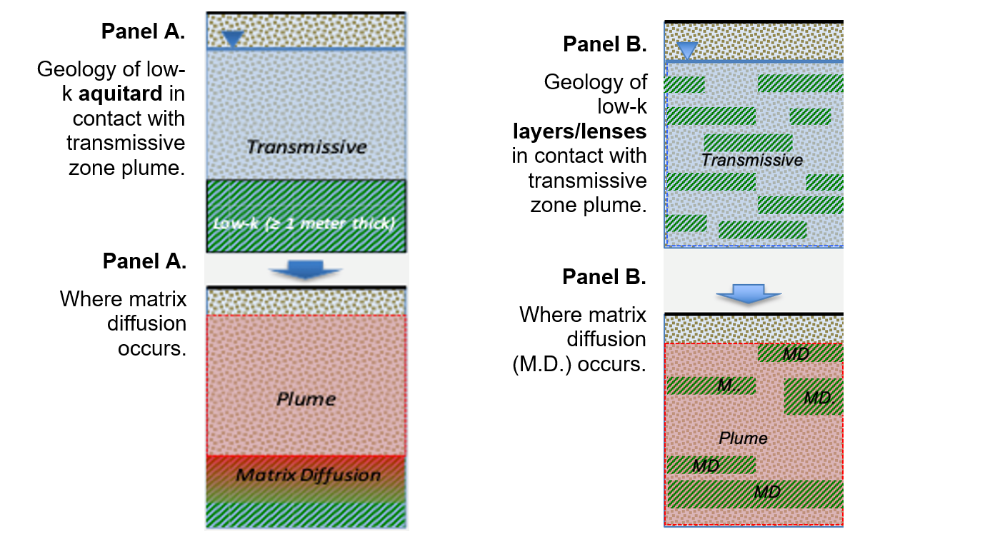

*Contributors: Newell, Falta, Hort*

**MATRIX DIFFUSION INPUT PARAMETERS**

Matrix diffusion is likely a key parameter that can slow down the migration of PFAS plumes, and REMFluor-MD is one of the few groundwater transport models that is designed to simulate the impacts of matrix diffusion. There are two separate matrix diffusion elements in REMFluor-MD: 1) the presence of aquitards either above or below or both above and below a transmissive zone; and 2) the presence of low-permeability (low-k) layers and lenses within a transmissive zone. REMFluor-MD allows users to select these cases in two ways: 1) qualitatively based on generalized figures showing aquitards and layers and lenses (examples shown in Figure 4.1.1), or 2) quantitively by entering the number and thickness of low-k soil types found in the contaminant plume interval.

{fig-alt="Matrix Diffusion" width=700px}

*Figure 4.1.1. Two geologic settings for matrix diffusion. Matrix diffusion is likely if the plume age is long, decades and if the aquitard/lenses are thick enough.*

To evaluate matrix diffusion in and out of low-k layers and lenses, three heterogeneity parameters are needed: 1) Transmissive Zone Volume Fraction (%), 2) Average Diffusion Length (m), and 3) Surface Area of Low-k interfaces (m²) per gridblock. These three parameters are assumed to be uniform across the entire REMFluor-MD modeling domain. The model provides three options to get the three input data:

1. *Easiest:* A visual estimate of the geologic heterogeneity in low-k lenses, from options of 0%, 20%, 40%, 60%, or 80%. The model stores default values for the three heterogeneity parameters for each option.

2. *Moderate:* Manual entry of low-k units from up to 100 boring logs for the site (see Figure 4.1.1). The model estimates the three heterogeneity parameters from this data.

3. *Complex:* External calculation, measurement, or estimates of the three heterogeneity parameters followed by manual entry directly in the model.

For both matrix diffusion elements (aquitards and layers/lenses), a subtle but key question when building a REMFluor-MD model is **whether a geologic interface between two soil types represents a boundary between a transmissive zone and a low-permeability ("low-k") zone**. This question is crucial for accurately representing matrix diffusion processes in models such as REMFluor-MD (Falta et al., 2018; Farhat et al., 2018).

REMFluor-MD only supports two soil categories (low-k and transmissive), and a more common approach is to use a relative contrast in hydraulic conductivity (K) ratio between the two soil units to determine if they will support some type of mass transfer between them via diffusion. Appendix 4.2 describes how to determine if a contact between two different soil types. For example, a *coarse-sand* / *clay* contact would likely represent a constant where significant matrix diffusion occurs. On the other hand, a *fine-sand* to *coarse-sand* contact is more difficult to assess from a matric diffusion perspective.

**REFERENCES**

Falta R.W., Farhat, S.K., C.J. Newell, and K. Lynch, 2018. REMChlor-MD, developed for the Environmental Security Technology Certification Program (ESTCP) by Clemson University, Clemson, South Carolina and GSI Environmental Inc., Houston, Texas.

Farhat, S.K., C.J. Newell, R.W. Falta, and K. Lynch, 2018. REMChlor-MD User's Manual, developed for the Environmental Security Technology Certification Program (ESTCP) by GSI Environmental Inc., Houston, Texas and Clemson University, Clemson, South Carolina.
