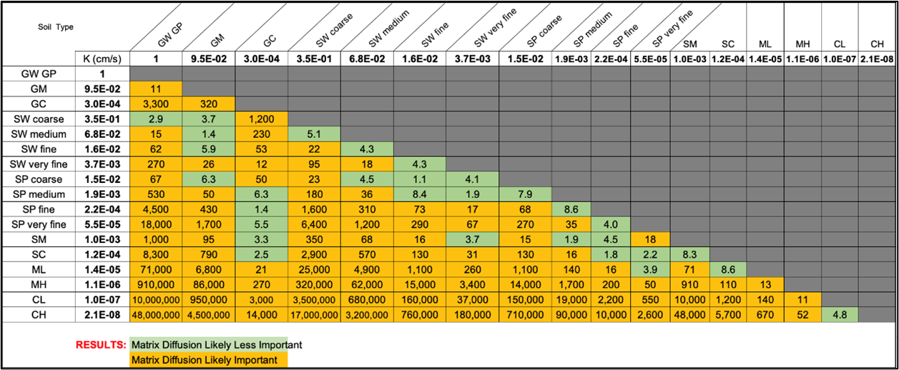

**Contributors:  Newell, Kulkarni, Cook**

**OVERVIEW**

For both matrix diffusion elements (aquitards and layers/lenses), a subtle but key question when building a REMFluor-MD model is whether a geologic interface between two soil types represents a boundary between a transmissive zone and a low-permeability (“low-k”) zone.  This question is crucial for accurately representing matrix diffusion processes in models such as REMFluor-MD (Falta et al., 2018; Farhat et al., 2018).

**DEFINITION OF LOW-k UNITS**

Some researchers have provided absolute hydraulic conductivity (K) values to define a "low-k" zone in the field. Brooks et al. (2021) described low permeable zones (LPZs) as having hydraulic conductivities below ~10⁻⁵ cm/s, citing Walden (1997), or below ~10⁻⁴ cm/s, based on Horst et al. (2019).  Other researchers have described more of a continuum between low-k and transmissive soils, with a third category of soils defined as supporting “slow advection” (Sale et al., 2013).

REMFluor-MD only supports two soil categories (low-k and transmissive), and a more common approach is to use a relative contrast in hydraulic conductivity (K) ratio between the two soil units to determine if they will support some type of mass transfer between them via diffusion. Sale et al. (2013) commented on the ratio approach by noting: “A fine-sand can be a transmissive zone given that the remainder of the domain is silt and/or clay; or a fine-sand can be a low k zone given that the remainder of the media is a well-sorted coarse sand or gravel.” Factors of 10X (Kulkarni et al., 2022) and 100X have been proposed to define a low-k/transmissive interface. For REMFluor-MD modeling, we recommend using a K ratio of at least one order of magnitude (factor of 10) when using the boring logs method to determine matrix diffusion parameters in the model. However, the specific threshold can vary depending on other site characteristics and the modeling approach employed.

**LOW-k and THE USCS METHOD**

Geologic logging in the United States often uses the Universal Soil Classification System (USCS).  The hydraulic conductivity of USCS soil types can be estimated based on published ranges. For instance, clean sands (SW or SP) typically exhibit much higher hydraulic conductivities than clays (CH or CL). While this is unquestionably a transmissive/low-k interface, other USCS soil type pairs are less clear.  A comparison of estimated K values for adjacent soil layers provides insight into the potential for matrix diffusion at their interface.

To facilitate easier identification of low-k units in USCS boring logs, Table 2.2 was developed showing the hydraulic conductivity ratios for all USCS soil type pairs using K values from Payne et al. (2008), Domenico and Schwarz (1997), Freeze and Cherry (1979), and Budhu (2011). Figure 3.9 from Payne et al. (2008) was used to further define K values for different sand grain sizes and sortings.  For example, the ratio of the hydraulic conductivities of a well-sorted coarse sand (SW coarse) and a well- or poorly-sorted gravel (GW/GP) would be 2.9. The cells are highlighted such that any ratio of at least 10 is in orange, indicating that adjacent units with those compositions would be considered a low-k/transmissive boundary, and less than 10 is in green, meaning that matrix diffusion is less important.

**OTHER RULES ABOUT DEFINING LOW-K UNITS IN REMFLUOR-MD**

Other key rules are described below:

- The thickness of the low-k aquitards is another important factor. The REMFluor-MD model assumes if the top/bottom aquitard scenarios are selected, the aquifer has very thick low-k units above and below the plume.  If at an actual field site the aquitard is only a few inches thick, the model will not provide accurate results. Therefore, any aquitard that is modeled should have a thickness of approximately one meter or more.  

- Note it is important to enter even very thin layers or lenses (even ones just a few inches thick) in the transmissive zone that are exposed to PFAS because (Borden et al, 2021):

- Thick and/or multiple low-k layers in REMFluor-MD result in significant plume shrinking and long back diffusion times, the key focus of the original REMFluor-MD model;

- Thin low-k layers in REMFluor-MD result in significant plume expansion as a process that slows expansion, the key focus of PFAS Monitored Retention and PFAS Enhanced Attenuation.

- The heterogeneity of the geologic media also plays a role in defining transmissive and low-k zones. Kulkarni et al. (2020) analyzed 141 boring logs from 43 sites in California and found that approximately 30% of the aquifer cross-section carried 90% of the groundwater flow. This suggests that in typical settings, up to 70% of the geologic media might function as low-k units for matrix diffusion modeling purposes.

*Table 2.2.  Hydraulic conductivity (K) ratios.   K ratios are shown for every USCS soil pair. 
Green indicates matrix diffusion is likely to be a factor in groundwater transport and 
therefore represents a transmissive/low-k interface using a 10X ratio metric.*
{fig-alt="K ratio" width=700px}

It is worth noting that even relatively small differences in fine particle content can significantly impact matrix diffusion potential. Payne (2016) demonstrated that a sandy zone with 7-17% silt content (potentially classified as an SM in the USCS with medium sand) could act as a low-k unit when in contact with a cleaner sand containing only 1-5% silt (potentially classified as a well sorted medium sand, SW), despite both units being predominantly sand. This is supported by Table 2.2, where the estimated K ratio is KSW-Med ÷ KSM = 68.   This ratio is greater than the 10X threshold described above for REMFluor-MD modeling that identifies a transmissive/low-k boundary that causes matrix diffusion.

When evaluating geologic interfaces for matrix diffusion potential, one should also consider the broader hydrogeologic context. For example, the presence of a thick aquitard (e.g., a meter or more of clay) underlying a transmissive zone with a plume represents a classic scenario for significant matrix diffusion effects (Chapman and Parker, 2005).

In practice, the determination of transmissive /low-k zone interfaces from USCS boring logs should involve:

1. Identify contacts between soil types in the PFAS plume.

2. Compare the K ratio of these two soil types using Table 2.

3. Check the thickness of potential low-k aquitards (preferably 1 meter or more; ok to enter thin layers/lenses).

4. Evaluate the overall hydrogeologic setting and plume characteristics.

It is important to recognize that matrix diffusion modeling involves some level of simplification of complex geologic conditions. The modeler must use professional judgment to determine which interfaces are most significant for representing matrix diffusion processes, balancing the need for accurate representation with model complexity and computational efficiency.

In conclusion, while specific thresholds for defining transmissive zone/low-k zone interfaces can vary, the key factors to consider when analyzing boring logs include the contrast in hydraulic conductivity, the thickness of low-k zones, and the overall hydrogeologic context. By carefully evaluating these factors, modelers can make informed decisions about how to represent matrix diffusion processes in groundwater fate and transport models.

**REFERENCES**

Borden, R. C., & Cha, K. Y. (2021). Evaluating the impact of back diffusion on groundwater cleanup time. Journal of Contaminant Hydrology, 243, 103889. https://doi.org/10.1016/j.jconhyd.2021.103889

Brooks, M. C., Yarney, E., & Huang, J. (2021). Strategies for Managing Risk due to Back Diffusion. Groundwater Monitoring & Remediation, 41(1), 76–98. https://doi.org/10.1111/gwmr.12423

Budhu, M. (2011). *Soil mechanics and foundations* (3rd ed.). John Wiley & Sons. 

Chapman, S. W., & Parker, B. L. (2005). Plume persistence due to aquitard back diffusion following dense nonaqueous phase liquid source removal or isolation. *Water Resources Research, 41*(12), W12411. https://doi.org/10.1029/2005WR004224 

Domenico, P. A., & Schwartz, F. W. (1997). *Physical and chemical hydrogeology* (2nd ed.). John Wiley & Sons.

Falta R.W., Farhat, S.K., C.J. Newell, and K. Lynch, 2018. REMChlor-MD, developed for the Environmental Security Technology Certification Program (ESTCP) by Clemson University, Clemson, South Carolina and GSI Environmental Inc., Houston, Texas.

Farhat, S.K., C.J. Newell, R.W. Falta, and K. Lynch, 2018. REMChlor-MD User’s Manual, developed for the Environmental Security Technology Certification Program (ESTCP) by GSI Environmental Inc., Houston, Texas and Clemson University, Clemson, South Carolina.

Freeze, R. A., & Cherry, J. A. (1979). *Groundwater*. Prentice-Hall. 

Horst, J., Divine, C., Schnobrich, M., Oesterreich, R., Munholland, J., 2019. Groundwater remediation in low-permeability settings: the evolving spectrum of proven and potential. Groundw. Monit. Remed. 39 (1), 11–19. https://doi.org/10.1111/gwmr.12316.

Kulkarni, P. R., Newell, C. J., King, D. C., Molofsky, L. J., & Garg, S. (2020). Application of Four Measurement Techniques to Understand Natural Source Zone Depletion Processes at an LNAPL Site. Groundwater Monitoring and Remediation, 40(3), 75–88. https://doi.org/10.1111/gwmr.12398

Kulkarni, P. R., Adamson, D. T., Popovic, J., & Newell, C. J. (2022). Modeling a well-characterized perfluorooctane sulfonate (PFOS) source and plume using the REMChlor-MD model to account for matrix diffusion. Journal of Contaminant Hydrology, 247, 103986. 

Payne, F.C. (2016). We’ve embraced geology, now what?. In: Panel Presentation at the Tenth International Conference on Remediation of Chlorinated and Recalcitrant Compounds, Palm Springs, CA, May 22–26, 2016. http://refhub.elsevier.com/S0169-7722(22)00035-3/rf0225

Payne, F. C., Quinnan, J. A., & Potter, S. T. (2008). Remediation hydraulics. In Remediation Hydraulics. CRC Press. 

Sale, T., Parker, B., Newell, C.J., Devlin, J.F., Adamson, D.T., Chapman, S., & Saller, K. (2013).

Management of contaminants stored in low permeability zones, a state-of-the science review. In: Developed for the Strategic Environmental Research and Development Program. SERDP project ER-1740. http://refhub.elsevier.com/S0169-7722(22)00035-3/rf0235

Walden, T., 1997. Summary of processes, human exposures, and technologies applicable to low permeability soils. Groundwater Monitoring and Remediation, 17 (1), 63–69. https://doi.org/10.1111/j.1745-6592.1997.tb01185.x

