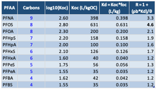
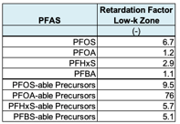

*Contributors: Carey, Werth, Newell*

**RETARDATION FACTOR CALCULATIONS**

**Overview**

REMFluor-MD explicitly represents sorption-driven retardation of PFAS transport in both transmissive aquifer zones and low-permeability (low‑k) geologic units. Low‑k units are defined as geologic materials with hydraulic conductivities substantially lower than the surrounding transmissive zones (e.g., clays, silts, shale, or glaciolacustrine deposits) that can act as long-term contaminant storage domains. Retardation factors are required inputs for both zones because sorption controls the effective velocity of dissolved PFAS and governs mass exchange between mobile groundwater and immobile or low‑mobility domains.

**Definition of Retardation Factor**

The retardation factor (R) is defined as the ratio of the total contaminant mass (dissolved plus sorbed) to the dissolved contaminant mass in the aqueous phase within a representative elementary volume of aquifer material. Retardation factors are unitless and are calculated using the following expression:

$$
R = 1 + \frac{K_d \cdot \rho_d}{n}
$$

where:

$K_d$ = soil–water distribution coefficient (mL/g)

$\rho_d$ = dry bulk density of the aquifer material (g/mL)

$n$ = effective porosity (–)

The distribution coefficient $K_d$ can be estimated from organic carbon partitioning using:

$$
K_d = K_{oc} \cdot f_{oc}
$$

where:

$K_{oc}$ = organic carbon–water partition coefficient (mL/g)

$f_{oc}$ = fraction organic carbon of the aquifer material (g/g)

Use of this last equation assumes hydrophobic effects dominate sorption and no air/water partitioning effects are present. This assumption is more accurate for longer-chain PFAS, and for soils with greater organic carbon ($f_{oc}$). For shorter chain PFAS, or when organic carbon content is low (<1%), sorption is affected by PFAS polar head groups and/or mineral surfaces, and greater deviations from Eqn. 1 will occur.

Approaches to estimate $K_{oc}$ have been developed by several authors, and the most recent are based on PFAS physiochemical properties. Three examples include the following:

$$
\log K_{oc} = \log K_{ow} - 0.21
$$

*(Developed from non-PFAS hydrophobic organic chemical sorption to soil data) (Karickhoff, 1984)*

$$
\log K_{oc} = (0.018 \pm 0.002) \cdot (V_m - 2.0 \pm 0.6)
$$

*(Developed from long PFAS sorption to soil data, with $V_m$ in cm$^3$/mol) (Brusseau, 2024)*

$$
\log K_{oc} = (1.413 \pm 0.018) \cdot \log K_{ow} - 0.651 \pm 0.140
$$

*(Developed from linear C7 through C10 PFCA sorption to solid data, with $K_{ow}$ calculated from SPARC method) (Rayne and Forest, 2009)*

Physiochemical properties can be directly measured, or estimated using a number of different methods. For example, PFAS octanol-water partition coefficient ($K_{ow}$) and molar volume ($V_m$) values can be estimated using group contributions methods, linear solvation energy relationships (LSERs), or artificial intelligence models (Nendza et al., 2025; Schwarzenbach and Gschwend, 2002). Selected literature values of PFAS physiochemical properties are listed in the Attachment 1 of this appendix.

Competitive sorption effects with NOM are often small and not considered because partitioning rather than adsorption generally dominates organic chemical uptake on these materials (Luthy et al., 1997).

**KEY INPUT PARAMETERS FOR RETARDATION FACTORS**

**Representative Koc Values for Eight PFAS**

The chemical-specific partition coefficient ($K_{oc}$) shows the relative concentrations of a contaminant sorbed to the soil organic carbon versus the concentration of this contaminant in the aqueous phase when the sorbed and aqueous phase are in equilibrium. Larger values in Table 5.1.1 indicate greater affinity of organic constituents for the organic carbon fraction of soil. These values are chemical specific and can be found in chemical reference books.

*Table 5.1.1. Number of carbons (#C), Log($K_{oc}$), $K_{oc}$ for 11 PFAAs. (Source: Brusseau (2024) Figure 1, based on 18 laboratory studies).*

{fig-alt="Koc Table" width=350px}

For the Detailed Model, $K_{oc}$'s are needed for the precursor group for PFAA-1 and PFAA-2 (if PFAA-2 is being modeled). There are little data in the literature on what are representative $K_{oc}$'s for precursors, so as an approximation one can assume the $K_{oc}$ of the precursor group is similar to the $K_{oc}$ of the PFAA they are degrading to. In addition, there are some precursor average $K_{oc}$ values in Brusseau (2024).

**Representative $f_{oc}$ Values for Aquifer Solids in Transmissive Zones**

The $f_{oc}$ parameter represents the fraction of the aquifer material comprised of natural organic carbon in transmissive zones. More natural organic carbon means higher adsorption of organic constituents on the aquifer matrix.

Typical values are 0.0002 – 0.02 (unitless) in transmissive zones.

The fraction organic carbon value should be measured, if possible, by collecting a sample of aquifer material from an uncontaminated saturated zone and performing a laboratory analysis for transmissive zones (e.g., ASTM Method 2974-87 or equivalent). If unknown, a default value of **0.001** is often used (e.g., ASTM 1995).

**Representative $f_{oc}$ Values for Aquifer Solids in Low-k Zones**

The $f_{oc}$ parameter represents the fraction of the aquifer material comprised of natural organic carbon in low-k zones. More natural organic carbon means higher adsorption of organic constituents on the aquifer matrix. A representative value to use if no site-specific data is **0.002**.

Although based on limited data, $f_{oc}$ of 0.0002 – 0.10 for low-k zones is a likely range, but some sites may be higher or lower. Some examples are shown below:

- At the Moffatt Field site, the $f_{oc}$ of the clay fraction was about 0.0066 (Roberts *et al.*, 1990).

- Domenico and Schwartz (1990) report these values:
    - silt (Wildwood Ontario): 0.00102
    - from Oconee River sediment: Coarse silt: 0.029; Medium silt: 0.02; Fine silt: 0.0226

- Chapman and Parker (2005) report a $f_{oc}$ of glaciolacustrine aquitard composed of varved silts and clays: 0.0024 to 0.00104 with an average of 0.00054.

- Adamson (2012) reports $f_{oc}$ = 0.001 for a clay layer in Jacksonville Florida and $f_{oc}$ values for silts at the MMR site in Massachusetts ranging from <0.0005 to 0.0022 (median value = 0.0014) for one core using a Leco carbon analyzer; a second core had $f_{oc}$ values < 0.005 for 10 samples and two samples with 0.00067 and 0.00084 (gram per gram). Values for $f_{oc}$ using Walkley-Black wet oxidation method were generally higher than ASTM method by a factor of 2 to 3.

- Values ranging from 0 to 0.078 have been reported for silts at F.W. Warren site in Wyoming, with a median value of 0.

**Soil Bulk Density in Transmissive Zone**

This parameter is the density of the saturated transmissive zone (referred to as "soil"), excluding soil moisture. Although this value can be measured in the lab, in most cases estimated values are used. A value of 1.7 g/mL is used frequently for unconsolidated media.

Data are derived either from an analysis of soil samples at a geotechnical lab or more commonly, application of estimated values such as 1.7 g/mL (equal to kg/liter).

**Soil Bulk Density in Low-k Zone**

This parameter is the density of soil in the saturated low k zone (referred to as "soil"), excluding soil moisture. Although this value can be measured in the lab, in most cases estimated values are used. A value of **1.5 g/mL** is used frequently for low-k unconsolidated media. Representative values for specific geologic media are shown below (Lovanh *et al.*, 2000; derived from Domenico and Schwartz, 1990):

| Material      | Bulk Density Range (g/mL) |
|---------------|--------------------------|
| Clay          | 1.0 – 2.4                |
| Loess         | 0.75 – 1.6               |
| Sandstone     | 1.6 – 2.68               |
| Shale         | 1.54 – 3.17              |
| Limestone     | 1.74 – 2.79              |
| Granite       | 2.24 – 2.46              |
| Basalt        | 2.0 – 2.7                |
| Medium Sand   | 1.34 – 1.81              |

Koerner (1984) reports these values for unit weight for saturated soils (note, no dry bulk density values are reported for these materials):

| Material                       | Bulk Density (g/mL) |
|--------------------------------|---------------------|
| Glacial till, very mixed grain | 2.32                |
| Stiff glacial clay             | 2.07                |
| Soft very organic clay         | 1.43                |
| Soft glacial clay              | 1.77                |
| Soft slightly organic clay     | 1.58                |
| Soft bentonite                 | 1.27                |

**Retardation in the Transmissive Zone**

Transmissive zones represent the primary groundwater flow domain and typically consist of sands, gravels, or fractured media. Retardation factors in transmissive zones are commonly lower than those in low‑k units due to lower organic carbon content and higher effective porosity. Calculated retardation factors (R) using $K_{oc}$'s from Brusseau's (2024) Figure 1 (18 laboratory studies) are shown at the far right hand column below assuming $f_{oc}$ = 0.001, bulk density = 1.7 kg/L, and total porosity of 0.30.

*Table 5.1.1.2. Representative retardation factors for transmissive units for 11 PFAAs based on default aquifer properties. (Source: Brusseau (2024) Figure 1, based on 18 laboratory studies).*

{fig-alt="Brusseau Transmissive Retardation" width=350px}

Transmissive-zone retardation factors for PFAS derived from a modeling study of one PFAS research site (Stockwell et al., 2026) are shown in Table 5.1.2.

*Table 5.1.2. Transmissive-zone retardation factors for PFAS derived from a modeling study of one PFAS research site (Stockwell et al., 2025).*

{fig-alt="Stockwell Transmissive Retardation" width=350px}

**RETARDATION IN LOW‑K UNITS**

Low‑k units are characterized by reduced permeability and often elevated organic carbon contents relative to transmissive zones. As a result, retardation factors in low‑k units may be equal to or greater than those in transmissive zones. Although site-specific data remain limited, several studies suggest enhanced sorption in low‑k materials.

REMFluor-MD requires separate retardation factors for low‑k units to properly simulate matrix diffusion, back-diffusion, and long-term plume persistence. Low‑k zone retardation factors are calculated using the same governing equations as transmissive zones but with material-specific values for bulk density, porosity, and fraction of organic carbon. Calculated retardation factors (R) using $K_{oc}$'s from Brusseau's (2024) Figure 1 (18 laboratory studies) are shown at the far right hand column below assuming $f_{oc}$ = 0.002, bulk density = 1.5 kg/L, and total porosity of 0.50.

*Table 5.1.3. Representative low-k unit retardation factors for PFAS derived from a modeling study of one PFAS research site (Stockwell et al., 2025).*

{fig-alt="Brusseau Low-k Retardation" width=350px}

Low-k retardation factors for PFAS derived from a modeling study of one PFAS research site (Stockwell et al., 2025) are shown in Table 5.1.3.2.

*Table 5.1.3.2. Low-k zone retardation factors for PFAS derived from a modeling study of one PFAS research site (Stockwell et al., 2025).*

{fig-alt="Stockwell Low-k Retardation" width=350px}

**Required Input Parameters**

Separate parameter values are specified for transmissive and low‑k zones, including:

- Soil bulk density

- Fraction of organic carbon

- Soil total porosity (in some models the effective porosity is assumed to be close enough to use in retardation factor calculations)

- Organic carbon partitioning coefficient ($K_{oc}$)

Default values may be applied where site-specific measurements are unavailable; however, measured values are preferred when possible due to the strong sensitivity of retardation to $f_{oc}$ and $K_{oc}$.

**Role in REMFluor-MD Transport Simulation**

Retardation factors directly affect advective transport velocities by reducing the effective groundwater velocity experienced by PFAS. In REMFluor-MD, retardation in both transmissive and low‑k domains controls mass storage, delayed breakthrough, and long-term rebound behavior. Accurate specification of retardation factors is therefore essential for realistic simulation of PFAS plume evolution and persistence.

**REFERENCES**

Adamson, D.T., 2012. GSI Environmental Inc., Houston, Texas. Personal communication.

Brusseau, M. L. (2024). Field versus laboratory measurements of PFAS sorption by soils and sediments. *Journal of Hazardous Materials Advances*, 16, Article 100508. <https://doi.org/10.1016/j.hazadv.2024.100508>

Chapman, S. W., & Parker, B. L. (2005). Plume persistence due to aquitard back diffusion following dense nonaqueous phase liquid source removal or isolation. *Water Resources Research*, 41(12), W12411. <https://doi.org/10.1029/2005WR004224>

Domenico, P. A., & Schwartz, F. W. (1997). *Physical and chemical hydrogeology* (2nd ed.). John Wiley & Sons.

Karickhoff, S. W. (1984). Organic pollutant sorption in aquatic systems. *Journal of Hydraulic Engineering*, 110(6), 707–735.

Koerner, R. M. (1984). *Construction and geotechnical methods in foundation engineering*. McGraw-Hill.

Lovanh, N., Y. Zhang, R.C. Heathcote, and P.J.J. Alvarez, 2000. "Guidelines to Determine Site-Specific Parameters for Modeling the Fate and Transport of Monoaromatic Hydrocarbons in Groundwater", report submitted to the Iowa Comprehensive Petroleum Underground Storage Tank Fund Board, University of Iowa, Iowa City, Iowa.

Luthy, R., G.R. Aiken, M.L. Brusseau, S.D. Cunningham, P.M. Gschwend, J.J. Pignatello, M. Reinhard, S.J. Traina, W.J. Weber, Jr., J.C. Westall. (1997). Sequestration of Hydrophobic Organic Contaminants by Geosorbents. *Environmental Science & Technology*, 31(12), 3341–3347.

Nendza, M., Kosfeld, V., & Schlechtriem, C. (2025). Consolidated octanol/water partition coefficients: Combining multiple estimates from different methods to reduce uncertainties in log KOW. *Environmental Sciences Europe*, 37(1), 44. <https://doi.org/10.1186/s12302-025-01072-2>

Rayne, S., & Forest, K. (2009). Congener specific organic carbon normalized soil and sediment-water partitioning coefficients for the C1 through C8 perfluorinated alkylsulfonic and alkylcarboxylic acids. *Nature Proceedings*, 1–1. <https://doi.org/10.1038/npre.2009.3011.1>

Roberts, P.V., G.D. Hopkins, D.M. Mackay, and L. Semprini, 1990. Field Evaluation of In Situ Biodegradation of Chlorinated Ethenes, 1. Methodology and Field Site Characterization, *Ground Water*, 28(4), 591–604.

Schwarzenbach, R.P., P.M. Gschwend, D.M. Imboden. (2002). *Environmental Organic Chemistry*, Wiley. ISBN: 9780471350538, DOI: 10.1002/0471649643.

Stockwell, E. B., Adamson, D. T., Gamlin, J. D., Kulkarni, P. R., Singh, A., Falta, R. W., & Newell, C. J. (2026). Modeling *per*- and polyfluoroalkyl substance precursor transformation in groundwater at a well-characterized site. *Journal of Contaminant Hydrology*, 276, 104766. <https://doi.org/10.1016/j.jconhyd.2025.104766>
