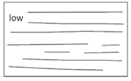
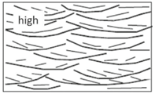
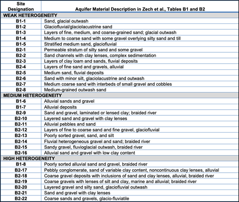
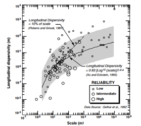

*Contributors: Newell, Stockwell, Singh*

**OBJECTIVE**

Two methods are presented for estimating longitudinal, transverse, and vertical dispersivities in REMFluor-MD:

1. New heterogeneity-based method from Zech et al. (2023), and

2. Classic methods based on plume length.

**NEW HETEROGENEITY-BASED DISPERSIVITY METHOD FROM ZECH ET AL., 2023**

**Overview**

The Zech et al. (2023) paradigm represents a significant advancement in estimating macrodispersivity for groundwater transport modeling by shifting away from the "universal scaling" approach toward a heterogeneity-based classification system. This methodology classifies aquifers into three categories, weak, medium, and high heterogeneity, based on their depositional environment, sedimentological characteristics, and statistical properties of hydraulic conductivity.

**Step-by-Step Qualitative Classification Process to Estimate Longitudinal Dispersivity ($\alpha_{\mathrm{L}}$)**

1. **Gather Available Geological Information:** Review boring logs and lithologic descriptions. Note grain-size distributions and sorting characteristics. Document presence and extent of different grain-size fractions. Identify depositional environment if possible.

2. Compare to General Descriptions of Aquifer Heterogeneity: use one of the two sub-methods below:
    - Sub-method A: Select weak, medium, or strong heterogeneity based on the descriptions in the section below; and/or
    - Sub-method B: Alternatively Compare to Analog Sites: Match lithologic descriptions at a site to Table 6.1.1; Look for similar grain-size distributions; consider similar depositional environments

3. **Assign Preliminary Heterogeneity Class:** although there is some level of arbitrariness, select either weak, medium, or high heterogeneity.

4. **Select Dispersivity Values:** Use mean values from Zech et al. (2023):
    - Weak Heterogeneity: $\alpha_{\mathrm{L}}$ = 1.1 m
    - Medium Heterogeneity: $\alpha_{\mathrm{L}}$ = 3.2 m
    - High Heterogeneity: $\alpha_{\mathrm{L}}$ = 7.5 m

Consider uncertainty analysis using the reported standard deviations.

**Or, If Enough Data, Quantitatively Estimate Heterogeneity:** Alternatively, if there are enough hydraulic conductivity (K) measurements (potentially 20+ measurement points), use the quantitative measurement approach below based on the log variance of K (Zech et al., 2023) (see detailed description below).

**Detailed Description of Qualitative Methods**

*Sub-Method A: Select Weak, Medium or High Heterogeneity Using Descriptions*

<ul>
<li>
<strong>Weak (low) heterogeneity Aquifers</strong>   <em>(Use $\alpha_{\mathrm{L}}$ = 1.1 m)</em>
    <ul>
        <li>Predominantly sandy composition with uniform grain sizes</li>
        <li>Minor fractions of silt/clay and/or gravel</li>
        <li>Well-sorted sediments</li>
        <li>Relatively continuous depositional units</li>
        <li>Terms like "glaciolacustrine," "glacial outwash," "medium sand," "uniform"</li>
        <li>Minimal mentions of clay or gravel; if present, described as "minor" or "some"</li>
    </ul>
</li>
</ul>

<ul>
<li>
<strong>Medium Heterogeneity Aquifers</strong>   <em>(Use $\alpha_{\mathrm{L}}$ = 3.2 m)</em>
    <ul>
        <li>Mixed grain sizes ranging from gravel to sand with some silt/clay</li>
        <li>Moderate sorting</li>
        <li>Interbedded or layered units</li>
        <li>Terms like "alluvial," "fluvial," "layered," "interbedded," "lenses"</li>
        <li>Clay described as "lenses" or "minor content"</li>
    </ul>
</li>
</ul>

<ul>
<li>
<strong>High Heterogeneity Aquifers</strong>   <em>(Use $\alpha_{\mathrm{L}}$ = 7.5 m)</em>
    <ul>
        <li>Wide variety of materials from gravel to silt/clay in similar proportions</li>
        <li>Poorly sorted sediments</li>
        <li>Complex, discontinuous depositional units</li>
        <li>Terms like "poorly sorted," "braided river," "variable," "with inclusions of," "lenses of silt and clay"</li>
        <li>Similar proportions of multiple grain-size classes</li>
    </ul>
</li>
</ul>

*Sub-Method B: Select Weak, Medium or High by Comparing to Analog Sites*

More detailed descriptions of 33 aquifers classified by weak, medium, high heterogeneity from Zech et al. (2023) are provided below in Table 6.1.1. "B1" or "B2" refer to Table B1 and B2 in Zech et al., and the "-XX" number is the position in the original table from top to bottom. (Only intensively and moderately characterized sites are reproduced in Table 6.1.1).

*Table 6.1.1. Aquifer Material Characteristics by Heterogeneity Class.*

{fig-alt="Aquifer Material" width=700px}

*Sub-Methods C: Uncertainty and Professional Judgment*

Zech et al. (2023) acknowledge inherent uncertainty in dispersivity estimation and note this classification system involves "some level of arbitrariness." Practitioners should:

- Document assumptions clearly in modeling reports
- Conduct sensitivity analyses using the range of values within a class
- Consider multiple lines of evidence rather than relying solely on limited data
- Use professional judgment based on available geological information
- Update classifications as additional data become available

**Detailed Description of Quantitative Method Using Log-Conductivity Variance**

*Theoretical Basis*

The log-conductivity variance ($\sigma^2_Y$, where $Y = \ln K$) serves as the primary quantitative metric for heterogeneity classification. Zech et al. (2023) provide approximate dividing lines:

- **Weak heterogeneity:** $\sigma^2_Y < 1$
- **Medium heterogeneity:** $1 < \sigma^2_Y < 2$
- **High heterogeneity:** $\sigma^2_Y > 2$

These boundaries are described as a "rough division" by the authors, acknowledging that the classification involves some professional judgment. A key question is how to calculate $\sigma^2_Y$.

*Data Requirements*

To calculate $\sigma^2_Y$ reliably, practitioners need spatially distributed hydraulic conductivity measurements. Potential data sources include:

- Multiple slug tests across the site
- Pumping tests at various locations
- Flowmeter logs or hydraulic profiling in multiple wells
- Grain-size analyses correlated to K (though this introduces additional uncertainty)

Note a large number of K values are needed to do this calculation, **potentially 20+ spatial locations that are spaced several times the K correlation length.**

*Calculation Procedure*

1. **Data Collection:** Obtain hydraulic conductivity measurements (K) at multiple locations and depths within the aquifer.
2. **Natural Log Transformation:** Convert each K value to log-conductivity: $Y_i = \ln(K_i)$.
3. **Calculate Mean Log-Conductivity:** $\bar{Y} = (1/n) \sum Y_i$.
4. **Calculate Log-Conductivity Variance:** $\sigma^2_Y = \frac{1}{n-1} \sum (Y_i - \bar{Y})^2$.
5. **Classify Heterogeneity:** Compare $\sigma^2_Y$ to the threshold values above.

*Important Considerations*

- **Spatial Coverage:** Measurements should span the area of interest, ideally several times the correlation length (typically 10–50 meters horizontally)
- **Vertical Sampling:** Include vertical variation by sampling multiple depths
- **Measurement Method:** Different methods (slug tests, pumping tests, permeameter) may yield different K estimates due to support volume differences, particularly in highly heterogeneous sites
- **Sample Size:** 20+ measurements recommended, though 50+ provides more robust statistics

*Practical Limitations*

Zech et al. (2023) acknowledge that in many cases, particularly for preliminary assessments, the statistical parameters **$\sigma^2_Y$** (log-conductivity variance) and **$I_h$** (longitudinal correlation scale) are "generally not available" at most sites.

**Zech et al. Recommendations for Transverse Dispersity ($\alpha_{\mathrm{T}}$)**

After their re-evaluation of dispersivity data, Zech et al. (2015, 2019) found no clear scale-dependency in transverse dispersivity ($\alpha_T$ or "alpha-T" or "alpha-Y"), with values typically ranging from 1% to 10% of the longitudinal dispersivity for the most reliable data sets. However, Zech et al. (2023) provide recommendations for alpha-T at **0.03 to 0.05 meters:** *"it is preferable to select an absolute value in the range of 3 to 5 cm, at least for aquifers of weak to medium heterogeneity"*

**Zech et al. Recommendations for Vertical Dispersity ($\alpha_{\mathrm{Z}}$)**

Zech et al. (2023) provide the following recommendation for vertical dispersivity ("alpha-v" or "alpha-z"):

$$
\alpha_{\mathrm{Z}} = 0.1 \times \alpha_{\mathrm{T}}
$$

Carey et al. (2018) conducted a regression analysis based on a meta study to develop an equation for estimating vertical dispersivity based on hydraulic conductivity:

$$
\alpha_{\mathrm{Z}} = 0.08 \, K^{-0.16}
$$

where $\alpha_{\mathrm{Z}}$ is in millimeters and K is in meters per second (m/s).

**SUMMARY**

The Zech et al. (2023) framework provides practitioners with a rational methodology for selecting macrodispersivity values based on aquifer heterogeneity. While quantitative assessment through log-conductivity variance ($\sigma^2_Y$) is preferable when data are available, the authors recognize that "for preliminary assessments, these data are not available and ad hoc values are adopted by practitioners."

The geological characterization approach, classifying aquifers based on grain-size proportions and comparing to well-studied analogues, offers a defensible alternative to arbitrary value selection. By examining boring logs and lithologic descriptions and matching them to the material characteristics in Table 6.1.1, practitioners can select dispersivity values that better represent actual field conditions than the previously used empirical scaling relationships.

The approach is inherently uncertain, as reflected in the standard deviations reported for each heterogeneity class. However, this uncertainty is explicitly quantified, allowing for appropriate sensitivity analyses in groundwater transport models. As noted in Zech et al. (2023), the suggested values are "based on a thorough analysis of tens of field experiments" and represent the best available guidance when research site level characterization data are not on hand.

**CLASSIC METHOD TO ESTIMATE DISPERSIVITIES**

**Estimate Longitudinal Dispersivity from Plume Lengths**

Conventional practice suggested estimating dispersion based on the expected length (L) of the plume with mathematical relationships such as:

1. Longitudinal Dispersivity = 0.1 × Plume Length (Pickens and Grisak, 1981)

2. The Xu and Eckstein (1995) relationship shown as the curved line on the figure below, where one puts in the plume "scale" (effectively the plume length) and uses the curved line to determine an appropriate longitudinal dispersivity. For example, if your plume length is 1,000 meters, the longitudinal dispersivity is about 10 meters. A plume 10,000 meters long would have a longitudinal dispersivity of about 20 meters.

{fig-alt="Xu & Eckstein (1995) Dispersivity vs. Plume Length" width=400px}

**Estimating Transverse Dispersivity ($\alpha_{\mathrm{T}}$)**

The classical method (Aziz *et al.*, 1999) typically applies a ratio:

- One commonly used value is the ratio of $\alpha_{\mathrm{T}}$ = 0.10 × $\alpha_{\mathrm{L}}$

- A less commonly used relationship is $\alpha_{\mathrm{T}}$ = 0.33 × $\alpha_{\mathrm{L}}$

**Estimating Vertical Dispersivity ($\alpha_{\mathrm{Z}}$)**

The classical method (Aziz *et al.*, 1999) typically applies another ratio:

- One commonly used value is the ratio of $\alpha_{\mathrm{Z}}$ = 0.05 × $\alpha_{\mathrm{T}}$

**REFERENCES**

Aziz, C., A. Smith, and C. Newell, 1999. *BIOCHLOR Chlorinated Solvent Plume Database*. Air Force Center for Environmental Excellence, San Antonio, Texas.

Carey, G. R., McBean, E. A., & Feenstra, S. (2018). Estimating transverse dispersivity based on hydraulic conductivity. *Environmental Technology & Innovation*, 10(2018), 36–45. <https://doi.org/10.1016/j.eti.2018.01.008>

Pickens, J.F., and G.E. Grisak (1981). Scale-Dependent Dispersion in a Stratified Granular Aquifer. *Water Resources Research*, 17(4), 1191–1211.

Xu, M., and Y. Eckstein (1995). Use of Weighted Least-Squares Method in Evaluation of the Relationship Between Dispersivity and Scale. *Ground Water*, 33(6), 905–908.

Zech, A., Attinger, S., Cvetkovic, V., Dagan, G., Dietrich, P., Fiori, A., Rubin, Y., & Teutsch, G. (2015). Is unique scaling of aquifer macrodispersivity supported by field data? *Water Resources Research*, 51(9), 7662–7679. <https://doi.org/10.1002/2015WR017220>

Zech, A., Attinger, S., Bellin, A., Cvetkovic, V., Dietrich, P., Fiori, A., Teutsch, G., & Dagan, G. (2019). A Critical Analysis of Transverse Dispersivity Field Data. *Groundwater*, 57(4), 632–639. <https://doi.org/10.1111/gwat.12838>

Zech, A., Attinger, S., Bellin, A., Cvetkovic, V., Dagan, G., Dietrich, P., Fiori, A., & Teutsch, G. (2023). Evidence Based Estimation of Macrodispersivity for Groundwater Transport Applications. *Groundwater*, 61(3), 346–362. <https://doi.org/10.1111/gwat.13252>
