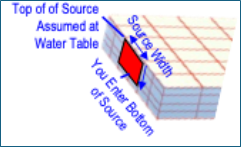
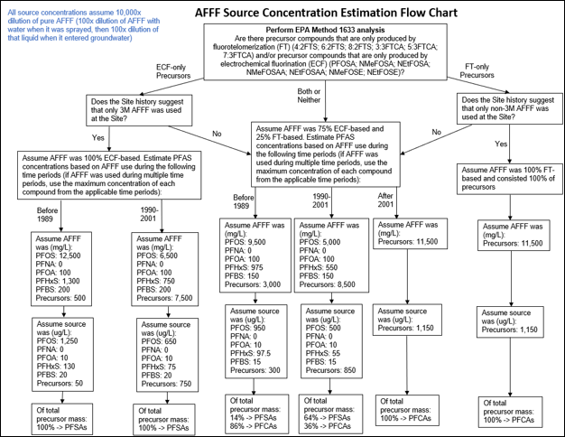
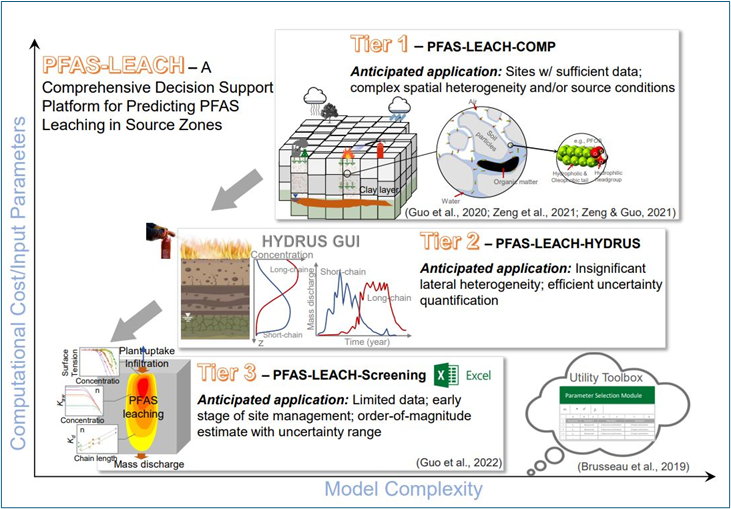

*Contributors: Newell, Stockwell, Carey*

**KEY CONCEPTS**

**Spatial Representation**

REMFluor-MD uses a <b>vertical plane source</b> to represent PFAS entering groundwater. This plane extends downward from the source area through the saturated zone and requires a <b>single representative concentration</b> for each modeled constituent. The concentration you enter should reflect the <b>average conditions in the high-concentration core</b> of the plume (typically the region bounded by the innermost concentration contours).

The source concentration you select strongly influences predicted plume longevity, downgradient concentrations, and rebound following remediation. Conservative assumptions (higher concentrations) increase predicted mass loading and accentuate effects of sorption, matrix diffusion, and back-diffusion, but are sometimes used when there is high uncertainty in the source concentrations.

**Temporal Representation of the Source**

*Simple Constant Source Assumption.* Because of the lack of historical data, modelers often assume a constant source concentration over the entire lifetime of the source and use current monitoring to get that concentration. The Simple Version of REMFluor-MD has this approach built into the interface.

*Time-Varying Source Concentrations.* Alternatively some type of varying source concentrations over time can be entered into REMFluor-MD. These could be based on an historical estimation technique based on the type of AFFF that might have been used at the site, or the use of a PFAS vadose zone model like PFAS-LEACH.

**Important Limitation:** REMFluor-MD requires simulations to begin when PFAS first entered groundwater (typically decades ago). Because matrix diffusion and back-diffusion depend on historical loading, simulations must begin when PFAS first entered groundwater rather than at present-day conditions.

**LOCATION OF THE VERTICAL PLANE SOURCE**

Typically the vertical plane source zone is drawn in the middle of source transverse to the groundwater direction (Figure 7.1.1).

{fig-alt="Figure 7.1.1 Recommended location for the REMFluor-MD vertical plane source." width=700px}

*Figure 7.1.1. Recommended location for the REMFluor-MD vertical plane source.*

**DETERMINING THE SOURCE CONCENTRATION**

**Current Concentration Based on Plume Maps**

The following simplified approach uses site-specific monitoring data to estimate a representative concentration across the source plane:

1. Evaluate plume maps with concentration contours.

2. Define a source-plane width that captures approximately 75% or more of the high-concentration zone mass discharge which captures the dominant plume core while excluding low-concentration fringe areas that contribute minimally to mass loading.

3. Estimate concentrations at the lateral boundaries from the contour maps.

4. Average the boundary concentrations with the maximum observed concentration in the source area.

This simple averaging approach is intended as a screening-level approximation; where plume geometry is well defined or concentration gradients span more than one order of magnitude, an area-weighted approach using additional contour intervals is recommended.

**Example:** If plume maps show PFOS concentrations of 10 µg/L and 9 µg/L at the left and right edges of your modeled source width, and the maximum observed PFOS concentration is 20 µg/L, the representative source concentration is:

$$
C_{\text{source}} = \frac{10 + 9 + 20}{3} = 13~\mu\text{g/L PFOS}
$$

Apply this same procedure to each PFAA (e.g., PFOS as PFAA-1, PFOA as PFAA-2) and to any precursor groups (PFAA-1-able and PFAA-2-able) if precursor transformation is included in your simulation. For widely varying source concentrations that vary over an order of magnitude, higher accuracy can be obtained by adding more contour lines and values to this calculation approach.

**Historical Concentrations Based on AFFF Composition Method (Experimental)**

When historical AFFF products used at the site can be identified, initial source zone concentrations can be estimated based on known AFFF compositions using a method developed by E. Stockwell (Figure 7.2). This method relies on:

- AFFF composition data from Backe et al. (2013) and Houtz et al. (2013);

- Estimates of electrochemical fluorination (ECF) vs. fluorotelomerization (FT)-based AFFF usage from Darwin (2004).

{fig-alt="Figure 7.2. AFFF Source Concentration Estimation Flow Chart (Experimental)." width=750px}

*Figure 7.2. AFFF Source Concentration Estimation Flow Chart (Experimental).*

**MODELING SOURCE CONCENTRATION CHANGES OVER TIME**

REMFluor-MD offers three options for representing how source concentrations change during the simulation period:

**Option 1: Constant Source (Simple Version of REMFluor-MD)**

*When to use:* Screening-level analyses, when source history is uncertain, or when a simple modeling approach is appropriate. This is the method used in the Simple Version of REMFluor-MD.

This option assumes a single, unchanging source concentration throughout the simulation. While this assumption is conservative and tends to overpredict concentrations and mass loading at downgradient receptors, it is widely accepted practice for screening-level assessments.

*Technical basis:* Many analytical and numerical groundwater transport formulations use constant-concentration or constant-flux boundary conditions (Bear, 1979; Zheng & Bennett, 2002). This approach is consistent with ASTM RBCA Tier 1 and Tier 2 assessments (ASTM, 2019; USEPA, 1996; Connor et al., 1997) and regulatory guidance that recommends conservative simulations when parameter uncertainty is high (Georgia EPD, 2017; Alaska DEC, 2017).

*Input options:* Enter either the averaged concentration from the plume map method or the maximum historical concentration approaches described above.

**Option 2: User-Defined Variable Source**

*When to use:* When you have site-specific data or empirical methods to estimate source concentration trends that are not derived from vadose zone models. In some cases, general trends can be obtained by comparing the Historical Source Concentration and the Current Source Concentration using the methods described above.

Enter concentration values for up to 11 time periods during the simulation. (For example, in a 44-year simulation, each time period would span 4 years.) Then simple concentration vs. time source patterns can be used as described by Newell and Adamson (2005):

- Linear decay over time

- First-order decay

- Constant concentration then some decay pattern

The interface requires source concentrations be entered over time for all selected PFAAs (PFAA-1, PFAA-2) and precursors (PFAA-1-able, PFAA-2-able), along with the total mass of each compound leaving the source over the modeling period.

**Option 3: Variable Source from a PFAS Vadose Zone Model (Detailed Version)**

*When to use:* Sites with vadose zone characterization data where source depletion over time is expected to significantly affect predictions.

Vadose zone PFAS transport models calculate mass discharge to groundwater based on soil concentrations (ng/kg) or porewater concentrations (ng/L or µg/L) and recharge rates. When combined with groundwater Darcy velocity and mixing zone assumptions, these models produce groundwater source concentrations over time.

*Available tools:*

- **PFAS-LEACH** (ESTCP, 2025): Developed by Guo et al. (2020), Zeng et al. (2021), Brusseau and Guo (2023), and Guo et al. (2022). REMFluor-MD is specifically designed to import PFAS-LEACH output directly (Figure 7.3).

- **Modified HYDRUS model** (Silva et al., 2020): Investigated under SERDP Project ER18-1389.

{fig-alt="Figure 7.3. Three Tiers of PFAS Leaching Models from ESTCP Project ER21-5041." width=750px}

*Figure 7.3. Three Tiers of PFAS Leaching Models from ESTCP Project ER21-5041.*

**QUICK REFERENCE**

| Option            | Best For                                                       | Version             |
|-------------------|----------------------------------------------------------------|---------------------|
| Constant Source   | Screening-level analysis; uncertain source history             | Simple or Detailed  |
| Vadose Zone Model | Sites with vadose zone data; source depletion important        | Detailed only       |
| User-Defined      | Site-specific trend data; custom decay assumptions             | Detailed only       |

**REFERENCES**

Alaska Department of Environmental Conservation. (2017). *Fate and transport modeling guidance*. Alaska Department of Environmental Conservation, Contaminated Sites Program.

ASTM. (2019). *Standard guide for risk-based corrective action applied at petroleum release sites* (ASTM E1739-95(2019)e1). ASTM International.

Backe, W. J., Day, T. C., & Field, J. A. (2013). Zwitterionic, cationic, and anionic fluorinated chemicals in aqueous film forming foam formulations and groundwater from U.S. military bases by nonaqueous large-volume injection HPLC-MS/MS. *Environmental Science & Technology*, 47(10), 5226–5234. <https://doi.org/10.1021/es3034999>

Bear, J. (1979). *Hydraulics of groundwater*. McGraw-Hill.

Brusseau, M. L., & Guo, B. (2023). Revising the EPA dilution-attenuation soil screening model for PFAS. *Journal of Hazardous Materials Letters*, 4, 100077. <https://doi.org/10.1016/j.hazl.2023.100077>

Connor, J. A., Bowers, R. L., Paquette, S. M., & Newell, C. J. (1997). Soil attenuation model for derivation of risk-based soil remediation standards. *Petroleum Hydrocarbons and Organic Chemicals in Groundwater Conference*, July, 1–34.

Darwin, R. (2004, August). *Estimated quantities of aqueous film forming foam (AFFF) in the United States*. Prepared for the Fire Fighting Foam Coalition, Arlington, VA.

ESTCP. (2025). *A comprehensive decision support platform for predicting PFAS leaching in source zones.* Environmental Security and Technology Certification Program Project ER21-5041. <https://serdp-estcp.org/projects/details/7b8e05de-6446-4992-adc2-c7e632972991>

Georgia Environmental Protection Division. (2017). *Groundwater contaminant fate and transport modeling guidance*. Georgia Environmental Protection Division, Land Protection Branch.

Guo, B., Zeng, J., & Brusseau, M. L. (2020). A mathematical model for the release, transport, and retention of per- and polyfluoroalkyl substances (PFAS) in the vadose zone. *Water Resources Research*, 56(2), e2019WR026667. <https://doi.org/10.1029/2019WR026667>

Guo, B., Zeng, J., Brusseau, M. L., & Zhang, Y. (2022). A screening model for quantifying PFAS leaching in the vadose zone and mass discharge to groundwater. *Advances in Water Resources*, 160, 104102. <https://doi.org/10.1016/j.advwatres.2021.104102>

Houtz, E. F., Higgins, C. P., Field, J. A., & Sedlak, D. L. (2013). Persistence of perfluoroalkyl acid precursors in AFFF-impacted groundwater and soil. *Environmental Science & Technology*, 47(15), 8187–8195. <https://doi.org/10.1021/es4018877>

Newell, C. J., & Adamson, D. T. (2005). Planning-level source decay models to evaluate impact of source depletion on remediation time frame. *Remediation Journal*, 15(4), 27–47.

Silva, J. A. K., Šimůnek, J., & McCray, J. E. (2020). A modified HYDRUS model for simulating PFAS transport in the vadose zone. *Water*, 12(10), 2758. <https://doi.org/10.3390/w12102758>

USEPA. (1996). *RBCA fate and transport models: Compendium and selection guidance* (EPA 530-R-96-021). U.S. Environmental Protection Agency, Office of Solid Waste.

Zeng, J., Brusseau, M. L., & Guo, B. (2021). Model validation and analyses of parameter sensitivity and uncertainty for modeling long-term retention and leaching of PFAS in the vadose zone. *Journal of Hydrology*, 603, 127172. <https://doi.org/10.1016/j.jhydrol.2021.127172>

Zheng, C., & Bennett, G. D. (2002). *Applied contaminant transport modeling* (2nd ed.). John Wiley & Sons.
