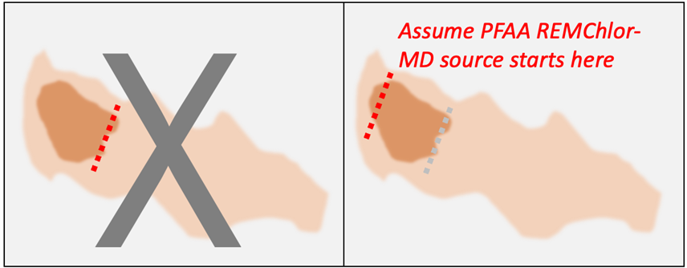

**OVERVIEW**

Conceptually, source remediation in REMFluor-MD for PFAS is similar to source remediation of chlorinated solvent source zones:  the user enters in the percent of the source mass that is removed or isolated from the plume during a certain year to a span of years.  For chlorinated solvent sites, there is a rich history of empirical data on how well in-situ destructive remediation technologies reduced source concentrations and implicitly the amount of source reduction. For example, the ESTCP In-Situ Remediation Performance Database (McGuire et al., 2016) indicates that while source zone remediation performance varied widely for sites in the 235-site database (from increasing concentrations to 99.99% removal), the median reduction in parent compound concentrations from source zone remediation was 91% (and implicitly a 91% reduction in source mass).

However, PFAS source remediation is quite different compared to chlorinated solvent source remediation for the following reasons:  1) PFAS are not DNAPLs; 2) considerable PFAS mass likely exists in the shallow unsaturated zone; and 3) no proven in-situ remediation technologies have yet been developed that can destroy PFAAs.  Therefore, for PFAS source removal/isolation, the key remediation technologies at this time are:

- *Excavation of PFAS-impacted soils. * The simplest method for modeling source remediation assumes that excavation removes nearly all (100%) of the PFAS being modeled. If detailed estimates of PFAS mass are available for both the planned excavated soil volume and the remaining unexcavated soil, these estimates can be used to calculate a percentage of mass removal for REMFluor-MD from an excavation project. It is important to note that, in general, long-chain PFAAs, particularly PFOS, are more likely to be retained in the upper few feet of the unsaturated zone, whereas short-chain PFAAs like PFBS tend to be distributed throughout the entire unsaturated zone.  At some sites complete excavation of the vadose zone soils may be possible.  At a much more limited number of sites dewatering can be performed to removed saturated zone soils impacted by PFAS.

- *Capping to reducing PFAS loading through source isolation.*  Capping involves constructing impermeable covers over PFAS sources in the unsaturated soil zone. This method can significantly reduce the amount of PFAS entering groundwater by limiting water infiltration, which in turn decreases PFAS leaching. When implemented correctly, capping can potentially isolate nearly 100% of PFAS sources in the unsaturated zone above the capillary fringe. However, it is important to account for groundwater table fluctuations when designing the cap.  Note that capping may not address all PFAS source materials.  Some PFAS may already be present in the saturated zone, either sorbed (attached) to soil particles, or diffused into low-permeability soils, which can later lead to back-diffusion of these PFAS out of the low-permeability soils and into transmissive aquifer zones.

**WHERE TO LOCATE MODEL VERTICAL PLANE SOURCE**

Saturated zone sources can be modeled in REMFluor-MD using a workaround when setting up the model by assuming a vertical plane source of PFAS at the upgradient edge of the PFAS plume (Figure 1). This approach allows the saturated zone portion of the plume to be included in the REMFluor-MD plume model, and this approach can also be used to include precursor transformation to PFAAs in the source zone.

{fig-alt="Suggested REMFluor-MD vertical plane source location to model PFAS sources" width=600px}

Figure 1. Suggested REMFluor-MD vertical plane source location to model PFAS sources.  Use the source configuration on the right, not on the left.

**REFERENCES**

McGuire, T.M., D.T. Adamson, M.S. Burcham,  P.B. Bedient, and C.J. Newell, 2016. Evaluation of Long-Term Performance and Sustained Treatment at Enhanced Anaerobic Bioremediation Sites, *Groundwater Monitoring & Remediation* 36: 32-44.

