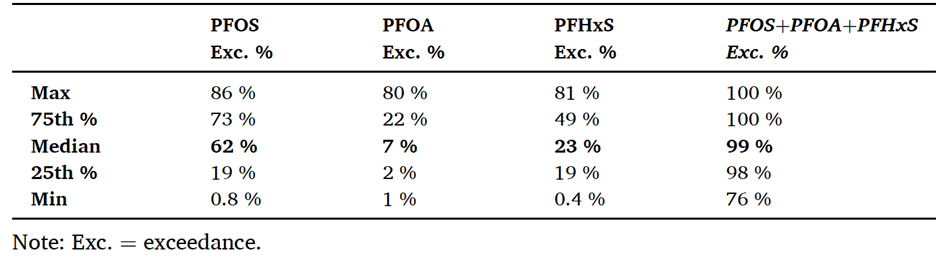

Contributors: Werth, Carey, Newell

**OVERVIEW**

Sorption of per- and polyfluoroalkyl substances (PFAS) to colloidal activated carbon (CAC) is nonlinear and is most commonly described using Freundlich isotherms:

$$
q = K_f\, c^a \tag{1}
$$

where q is the sorbed concentration (e.g., mg/kg), c is the aqueous concentration (e.g., mg/L), $K_{f}$ is the Freundlich capacity parameter, and a is the Freundlich exponent..

Freundlich isotherm values for several common PFAS and commercial CAC products are summarized in Attachment A, Table A9-1. In REMFluor‑MD, default sorption parameters are based on laboratory studies in which PFAS mixtures from AFFF‑impacted groundwater were sorbed to the CAC product PlumeStop®. These mixture‑based isotherms are preferred because they partially account for competitive sorption and dissolved organic matter (DOM) effects that reduce PFAS sorption and barrier longevity. Isotherms derived from NaCl‑amended water and other CAC products are included for comparison.

REMFluor‑MD allows users to directly input site‑specific Freundlich parameters. A primary objective of the model is to estimate CAC barrier longevity, defined as the time required for PFAS concentrations at the downgradient edge of the barrier to reach compound‑specific drinking water standards (Newell et al., 2025). Accurate selection of Freundlich parameters is therefore critical to reliable longevity estimates.

**GENERAL RECOMMENDATIONS TO GET “$K_{f}$ “ AND “a” FOR MODELING CAC BARRIERS**

Whenever possible, Freundlich isotherms derived from experiments using real PFAS mixtures and site groundwater should be used instead of single‑compound laboratory isotherms. Mixture‑based studies partially capture competitive sorption among PFAS and interactions with dissolved organic matter, both of which can substantially reduce sorption affinity and CAC barrier longevity (Carey et al., 2022).

Isotherms developed using simple electrolyte solutions often overestimate PFAS sorption and therefore overpredict barrier longevity. The influence of DOM is illustrated by laboratory comparisons (Figure 1) showing that PFOS sorption from groundwater is nearly an order of magnitude lower than sorption measured in single‑species laboratory solutions. These effects should be considered explicitly when selecting Freundlich parameters for modeling.

{fig-alt="DOm on PFAS" width=600px}

Figure 1.  Effects of DOM on PFAS sorption to a commercial CAC 
(reproduced with permission from Carey et al., 2022)

**WHICH PFAS TO MODEL TO ESTIMATE CAC BARRIER LONGEVITY?**

The first decision point when modeling CAC barrier longevity is which of the PFAS should be modeled in REMFluor-MD.   Two key considerations are 1) the relative “exceedance magnitude” of different PFAAs as proxy for individual risk in groundwater from each of the key PFAAs; and 2) competitive sorption effects where long-chain PFAAs can dislodge sorbed short-chain PFAAs and cause them to travel through a CAC barrier faster than what might be expected.  These two interrelated factors are discussed in more detail below.  Note these methods have been developed from AFFF site data, and that some of selection criteria below may not be relevant at other types of PFAS sites.

**“Exceedance Magnitude” Points to Modeling PFOS, PFOA, PFHxS**

Selection of PFAS compounds for CAC barrier modeling should be guided by two factors: (1) exceedance magnitude relative to regulatory criteria, and (2) competitive sorption behavior within CAC barriers.

Exceedance magnitude quantifies how much a PFAS concentration exceeds its regulatory standard and serves as a proxy for relative risk. Analysis of 22 AFFF‑impacted sites (Kulkarni et al., 2025) shows that three long‑chain PFAS (PFOS, PFOA, and PFHxS) account for approximately 99% of exceedance magnitude across sites (Table 1, Figure 2). Short‑chain PFAS such as PFHxA, PFBS, and PFBA typically contribute less than 2% of exceedance‑based risk under current federal standards.

Accordingly, REMFluor‑MD modeling at AFFF sites should **focus on PFOS, PFOA, and PFHxS (and potentially PFNA where relevant**). This approach captures the vast majority of regulatory risk while avoiding unnecessary complexity associated with explicitly modeling short‑chain PFAS that are not primary risk drivers.

Table 1.  Distribution of PFAA Exceedance Magnitude at 22 AFFF sites (Kulkarni et al, 2025).

{fig-alt="PFAA exceedance" width=600px}

Figure 2.  Distribution of Individual Site Relative Exceedance Magnitude.  Bars show the median value of dataset per constituent, and each dot represents an individual site out of 22 sites (Kulkarni et al., 2025).
{fig-alt="Distribution of Site Exceedance" width=600px}

**COMPETITIVE SORPTION EFFECTS OVERVIEW**

Competitive sorption occurs when multiple PFAS compete for finite sorption sites on CAC. Long‑chain PFAS (PFOS, PFOA, PFHxS) sorb much more strongly than short‑chain compounds and can displace them from CAC surfaces. As a result, short‑chain PFAS may break through CAC barriers much earlier than long‑chain PFAS, even when all compounds enter the barrier simultaneously.

REMFluor‑MD does not explicitly simulate dynamic competitive sorption. However, this limitation is mitigated because the PFAS that control regulatory risk and barrier longevity are the long‑chain compounds that dominate sorption. Among these, PFOA typically controls CAC barrier longevity due to its weaker sorption relative to PFOS and PFHxS. Modeling studies and field data indicate that PFOA is the first of the regulated long‑chain PFAS to break through CAC barriers at most AFFF sites.

For sites where short‑chain PFAS are of regulatory concern, more complex models capable of explicitly simulating competitive sorption may be required, or conservative assumptions regarding short‑chain breakthrough should be applied.

**TIERED APPROACH FOR SELECTING FREUNDLICH ISOTHERMS**

**Tier 1:  Use General Literature Values for “$K_{f}$“and “a” for Three PFAS**

For screening‑level analyses, REMFluor‑MD users should apply Freundlich parameters reported by Carey et al. (2022) for PFOS, PFOA, and PFHxS sorption to PlumeStop® CAC using AFFF‑impacted groundwater (Table 2).

Table 2.  Recommended Freundlich values for planning / screening level 
CAC modeling in REMFluor-MD (Carey et al., 2022)

| PFAA   | Source Type | Type of CAC | Kf (mg/g/L) | a    |
|--------|-------------|-------------|------------------------|------|
| PFOS   | AFFF        | PlumeStop   | 12,000                 | 0.33 |
| PFOA   | AFFF        | PlumeStop   | 580                    | 0.25 |
| PFHxS  | AFFF        | PlumeStop   | 1,240                  | 0.24 |

As noted above, competitive sorption effects on PFAS longevity can be partially accounted for by using isotherms developed in lab that used a specific PFAS mixture, groundwater, and CAC rather than individual PFAS isotherms conducted using tap water.   

**Tier 2a:  Use More Site-Specific Literature Values for “Kf “and “a” for PFAS**

As researchers continue to publish Freundlich isotherms derived from different groundwater types, REMFluor-MD users gain the ability to select isotherms developed under conditions that most closely match their site. Users should compare their site's groundwater characteristics to the groundwater used in published laboratory studies and select isotherms from the most similar conditions. Key characteristics to match include: 

1. PFAS concentrations and compound profiles (which PFAAs are present and at what levels), 

2. Groundwater geochemistry parameters such as total dissolved solids, total organic carbon, and divalent cation concentrations (e.g., calcium and magnesium), 

3. The type of CAC used in the lab study vs. the actual site. This site-specific isotherm selection approach improves model accuracy compared to using a single 'universal' isotherm for all sites.  

A compilation of published Freundlich isotherms for PFAS sorption to CAC, current as of late 2025, is provided in Attachment A, Table A9.1. to assist users in selecting appropriate parameters for their site conditions.

**Tier 2b:  Apply Simplified Handling of PFAS Short-Chain and Precursor Sorption**

Use of measured isotherms for short-chain and precursor PFAS are always preferred, especially those using a site specific PFAS mixture, groundwater, and CAC.  However, such isotherms are often not available because short-chain PFAS often represent a lower risk in groundwater and are less studied, and because short-chain PFAS may be present at very low concentrations relative to other PFAS in a site specific mixture.  In the absence of such data, possible approaches include:  

1. Assume no or limited sorption of short-chain PFAS to the CAC barrier and then assess the downgradient risk

2. Use a measured isotherm for the shortest-chain PFAA available as a surrogate (as long as it is not a single-specie isotherm)

3. Use the PAPT model (described below) to predict short-chain PFAS sorption to CAC based on isotherms measured for longer-chain PFAS to the same CAC.

The first assumption is most appropriate for precursors with large aqueous solubility values (e.g., >10⁻¹ mol/L).  The second assumption appears most appropriate when the aqueous solubility value for a short-chain or precursor PFAS is within 20% of that for the measured PFAS.  While not perfect, these options provide practical pathways for incorporating short-chain and precursor dynamics into remediation modeling.

**Tier 3a:  Site-Specific Lab-Based Isotherm Testing for PFAS**

For sites where the most accurate barrier longevity predictions are required, practitioners can obtain site-specific Freundlich isotherms (similar to ones shown in Figure 1) through commercial laboratory testing services. Companies such as SiREM (2025) (Ontario, Canada) and others offer sorptive media isotherm testing specifically designed to determine the capacity of CAC or other sorptive media to adsorb PFAS under site-specific conditions. The process involves sending groundwater samples, soil samples, and the specific CAC product being considered for barrier installation to the laboratory, where technicians conduct controlled batch reactor studies to develop customized isotherm parameters. These laboratory studies expose the actual CAC material to the site's groundwater chemistry and PFAS mixture, generating Freundlich constants ($K_{f}$ and n values) that reflect the real-world competitive sorption effects and geochemical interactions specific to that site. While this approach requires additional time and cost compared to using literature-derived isotherms, it provides the highest level of confidence for barrier design and longevity predictions, particularly at high-value sites, sites with unusual groundwater chemistry, or sites where regulatory compliance margins are narrow. The resulting site-specific isotherms can be directly input into REMFluor-MD, eliminating uncertainty about whether published isotherm values adequately represent site conditions.

**Tier 3b:  Predict Single-Species Freundlich Isotherms for PFAS sorption to CAC**

No methods have been reliably established to predict single-species Freundlich isotherms for PFAS sorption to CACs.  However, the Polanyi Adsorption Potential Theory (PAPT) was used to estimate Freundlich isotherms for PFAS sorption to granular activated carbon with some success, and represents a possible approach for predicting Freundlich isotherm parameters for PFAS sorption to CAC.  The method requires measured Freundlich isotherms for one or more representative PFAS on the selected CAC (Burkhardt et al., 2023).

$$
K_f = \rho W_o \exp\left(\frac{BRT \ln(C_s \times 1000)}{V_m}\right) \tag{2}
$$

$$
n_f = \frac{BRT}{V_m} \tag{3}
$$

Here, ρ is the liquid density (g/cm3), $c_{s}$ is the aqueous solubility (mg/l), and $V_{m}$ is the PFAS molar volume (cm³/mol); the latter two inputs represent individual PFAS physio chemical characteristics and values for selected PFAS are presented in the Attachment A, Table A9.2. Here, $W_{o} (μl/g) is the adsorption saturation limit and B (ml/cal) characterizes the change in adsorption affinity with adsorption potential; these two inputs represent carbon characteristics. Also, R is the ideal gas constant (1.986 cal/(mol-K)) and T is the temperature (K).  

The PAPT assumes that the adsorption potential of the sorbent (e.g., carbon) is directly related to the volume of sorbate it can uptake in its pores. A sorbate’s adsorption potential is quantitated through the ratio of its aqueous solubility and its maximum adsorption volume with a given sorbent. As the adsorption potential and volume remain the same with a specified sorbent at a given sorbate concentration, an estimate of another similar sorbate’s adsorption can be approximated from its molar volume and solubility.  

To implement, single sorbate isotherms for two or more PFAS are first used to obtain single values of Wo and B by transforming Equations (2) and (3) to Equations (4) to (6).

$$
x = \frac{\text{Adsorption Potential}}{\text{Molar Volume}} = \frac{RT}{V_m} \ln\left(\frac{C_s}{c} \times 10^3\right)
$$

$$
\ln(y) = \ln(\text{Volume Adsorbed}) = \ln\left(\frac{q}{\rho}\right)
$$

$$
\ln(y) = B \cdot x + \ln(W_o)
$$

The variables c (µg/L) and q (µg/mg) are equilibrium concentration and adsorption data point pairs acquired from an isotherm for a given CAC. Values x and ln(y) for the measured single sorbate isotherms are plotted together to obtain single values of Wo and B. These same values of Wo and B are then used to predict single sorbate Freundlich parameter values from Equations (2) and (3) for other PFAS. An example calculation is shown in the Attachment  A, Table A9.3.  

Two shortcomings of the PAPT are that it does not consider contributions from electrostatic interactions between charged head groups in PFAS molecules and the CAC surface (Higgins and Luthy, 2007), and it assumes all PFAS have access to the same distribution of pores. The former assumption is expected to be approximately met for longer-chain PFAS, and when solution pH and ionic strength values remain relatively constant.  The latter assumption is expected to be approximately met for similar chain length PFAS.  This means greater prediction errors are expected for PFAS isotherms when their chain lengths deviate from those used to determine Wo and B.

It is important to note that the PAPT model has only been used to predict Freundlich isotherms for individual PFAS alone in solution on GAC, based on measured Freundlich isotherms for one or more other PFAS alone in solution on the same GAC.  It has not been used to predict Freundlich isotherms for individual PFAS in a mixture based on measured Freundlich isotherms for one or more other PFAS in the same mixture and on the same GAC.  

**SUMMARY**

For screening‑level analyses, REMFluor‑MD users should apply Freundlich parameters reported by Carey et al. (2022) for PFOS, PFOA, and PFHxS sorption to PlumeStop® CAC using AFFF‑impacted groundwater.

**REFERENCES**

Burkhardt, J. B., Cadwallader, A., Pressman, J. G., Magnuson, M. L., Williams, A. J., Sinclair, G., & Speth, T. F. (2023). Polanyi adsorption potential theory for estimating PFAS treatment with granular activated carbon. Journal of Water Process Engineering, 53, 103691. .

Carey, G. R., McGregor, R., Pham, A. L.-T., Sleep, B., & Hakimabadi, S. G. (2019). Evaluating the longevity of a PFAS in situ colloidal activated carbon remedy. Remediation Journal, 29(2), 17–31. 

Carey, G. R., Hakimabadi, S. G., Singh, M., McGregor, R., Woodfield, C., Van Geel, P. J., & Pham, A. L.-T. (2022). Longevity of colloidal activated carbon for in situ PFAS remediation at AFFF-contaminated airport sites. Remediation Journal, 33(1), 3–23. 

Carey, G. R., Anderson, R. H., Van Geel, P., McGregor, R., Soderberg, K., Danko, A., Hakimabadi, S. G., Pham, A. L.-T., & Rebeiro-Tunstall, M. (2024). Analysis of colloidal activated carbon alternatives for in situ remediation of a large PFAS plume and source area. Remediation Journal, 34(1), e21772. 

Higgins, C. P., & Luthy, R. G. (2007). Modeling Sorption of Anionic Surfactants onto Sediment Materials: An a priori Approach for Perfluoroalkyl Surfactants and Linear Alkylbenzene Sulfonates. Environmental Science & Technology, 41(9), 3254–3261. 

Kulkarni, P. R., Andrzejczyk, N. E., Gavaskar, A., Cartwright, A., Adamson, D. T., Cook, J., & Newell, C. J. (2025). Characteristics of aqueous film forming foam (AFFF) sites impacted with per- and polyfluoroalkyl substances (PFAS): A 37-site study. Water Research, 285, 124124. 

Molé, R. A., Velosa, A. C., Carey, G. R., Liu, X., Li, G., Fan, D., Danko, A., & Lowry, G. V. (2024). Groundwater solutes influence the adsorption of short-chain perfluoroalkyl acids (PFAA) to colloidal activated carbon and impact performance for in situ groundwater remediation. Journal of Hazardous Materials, 474, 134746. 

National Ground Water Association. (2017). Groundwater and PFAS: State of knowledge and practice.  

Newell, C. J., Smith, W. B., Kearney, K., Clay, S., Javed, H., Carey, G. R., Richardson, S. D., & Werth, C. J. (2025). Tool and Database for Estimating Potential Longevity of Colloidal Activated Carbon Barriers for PFAS in Groundwater. Remediation Journal, 35(3), e70017.  (Open Access)

SIREM. (2025).  SiREM Provides Products and Services for Monitoring and Remediating PFAS.  

Yu, Q., Zhang, R., Deng, S., Huang, J., & Yu, G. (2009). Sorption of perfluorooctane sulfonate and perfluorooctanoate on activated carbons and resin: Kinetic and isotherm study. *Water Research*, *43*(4), 1150–1158. 

## ATTACHMENT A. FREUNDLICH ISOTHERM DATA AND EXAMPLES

### Table A9.1. Default Freundlich Parameter Values for Individual PFAS

Default Freundlich parameter values (Kf and α) for individual PFAS using site-specific PFAS mixtures and groundwater and a commercial CAC. **Values bold in red** are used as defaults in REMFluor-MD.

| PFAS       | CAC               | Solution                          | Kf   (mg/kg)/(mg/L)α | α   | Kd (L/g) @C=500ppb | R          | Source                   |
|------------|-------------------|-----------------------------------|-----------------|------|------------------|------------|----------------------------|
| PFOS | PlumeStop        | AFFF mixture in groundwater        | 12,000  | 0.33  | 89,300       | 44.7×106  | Carey et al. (2022)     |
| PFOA | PlumeStop        | AFFF mixture in groundwater        | 580     | 0.25  | 5,490        | 2.74×106 | Carey et al. (2022)     |
| PFOA       | Intraplex®, Germany | NaCl sol’n @pH 7.5                | 83,600          | 0.15 | 1.07×106   | 534×106     | Molé et al. (2024)        |
| PFHxS | PlumeStop        | AFFF mixture in groundwater        | 1,240   | 0.24  | 12,100      | 6.04×106  | Carey et al. (2022)     |
| PFHxA      | Intraplex®, Germany | NaCl sol’n @pH 7.5                | 32,900          | 0.26 | 302,000            | 151×106     | Molé et al. (2024)        |
| 6:2 FtS    | PlumeStop        | AFFF mixture in groundwater        | 3,900           | 0.28 | 33,700             | 16.9×106    | Molé et al. (2024)        |
| PFPeA      | Intraplex®, Germany | NaCl sol’n @pH 7.5                | 27,600          | 0.52 | 116,000            | 58.2×106    | Molé et al. (2024)        |
| PFBA       | Intraplex®, Germany | NaCl sol’n @pH 7.5                | 7,920           | 0.64 | 23,300             | 11.6×106    | Molé et al. (2024)        |
| PFBS       | Intraplex®, Germany | NaCl sol’n @pH 7.5                | 41,100          | 0.32 | 315,000            | 157×106     | Molé et al. (2024)        |
| HFPO-DA (GenX) | Intraplex®, Germany | NaCl sol’n @pH 7.5           | 44,900          | 0.3  | 365,000            | 183×106     | Molé et al. (2024)        |

R = 1 + ρbKd/θ, with fcac=0.002&nbsp;g-carb/g-sed (fraction CAC), ρb=1500&nbsp;g-sed/L (bulk density), θ=0.3 (porosity)

---

### Table A9.2. Example pKa, Density, and Aqueous Solubility Values of Selected PFAAs and Precursors

| PFAS        | CAS #      | # C-F | pKa1 | M.W. (g/mol) | Density2 (g/cm3) | Solubility6 (mol/L) | Log Kow3 |
|-------------|------------|-------|-----------|-------------|-------------------------|--------------------------|------------|
| PFbA        | 375-22-4   | 3     | -0.21     | 213.99      | 1.55                    | 2.09E-03                 | 2.82       |
| PFPeA       | 2706-90-3  | 4     | -0.80     | 263.98      | 1.65                    | 4.57E-04                 | 3.43       |
| PFHxA       | 307-24-4   | 5     | 0.20      | 313.98      | 1.66                    | 9.12E-05                 | 4.06       |
| PFHpA       | 375-85-9   | 6     | 0.06      | 363.98      | 1.68                    | 3.16E-01                 | 4.67       |
| PFOA        | 335-67-1   | 7     | 0.34      | 413.97      | 1.70                    | 3.31E-02                 | 5.3        |
| PFNA        | 375-95-1   | 8     | 0.23      | 463.97      | 1.80                    | 2.82E-03                 | 5.92       |
| PFDA        | 335-76-2   | 9     | 0.40      | 489.97      | 1.82                    | 2.24E-03                 | 6.5        |
| PFUnA       | 2058-94-8  | 10    | 0.54      | 563.96      | 1.85                    | 1.66E-04                 | 7.15       |
| PFDoA       | 307-55-1   | 11    | 0.54      | 614.10      | 1.87                    | 1.35E-04                 |            |
| PFTrDA      | 72629-94-8 | 12    | 0.54      | 663.96      | 1.92                    | 4.27E-05                 |            |
| PFTeDA      | 376-06-7   | 13    | 0.54      | 713.95      | 1.94                    | 3.25E-05                 |            |
| PFbS        | 375-73-5   | 4     | -1.61     | 299.95      | 1.81                    | 7.24E-03                 | 3.9        |
| PFPeS       | 2706-91-4  | 5     | -1.77     | 349.94      | 1.81                    | 2.34E-03                 |            |
| PFHxS       | 355-46-4   | 6     | -1.64     | 399.94      | 1.84                    | 6.17E-04                 | 5.17       |
| PFHpS       | 375-92-8   | 7     | -1.81     | 449.94      | 1.89                    | 1.02E-03                 |            |
| PFOS - L    | 1763-23-1  | 8     | -1.64     | 499.94      | 1.85                    | 8.13E-04                 | 6.3        |
| PFOS - B h  | 1763-23-1  | 8     | -1.64     | 499.94      | 1.85                    | 8.13E-04                 |            |
| PFNS        | 68259-12-1 | 9     | -1.68     | 549.93      | 1.88                    | 6.92E-04                 |            |
| PFDS        | 335-77-3   | 10    | -1.54     | 599.93      | 1.92                    | 3.24E-04                 | 7.66       |
| PFUdSg   | 749786-16-1 | 11  | -1.38d | 649.93 | 1.83      | 5.37E-05         |            |
| PFDoS       | 79780-39-5 | 12    | -1.38     | 699.93      | 1.93                    | 3.39E-05                 |            |
| PFDtrSg   | 791563-89-8 | 13  | -1.38d | 749.93 | 1.83      | 7.24E-05         |            |
| 4:2 FTSi  | 757124-72-4 | 4   | 0.93d  | 326.97 | 1.68      | 2.40E-03         |            |
| 6:2 FTSi  | 27619-97-2  | 6   | 1.20             | 427.97 | 1.64       | 1.20E-03         | 4.44       |
| 8:2 FTSi  | 39108-34-4  | 8   | 1.33             | 527.97 | 1.69       | 6.76E-04         | 5.66       |
| EtFOSAi   | 4151-50-2   | 8   | 8.36             | 527.20 | 1.60       | 8.13E-07         | 6.71       |
| FOSAj     | 754-91-6    | 8   | 6.78             | 498.95 | 1.78       | 7.76E-07         |            |
| Me-FOSAi  | 31506-32-8  | 8   | 8.27             | 512.96 | 1.62       | 7.94E-07         | 6.07       |
| EtFOSAAi  | 2991-50-6   | 8   | -0.57            | 584.99 | 1.81       | 3.27E-06         |            |
| NMeFOSAAi | 2355-31-9   | 8   | -0.36            | 570.97 | 1.82       | 3.89E-06         |            |
| MeFOSEi   | 24448-09-7  | 8   | 6.16             | 556.99 | 1.76       | 1.48E-06         |            |
| EtFOSEi   | 1691-99-2   | 8   | 5.42             | 571.01 | 1.76       | 2.63E-07         |            |

6 Solubility units as reported (usually at 25°C) 
g Gaussian estimated 
d Data estimated / default 
i Isomer-specific or precursor 
j Structure confirmation needed

**REFERENCES**

1. OPERA values used per: Q. Yu, R. Zhang, S. Deng, J. Huang, and G. Yu, “Sorption of perfluorooctane sulfonate and perfluorooctanoate on activated carbons and resin: Kinetic and isotherm study,” *Water Research*, vol. 43, no. 4, pp. 1150–1158, Mar. 2009, doi: [10.1016/j.watres.2008.12.001](https://doi.org/10.1016/j.watres.2008.12.001).

2. TEST values used per: J. B. Burkhardt et al., “Polanyi adsorption potential theory for estimating PFAS treatment with granular activated carbon,” *Journal of Water Process Engineering*, vol. 53, p. 103691, Jul. 2023, doi: [10.1016/j.jwpe.2023.103691](https://doi.org/10.1016/j.jwpe.2023.103691).

3. National Ground Water Association. "Groundwater and PFAS: State of knowledge and practice." Waterville, OH, USA (2017).

---

### Table A9.3. (To be completed)

