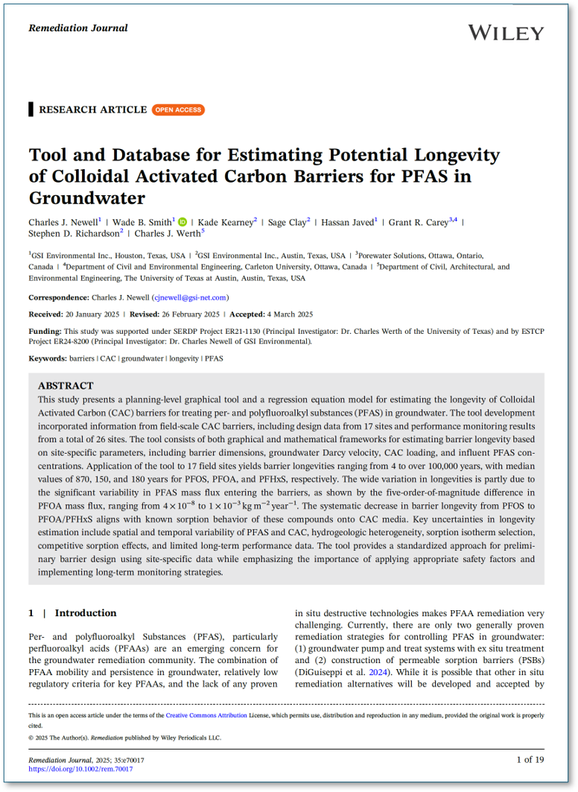

Download this open access paper here: <https://onlinelibrary.wiley.com/doi/10.1002/rem.70017>

{fig-alt="CAC" width=600px}

Newell, C. J., Smith, W. B., Kearney, K., Clay, S., Javed, H., Carey, G. R., Richardson, S. D., & Werth, C. J. (2025). Tool and Database for Estimating Potential Longevity of Colloidal Activated Carbon Barriers for PFAS in Groundwater. *Remediation Journal*, 35(3), e70017. <https://doi.org/10.1002/rem.70017>

