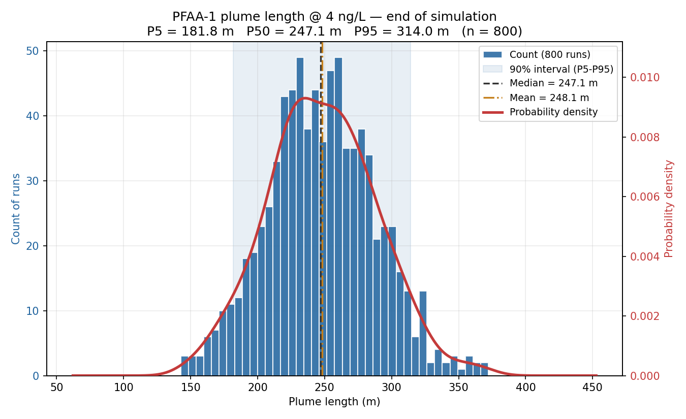

---
title: "Sensitivity / Uncertainty Analysis"
---

REMFluor-MD includes a **Monte Carlo sensitivity / uncertainty analysis**
that answers a question the calibration alone cannot: *given that the
site parameters are not known exactly, how uncertain are the model's
predictions?*  Instead of one "best" simulation, the model is run many
times (1,000 by default), each time with a different — but plausible —
combination of parameter values, and the spread of the results is
reported.

The analysis reuses the **Step 4 calibration table**: every parameter
whose "*Use this Parameter?*" button is selected is varied between its
*Lowest Likely Value* and *Highest Likely Value*, with the *Mid-Range
Value* as the most likely.  Parameters that are not selected stay fixed
at their current model values.

## How it works

1.  Select the parameters to vary in Step 4 and enter their Lowest /
    Mid-Range / Highest Likely Values (exactly as for a calibration).
2.  Choose the **sampling distribution** in the "*Distribution for
    Sensitivity Analysis*" box (see below).
3.  Click "***Run Sensitivity Analysis***".  Enter the number of runs,
    the plume boundary (target) concentration, an optional year for the
    plume-length calculation, and a random seed, then choose the folder
    where results should be saved.
4.  The model generates the parameter combinations by **Latin Hypercube
    Sampling** (a stratified sampling method that covers the whole
    parameter range evenly with far fewer runs than plain random
    sampling), runs the full REMFluor-MD solver for each combination,
    and collects two things from every run: the **model-to-data misfit**
    (RMSE / RMSLE against the Section 10 monitoring-well data) and the
    **plume length** at the target concentration.

## Inputs

| Parameter | Description |
|---|---|
| **Number of runs** | How many Monte Carlo simulations to perform.  Default 1,000.  More runs give smoother histograms and more stable percentile estimates but take proportionally longer — each run is a complete REMFluor-MD simulation.  A quick scoping pass with 50–100 runs is a good way to estimate total runtime before launching the full set. |
| **Plume boundary (target) concentration** | The concentration contour that defines the leading edge of the plume, entered in **ng/L** (e.g. 4 ng/L).  For each run, the plume length is the greatest distance from the source at which the simulated concentration still equals or exceeds this value.  The interface converts to the solver's internal units automatically. |
| **Year for plume length** | The calendar year at which plume length is measured.  Leave blank to use the end of the simulation. |
| **Random seed** | Controls the random number generator.  Re-running with the same seed and the same inputs reproduces the identical set of parameter combinations — useful for documentation and review. |

## Choosing a distribution

| Distribution | When to use it |
|---|---|
| **Triangular** (recommended default) | Values are drawn between the Lowest and Highest Likely Values, with the Mid-Range Value as the most likely (the peak).  Nothing outside the Low–High range is ever sampled.  A transparent, defensible choice when the plausible range of a parameter is reasonably well known — porosity, retardation factors, source multipliers. |
| **Log-normal** | A skewed distribution: most samples near the low end with a tail toward high values.  Appropriate for parameters that naturally vary over orders of magnitude — hydraulic conductivity is the classic example (field studies routinely find K to be log-normally distributed).  The Mid-Range Value is used as the **median**, the Lowest / Highest Likely Values as the **5th / 95th percentiles**, and samples are still limited to the Low–High range.  All three values must be greater than zero; rows that cannot support the mapping (e.g. Source Start Year) automatically fall back to Triangular and are reported. |

## Outputs

All results are written to a **sensitivity** folder created inside the
location you choose:

| File | Contents |
|---|---|
| **sensitivity_runs.csv** | One row per run: the sampled value of every varied parameter (one column each), the RMSE and RMSLE versus the Section 10 field data, the observed and simulated concentration at each monitoring well, the plume length for each simulated constituent, and a status flag (failed runs are marked and excluded from the statistics). |
| **plume_length_histograms.png** | One combined figure with a panel per simulated constituent (PFAA-1, PFAA-2, and Precursors in the Detailed model).  Each panel shows the histogram of plume lengths (left axis = count of runs) with a smoothed probability-density curve (right axis), the shaded 90% interval (P5–P95), and the median and mean. |
| **rmse_histogram.png** | The distribution of model-to-data misfit (RMSE) across all runs — one panel, since RMSE is a single metric for the whole model. |
| **sensitivity_log.txt** | Run settings (number of runs, target concentration, seed, distribution) and diagnostics for any failed runs. |

## Reading the results

The headline numbers are the **P5 / P50 / P95 plume lengths** printed on
the figure.  For example: *"at 4 ng/L the median predicted plume length
is 250 m, and there is a 90% probability it lies between 180 m and
315 m given the stated parameter uncertainty."*  A wide interval means
the checked parameters matter a great deal for this prediction; a narrow
one means the prediction is robust to them.

The **RMSE histogram** shows how much the quality of fit varies across
the sampled parameter space.  If many runs fit the field data almost as
well as the calibrated optimum, the calibration is *non-unique* — other
parameter combinations explain the data equally well — which is
precisely why reporting a plume-length *range* is more defensible than a
single number.

Because every run is recorded in **sensitivity_runs.csv** with one column
per parameter, the table can also be used for simple sensitivity
screening: sort or plot plume length against each parameter to see which
ones drive the spread.

## Example

A Simple-model PFOS site: check *Hydraulic Conductivity*, *Hydraulic
Gradient*, and the *PFAA-1 Source Concentration Multiplier* in Step 4;
select **Log-normal** (K spans orders of magnitude); run 1,000
simulations at a 4 ng/L boundary.  Result: **plume_length_histograms.png**
shows P5 = 182 m, P50 = 247 m, P95 = 314 m — the plume-length prediction
carries roughly ±30% uncertainty from these three parameters, and the
CSV shows the spread is driven mostly by the conductivity range.

 

<em>Example plume-length figure (illustrative data): histogram of runs (left axis), probability density (right axis), 90% interval band, median and mean.</em>
 

## Notes and guidance

-   **Run the calibration first.**  A sensible workflow is: calibrate,
    push the optimal values into the model, then run the sensitivity
    analysis with ranges centered on the calibrated values.
-   **Runtime** scales linearly with the number of runs: 1,000 runs take
    roughly 1,000 × the time of one Run Model.  Time a single run first.
-   **Failed runs** (solver errors, unphysical combinations) are flagged
    in the CSV and excluded from the histograms — a small number is
    normal at wide parameter ranges.
-   If the plume reaches the **edge of the model domain** at the target
    concentration, the reported plume length is limited by the model
    size (Section 2).  A histogram piled up against a single maximum
    value is the sign — enlarge the model X size and re-run.
