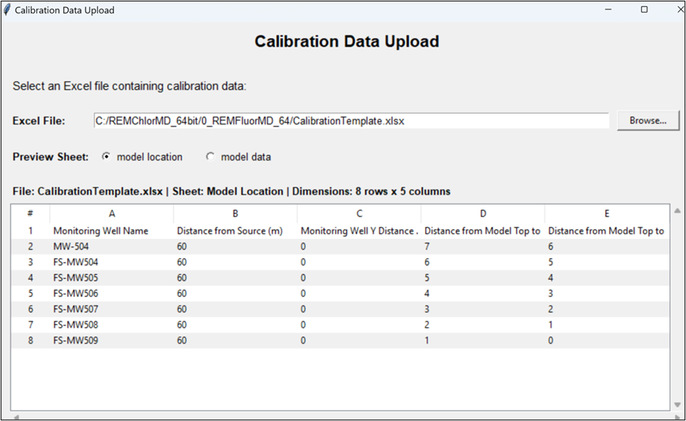
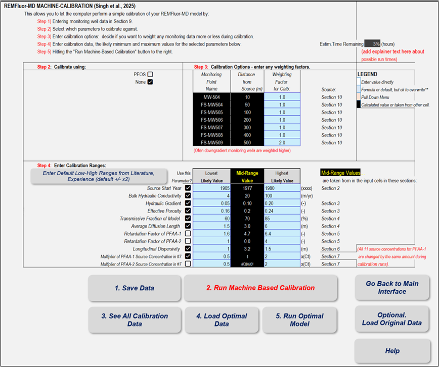
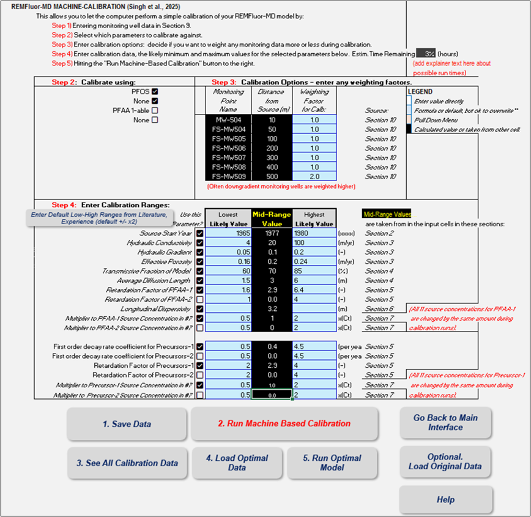

## Simple Version
Note: This version assumes all wells are located along the centerline from the source, simplifying the spatial arrangement.

## Sample Year

| **PARAMETER**     | **SAMPLE YEAR**                                                 |
| ----------------- | ------------------------------------------------------------------------- |
| Description       | The year sampled. You may only plug in one sample event for the Simple Version. |
| Units             | YEAR                                                                   |
| Typical Values    | Example: 2020                                                              |
| Source of Data    | Lab or field record                                                 |
| How to Enter Data | Enter the distance along centerline (e.g., 150)                           |

## Monitoring Well Name

| **PARAMETER**     | **MONITORING WELL NAME**                                                                    |
| ----------------- | ------------------------------------------------------------------------------------------- |
| Description       | Identifier of the monitoring well used in sampling. Must match the well name in records. |
| Units             | Text                                                                                        |
| Typical Values    | Example: MW-01                                                                              |
| Source of Data    | Monitoring well records                                                                     |
| How to Enter Data | Enter the well identifier (e.g., MW-01)                                                     |

## Concentration Measured

| **PARAMETER**     | **CONCENTRATION MEASURED**                                |
| ----------------- | --------------------------------------------------------- |
| Description       | Measured concentration of analyte in the sample.          |
| Units             | µg/L                                                       |
| Typical Values    | Example: 12.5                                              |
| Source of Data    | Lab analysis                                               |
| How to Enter Data | Enter measured concentration (e.g., 12.5)                 |

## Distance from Source

| **PARAMETER**     | **DISTANCE FROM SOURCE**                                                  |
| ----------------- | ------------------------------------------------------------------------- |
| Description       | Horizontal distance from the source along the centerline to the monitoring well. |
| Units             | ft (or m)                                                                   |
| Typical Values    | Example: 150                                                              |
| Source of Data    | Field survey / site map                                                   |
| How to Enter Data | Enter the distance along centerline (e.g., 150)                           |

## Detailed Version
**Note:** This version requires loading the Excel template (CalibrationTemplate.xlsx) that includes two sheets; model location and model data. Use the template formatting as a guide, or create your own Excel file following the same structure. This allows calibration using multiple wells and data points for refined model calibration.

    

## Monitoring Well Name

| **PARAMETER**     | **MONITORING WELL NAME**                                                                    |
| ----------------- | ------------------------------------------------------------------------------------------- |
| Description       | Identifier of the monitoring well used in sampling. Must match the well name in records. |
| Units             | Text                                                                                        |
| Typical Values    | Example: MW-01                                                                              |
| Source of Data    | Monitoring well records                                                                     |
| How to Enter Data | Enter the well identifier (e.g., MW-01)    |

## Distance from Source

| **PARAMETER**     | **DISTANCE FROM SOURCE**                                                  |
| ----------------- | ------------------------------------------------------------------------- |
| Description       | Horizontal distance from the source along the centerline to the monitoring well. |
| Units             | ft (or m)                                                                   |
| Typical Values    | Example: 150                                                              |
| Source of Data    | Field survey / site map                                                   |
| How to Enter Data | Enter the distance along centerline (e.g., 150)                                 |

## Monitoring Well Y Distance off Centerline

| **PARAMETER**     | **MONITORING WELL Y DISTANCE OFF CENTERLINE**          |
| ----------------- | ------------------------------------------------------ |
| Description       | Distance of the well from the centerline of the plume. |
| Units             | ft (or m)                                                |
| Typical Values    | Example: 5                                             |
| Source of Data    | Field survey / site map                                |
| How to Enter Data | Enter distance from the centerline of the plume        |

## Distance from Model Top to Screen Top

| **PARAMETER**     | **DISTANCE FROM MODEL TOP TO SCREEN TOP**                     |
| ----------------- | ------------------------------------------------------------- |
| Description       | Depth from model top to top of the well perforation interval. |
| Units             | ft (or m)                                                       |
| Typical Values    | Example: 2.5                                                  |
| Source of Data    | Field survey / site map                                       |
| How to Enter Data | Enter depth to top of perforation interval                    |

## Distance from Model Top to Screen Bottom

| **PARAMETER**     | **DISTANCE FROM MODEL TOP TO SCREEN BOTTOM**                     |
| ----------------- | ---------------------------------------------------------------- |
| Description       | Depth from model top to bottom of the well perforation interval. |
| Units             | ft (or m)                                                         |
| Typical Values    | Example: 5.0                                                     |
| Source of Data    | Field survey / site map                                          |
| How to Enter Data | Enter depth to bottom of perforation interval                    |

## Date to Sampling

| **PARAMETER**     | **DATE OF SAMPLING**                |
| ----------------- | ----------------------------------- |
| Description       | Date when the sample was collected. |
| Units             | Date                                |
| Typical Values    | Example: 03/15/2025                 |
| Source of Data    | Lab or field records                |
| How to Enter Data | Enter sampling date                 |

## Analyte

| **PARAMETER**     | **ANALYTE**                                  |
| ----------------- | -------------------------------------------- |
| Description       | Chemical or compound measured in the sample. |
| Units             | Text                                         |
| Typical Values    | Example: PFAS                                |
| Source of Data    | Lab analysis                                 |
| How to Enter Data | Enter analyte name                           |

## Concentration

| **PARAMETER**     | **CONCENTRATION**                                |
| ----------------- | ------------------------------------------------ |
| Description       | Measured concentration of analyte in the sample. |
| Units             | µg/L                                             |
| Typical Values    | Example: 12.5                                    |
| Source of Data    | Lab analysis                                     |
| How to Enter Data | Enter measured concentration                     |

## Units

| **PARAMETER**     | **UNITS**                               |
| ----------------- | --------------------------------------- |
| Description       | Units used for reporting concentration. |
| Units             | µg/L                                    |
| Typical Values    | µg/L is the only unit allowed at this time.                          |
| Source of Data    | Lab analysis                            |
| How to Enter Data | Enter units                             |

## Machine Calibration Input Screen for Simple Model:
    

## Machine Calibration Input Screen for Detailed Model:
    

