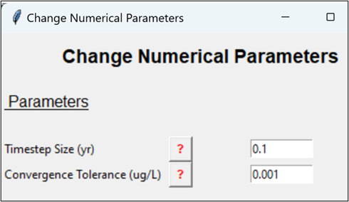
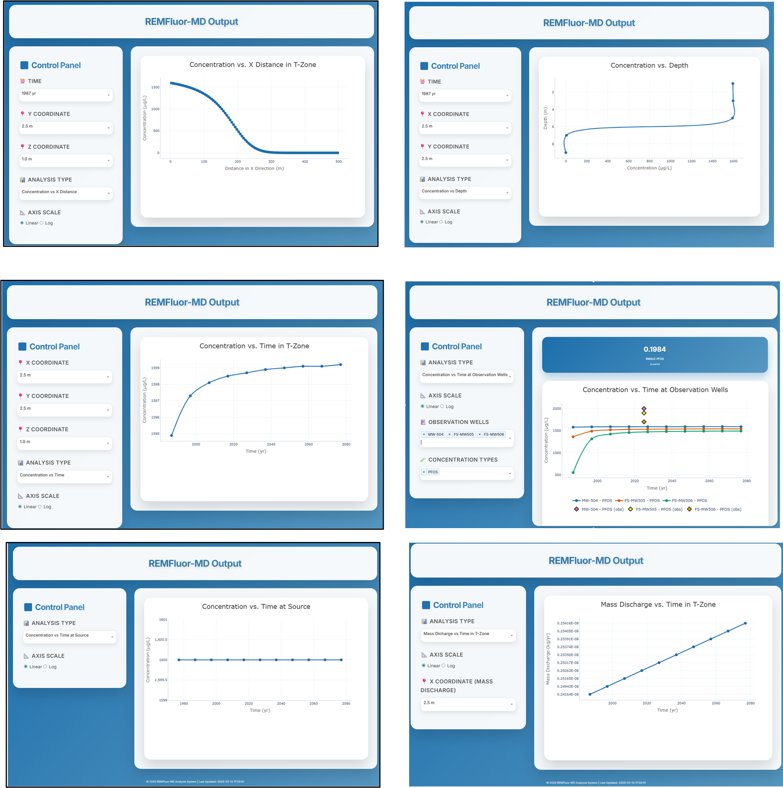

## Timestep Size

| **Parameter** | **TIMESTEP SIZE** |
| --- | --- |
| Description | Finite difference modeling parameter.     |
| Units | yr. |
| Typical Values | 0.01 to 1 yr. |
| Source of Data | A rule of thumb is to make sure the timestep size is smaller than: (X-Direction cell size) ÷ (groundwater Darcy velocity). TVD (default), upstream weight (second option) radio button. |
| How to Enter Data | Enter directly. |

## Convergence Tolerance

| **Parameter** | **CONVERGENCE TOLERANCE** |
| --- | --- |
| Description | Finite difference modeling parameter. Convergence tolerance during the Gauss Siedell iteration. See screen shot above for entry pop up box. |
| Units | ug/L. |
| Typical Values | Typically, 5 - 8 orders of magnitude lower than the initial source concentration. If this value is too small, the model may not converge. |
| Source of Data | Take the (**INITIAL SOURCE CONCENTRATION**) and divide by 10,000,000. |
| How to Enter Data | Enter directly. |

## See Results Every

| **Parameter** | **SEE RESULTS EVERY** |
| --- | --- |
| Description | Time interval over which to plot results. |
| Units | Number of time-steps. |
| How to Enter Data | Enter directly. |

## Input Screen Option Buttons

    

### Run Model

| **Parameter** | **RUN MODEL** |
| --- | --- |
| Description | Runs single model based on the parameters you have setup. |

### Run Model with Auto-Calibration

| **Parameter** | **RUN MODEL WITH AUTO-CALIBRATION** |
| --- | --- |
| Description | Navigates to the section where you need to setup the calibration parameters. |

### Authors

| **Parameter** | **AUTHORS** |
| --- | --- |
| Description | Lists name of the authors and their affiliations. |

### Load Data

| **Parameter** | **LOAD DATA** |
| --- | --- |
| Description | Loads data files saved in the specified folder through the Toolkit. DO NOT EDIT ANY TOOLKIT FILES. Editing files may cause the Toolkit to crash. |

### Save Data

| **Parameter** | **SAVE DATA** |
| --- | --- |
| Description | Saves all model data to a specified folder. DO NOT ADD ANY EXTENSIONS TO FILE NAME WHEN SAVING. |

### Clear All Data

| **Parameter** | **CLEAR ALL DATA** |
| --- | --- |
| Description | Clears ALL data in the Toolkit memory banks. Use this button to start a new project. |

### Paste Example

| **Parameter** | **PASTE EXAMPLE** |
| --- | --- |
| Description | Clears ALL data in the Toolkit memory banks and pastes an example dataset (simple or detailed). The example dataset used in REMFluor-MD is obtained from Tutorial 7 of the original REMFluor model. |

## REMFluor-MD Results

### Output Screens

    

### Run Model

### Concentration in T-Zone vs. Distance in X-Direction

| **Parameter** | **CONCENTRATION IN T-ZONE VS. DISTANCE IN X-DIRECTION** |
| --- | --- |
| Description | Concentration in the transmissive zone vs. distance in the x-direction. The user may scroll down the various "Time", "Y", and "Z" values in the boxes to the left of the chart to see the output at a particular time and location. Additionally, graphs for individual components may be turned on and off using the check boxes under "Select Component". The "Total" option displays the sum of all the individual components. The user may use the LogLinear button to see the results on a semi-log plot. |

### Concentration in T-Zone vs. Distance from Bottom of Model

| **Parameter** | **CONCENTRATION IN T-ZONE VS. DISTANCE FROM BOTTOM OF MODEL** |
| --- | --- |
| Description | Concentration in the transmissive zone vs. distance from the bottom of the model. The user may scroll down the various "Time", "X", and "Y" values in the boxes to the left of the chart to see the output at a particular time and location. Additionally, graphs for individual components may be turned on and off using the check boxes under "Select Component". The "Total" option displays the sum of all the individual components. Note that if only one "Z" cell is modeled, then the output will be in terms of a single point for each component rather than a line. The user may use the LogLinear button to see the results on a semi-log plot. |

### Concentration in T-Zone vs. Time

| **Parameter** | **CONCENTRATION IN T-ZONE VS. TIME** |
| --- | --- |
| Description | Concentration in the transmissive zone vs. the simulated time. The user may scroll down the various "X", "Y", and "Z" values in the boxes to the left of the chart to see the output at a particular location. Additionally, graphs for individual components may be turned on and off using the check boxes under "Select Component". The "Total" option displays the sum of all the individual components. The user may use the LogLinear button to see the results on a semi-log plot. |

### Concentration vs. Time in Observation Well

| **Parameter** | **CONCENTRATION VS. TIME IN OBSERVATION WELL** |
| --- | --- |
| Description | Concentration vs. the simulated time in an observation well specified on the input screen. Graphs for individual components may be turned on and off using the check boxes under "Select Component". The "Total" option displays the sum of all the individual components. The user may use the LogLinear button to see the results on a semi-log plot. |

### Mass Discharge vs. Time in T-Zone

| **Parameter** | **MASS DISCHARGE VS. TIME IN T-ZONE** |
| --- | --- |
| Description | Mass discharge vs. time in the transmissive zone. The user may scroll down the various "X" values in the box to the left of the chart to see the output at a particular location. Additionally, graphs for individual components may be turned on and off using the check boxes under "Select Component". The "Total" option displays the sum of all the individual components. The user may use the LogLinear button to see the results on a semi-log plot. |

### Mass vs. Time in T-Zone

| **Parameter** | **MASS VS. TIME IN T-ZONE** |
| --- | --- |
| Description | Mass vs. time in the transmissive zone. Graphs for individual components may be turned on and off using the check boxes under "Select Component". The "Total" option displays the sum of all the individual components. The user may use the LogLinear button to see the results on a semi-log plot. |

### Mass vs. Time in Low-K Zone

| **Parameter** | **MASS VS. TIME IN LOW-K ZONE** |
| --- | --- |
| Description | Mass vs. time in the low-k zone. Graphs for individual components may be turned on and off using the check boxes under "Select Component". The "Total" option displays the sum of all the individual components. The user may use the LogLinear button to see the results on a semi-log plot. |

### Calculate T-Zone Mass Discharge

| **Parameter** | **CALCULATE T-ZONE MASS DISCHARGE** |
| --- | --- |
| Description | The user may calculate the mass discharge at any X and Time by entering the desired inputs in the white cells to the right of the chart. Note that because the Toolkit is a grid-based model, the user provided inputs are rounded down to the closest X and Timestep in the model. |

### Calculate Mass

| **Parameter** | **CALCULATE MASS** |
| --- | --- |
| Description | The user may calculate the mass at any Time in both the low-k and transmissive zones by entering the desired input in the white cell to the right of the chart. Note that because the Toolkit is a grid-based model, the user provided input is rounded down to the closest Timestep in the model. |

## REMFluor-MD Output Files

| **Parameter** | **REMFLUOR-MD OUTPUT FILES** |
| --- | --- |
| Description | REMFluor-MD outputs text files created by the FORTRAN model code may be viewed externally. The files are generated in the same folder as the REMFluor-MD software. If a simulation is saved by the User, all output files associated with that simulation are moved to the location selected by the User. Output files include: • <b>Discharge.out</b> – mass discharge output. Data is output as: &emsp;&emsp;○ Time (yrs), X-direction location (m), &emsp;&emsp;○ Mass discharge for component 1 (kg/yr), &emsp;&emsp;○ Mass discharge for component 2 (kg/yr), &emsp;&emsp;○ Mass discharge for component 3 (kg/yr), and &emsp;&emsp;○ Mass discharge for component 4 (kg/yr). • <b>Obs_well#.out</b> – observation well output for well number # (1-7). Data is output as: &emsp;&emsp;○ Time (yrs), &emsp;&emsp;○ Concentration of component 1 (g/L), &emsp;&emsp;○ Concentration of component 2 (g/L), &emsp;&emsp;○ Concentration of component 3 (g/L), and &emsp;&emsp;○ Concentration of component 4 (g/L). • <b>Plume_mass.out</b> – plume mass output in both the low-k and transmissive zones. Data is output as: &emsp;&emsp;○ Time (yrs), &emsp;&emsp;○ Mass of component 1 in the low-k zone (kg), &emsp;&emsp;○ Mass of component 1 in the transmissive zone (kg), &emsp;&emsp;○ Mass of component 2 in the low-k zone (kg), &emsp;&emsp;○ Mass of component 2 in the transmissive zone (kg), &emsp;&emsp;○ Mass of component 3 in the low-k zone (kg), &emsp;&emsp;○ Mass of component 3 in the transmissive zone (kg), &emsp;&emsp;○ Mass of component 4 in the low-k zone (kg), &emsp;&emsp;○ Mass of component 4 in the transmissive zone (kg). • <b>REMFluor-MD.out</b> – concentration in the transmissive zone. Data is output as: &emsp;&emsp;○ Time (yrs), &emsp;&emsp;○ X-direction location (m), &emsp;&emsp;○ Y-direction location (m), &emsp;&emsp;○ Z-direction location (m), &emsp;&emsp;○ Concentration for component 1 (g/L), &emsp;&emsp;○ Concentration for component 2 (g/L), &emsp;&emsp;○ Concentration for component 3 (g/L), &emsp;&emsp;○ Concentration for component 4 (g/L). |

