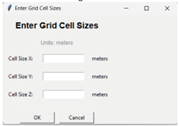
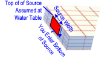

**See _Appendix 2.1 REMFluor-MD Cell Size Configuration_ for more info**.

## Model Size in Direction of Groundwater Flow (X Direction) 

| **Parameter** | **Model Size in Direction of Groundwater Flow (X Direction)** |
| --- | --- |
| **Units** | ft (or m). |
| Description | Modeling parameter representing the model domain in the x-direction. In most cases the model extends to the farthest monitoring point downgradient of the source, or to a potential receptors such as stream or water well. |
| Typical Values | 1 - 10,000 ft (0.3 - 3000 m). |
| How to Enter Data | Enter directly. |

## Model Half-Width Perpendicular to Flow (Y Direction) 

| **Parameter** | **Model Half-Width Perpendicular to Flow (Y Direction)** |
| --- | --- |
| **Units** | ft (or m). |
| Description | Modeling parameter representing the model domain in the y-direction.  Note that the model is symmetrical around y=0, so this is the halfwidth. |
| Typical Values | 10 - 1000 ft (3 - 300 m). |
| Source of Data | Plume maps. |
| How to Enter Data | Enter directly. |

## Model Depth Below Water Table (Z Direction)

| **Parameter** | **Model Depth Below Water Table (Z Direction)** |
| --- | --- |
| **Units** | ft (or m). |
| Description | Modeling parameter representing the model domain in the z-direction. |
| Typical Values | 3 - 60 ft (1 - 20 m). |
| Source of Data | Plume cross-sections. |
| How to Enter Data | Enter directly. |

## Finite Difference Cell Size

| **Parameter** | **Finite Difference Cell Size** |
|---|---|
| **Units** | ft (or m). |
| **Description** | The default finite difference grid cells in the X, Y, and Z directions are defined:    &bull; Δx = 5 m (or 15 ft) (depending on which units are selected)   &nbsp;&nbsp; &nbsp;&nbsp;&nbsp;&nbsp;&bull; \# of cells in X-direction = Model Length ÷ 5 meters (or 15 ft)   &bull; \#y cells = 5 cells in the Y-direction (model is symmetric about y=0, so this gives 5 cells in +y direction)   &bull; \#z cells = 10 cells in the Z-direction    The minimum cell size value should be greater than zero.    You can override these default values by clicking on this button in the interface and then enter your own DeltaX, DeltaY, and DeltaZ cell sizes.         In general, the recommended maximum number of cells is shown below:    &bull; Maximum number of cells in the X-direction is 2,000 cells. It is recommended that the number of cells in this direction be kept below 200.   &bull; Maximum number of cells in the Y-direction on either side of Y=0 is 50 cells. It is recommended that the number of cells in this direction be kept below 20.   &bull; Maximum number of cells in the Z-direction is 50 cells. It is recommended that the number of cells in this direction be kept below 20.   <b> While the models can be built with up to 80,000 cells, the maximum number of cell total number of cells (X\*Y\*Z) should be kept below about 20,000 for efficient model performance.</b> |
| **Typical Values** | 1 – 30 ft (0.3 – 10 m) |
| **How to Enter Data** | Enter directly |

## Source Width

| **Parameter** | **Source Width** |
| --- | --- |
| **Units** | ft (or m). |
| **Description** | Width of source area perpendicular to groundwater flow. **Note that because REMFluor-MD is a grid-based model, the Toolkit will round the source width to the nearest model cell. The source width should be at least two (2) times the cell width in the y-direction for best results.**    In REMFluor-MD, the groundwater source term is represented as a <b>vertical planar source</b> that extends downward from the source area through the saturated zone. This source plane is assigned a <b>uniform concentration</b> for each modeled constituent. As a result, the model requires a <b>single representative source concentration</b> that reflects average conditions along the vertical plane supplying mass to downgradient groundwater flow. Low-concentration fringe areas of the plume are not explicitly modeled; instead, the source term is intended to represent the <b>high-concentration core of the plume</b>, which dominates mass loading to the aquifer.  One practical approach for selecting the representative source concentration is to evaluate **plume maps with concentration contours** and identify a modeled source-plane width that appears to capture **approximately 75% or more of the high-concentration zone** leaving the source area. Once this effective source width is defined, concentrations at the lateral boundaries of the modeled plane can be estimated from plume contours, and these values can be combined with the maximum observed concentration in the source area to approximate the average concentration along the vertical plane.  See ***[Appendix 7.1 Source Concentrations]*** regarding where to locate the vertical plane source within a source zone. |
| **Typical Values** | 10 -- 1,000 ft (3 -- 300 m). |
| **Source Of Data** | Estimated using: 1) historical knowledge of site; 2) estimates of historical DNAPL location, and/or 3) plume maps. |
| **How To Enter Data** | Enter directly. **Note that because REMFluor-MD is a grid-based model, the Toolkit will round the source width to the nearest model cell.** |

## Thickness of Source Below Water Table

| **Parameter** | **Thickness of Source Below Water Table** |
|---|---|
| **Units** | ft (or m) |
| **Description** | Because of the nature of most PFAS sources (vadose zone soils contribution to the groundwater source term, no DNAPL-type behavior), REMFluor-MD assumes the top of the source is the top of the model domain. You need to enter the bottom of the source in units of feet or meters below the top of the model domain.   |
| **Source Of Data** | Estimated using data from monitoring points within the source zone. |
| **How To Enter Data** | Enter directly. <b>Note that because REMFluor-MD is a grid-based model, the interface will round the source thickness to the nearest model cell.</b> |

## Starting Year of Simulation

| **Parameter** | **starting year of simulation** |
|---|---|
| **Units** | Year (YYYY). |
| **Description** |  Year PFAS loading to groundwater started. Some general rules are: &bull; This is most often determined from site historical records, such as "fire training activities at FTA-1 started in 1972." &bull; As a first-cut approximation, it is often assumed the groundwater impact occurred relatively quickly (the same year that fire training started). &bull; A more detailed approach is to use a vadose zone model such as PFAS-leach to estimate the number of years travel time it takes for the PFAS in shallow surface soils to reach groundwater. For example, if "fire training activities at FTA-1 started in 1972" and the vadose zone model suggested a 5-year travel time, then enter 1977 as the year PFAS loading to groundwater started. &bull; For most PFAS, sources started sometime after the late-1960s when PFAS were first manufactured at scale. &bull; The number of new sources of PFOS, PFOA likely went down by 2010s due to the decision to stop production of long-chain PFAAs in 2000. &bull; Press the button below for general guidelines that are sometimes useful (but sometimes not) on how to estimate when the source first reached groundwater.    See *[Appendix 2.2 Estimating the Source Start Time]* for more info. |
| **How To Enter Data** | Enter directly. |

## Ending Year of Simulation

| **Parameter** | **Ending year of simulation** |
|---|---|
| **Units** | Year (YYYY) |
| **Description** | Year to end the modeling simulation. For example, this could be values such as: 1) 30 years from now, 2) 100 years from now, 3) some time to see the plume extend to a downgradient receptor. |
| **How To Enter Data** | Enter directly. |

