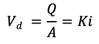
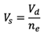
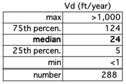
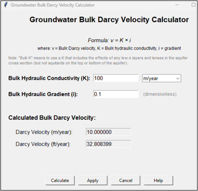

**See _Appendix 3.1 Groundwater Darcy Velocity_ for more info**.

## Groundwater Darcy Velocity (Vd)

| **Parameter** | **Darcy Velocity (Bulk Specific Discharge) (V~d~)** |
|---|---|
| **Units** | ft/yr (or m/yr). |
| **Description** | Darcy velocity (also called specific discharge, Darcy flux, or volumetric flux) represents the volumetric flow rate of groundwater per unit total cross-sectional area of the porous medium. The total area includes both solids and pores, as well as both transmissive and low-permeability zones. It is defined:     V~d~ = Darcy velocity   Q = volumetric discharge   A = total cross-sectional area   K = hydraulic conductivity   i = hydraulic gradient (dh/dx)   *Bulk Darcy Velocity in REMFluor-MD*  In REMFluor-MD, the required input is the **bulk Darcy velocity**, meaning that the hydraulic conductivity (K) must represent the bulk conductivity averaged over the entire cross-section (including transmissive and low-permeability materials). Examples:  • Homogeneous aquifer: If the aquifer consists of uniform sand (no low-permeability layers or lenses), use the hydraulic conductivity of the transmissive material (e.g., sand or gravel).  • Heterogeneous aquifer --- test data representative of full section: If slug test or pumping test results reflect the combined influence of transmissive and low-permeability materials, use that measured K directly to calculate Darcy velocity.  • Heterogeneous aquifer --- test data representative of only transmissive zones: If hydraulic testing reflects only the transmissive materials and does not account for low-permeability layers or lenses, then the transmissive-zone K must be multiplied by the volumetric fraction of transmissive material to estimate a bulk hydraulic conductivity before calculating Darcy velocity.  See Appendix 3.1 for further discussion of bulk Darcy velocity.  <b>Important Distinction</b>    In contrast, **groundwater seepage velocity (V~s~)**, also called average linear velocity, pore-water velocity, or interstitial velocity, represents the actual velocity of water moving through the pore spaces and is higher than the Darcy velocity because flow occurs only through the connected pores. It is calculated using the expression to the right where n~e~ is the effective porosity. **Do not enter** the seepage velocity into REMFluor-MD; this parameter is calculated internally.  See *[Appendix 3.1 Groundwater Darcy Velocity]* for more information. |
| **Typical Values** | The HGDB Hydrogeologic Database (Newell et al., 1996) was used to calculate the groundwater Darcy velocity at 288 sites. Summary statistics are shown below:    A calculator has been provided to assist you to calculate the groundwater Darcy velocity for hydraulic conductivity (K) of different units and inputted hydraulic gradient (i) values.       |
| **Source Of Data** | &bull; For hydraulic conductivity (K): Aquifer tests (e.g., slug tests or pumping tests), if available, or by estimates based on literature values of the predominate soil type in the transmissive zone.  &bull; For hydraulic gradient (i or dh/dx): Calculated by constructing potentiometric surface maps using static water level data from monitoring wells and estimating the slope of the potentiometric surface.   |
| **How To Enter Data** | 1\) Enter the Darcy velocity directly, or 2\) Click the "Groundwater Velocity Calculator" to calculate the Darcy velocity based on input hydraulic conductivity (K) and hydraulic gradient (i). |

## Transmissive Zone Effective Porosity

| **Parameter** | **Transmissive Zone Effective Porosity** |
|---|---|
| **Units** | Unitless. |
| **Description** | Dimensionless ratio of the volume of voids to the bulk volume of the surface soil column matrix. Note that *total porosity* is the ratio of all voids (including non-connected voids) to the bulk volume of the aquifer matrix. Differences between total and effective porosity reflect lithologic controls on pore structure. In unconsolidated sediments coarser than silt size, effective porosity can be less than total porosity by 2-5% (e.g., 0.28 vs. 0.30) (Smith and Wheatcraft, 1993). Note this porosity estimate does not include the effects of low-k layers and lenses, just the transmissive geologic media. |
| **Typical Values** | Toolkit default values provided are averages of the ranges below.  Gravel: 0.10 - 0.35  Coarse Sand: 0.20 - 0.35 Fine Sand: 0.10 - 0.30  Medium Sand: 0.15 - 0.30 |
| **Source Of Data** | Typically estimated. Occasionally obtained through physical property testing of site soil samples. One commonly used value for silts and sands is 0.25. The ASTM RBCA Standard (ASTM, 1995) includes a default value of 0.38 (to be used primarily for unconsolidated deposits). A collection of default values is presented in the Geologic Parameter Database included in this manual. |
| **How To Enter Data** | Enter directly. (Note that if the transmissive zone description is selected from the drop-down list, the Toolkit provides a default value for the parameter.) |

