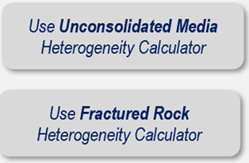
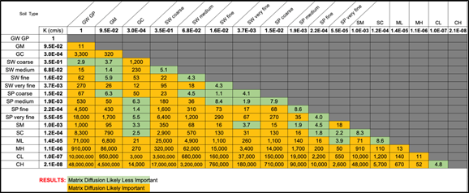
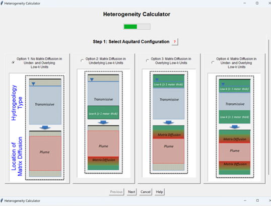
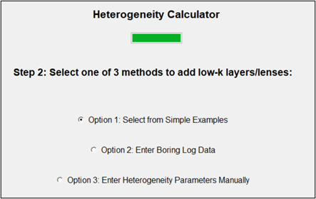
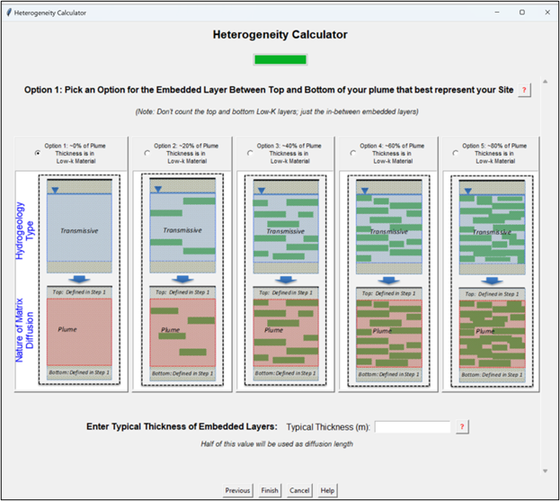
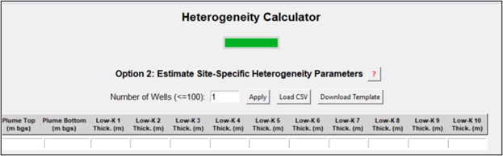
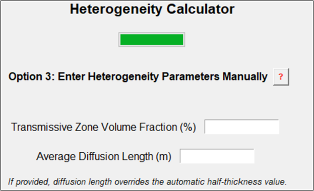
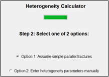
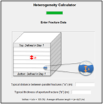
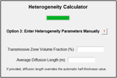

---
title: "Step 4: Hydrogeologic Setting and Matrix Diffusion"
---

See these Appendices for more information:

-   ***_Appendix 4.1 Using the Heterogeneity Calculator_***

-   ***_Appendix 4.2 What is a Low-k Geologic Unit_***

REMFluor-MD can account for matrix diffusion into and out of aquitards
overlying or underlying the transmissive zone. Additionally, REMFluor-MD
can represent embedded subsurface heterogeneity within the transmissive
zone based on three geologic factors that are entered by the user or
calculated by the model:

1.  **Volume fraction** of the transmissive zone material (i.e.,
    fraction of the plume zone containing transmissive soils),

2.  **Characteristic maximum matrix diffusion length** (i.e., how far,
    on average, constituents can penetrate into low-k lenses or layers),
    and

3.  **Surface area of the transmissive/low-k interfaces** where
    constituent mass has moved or will move between transmissive media
    (such as sand/gravel or fractures) and low-k soils (such as clay
    lenses and/or clay layers or the matrix in fractured systems) due to
    matrix diffusion. This is the interfacial surface area in each
    gridblock that contains embedded low-K zones. For this reason, its
    magnitude depends on the size of the gridblock. This parameter is
    normally calculated internally by the model using the gridblock
    size, the high-K volume fraction, and the characteristic length.

Select either the "*Use Unconsolidated Media Heterogeneity Calculator*"
button or the "*Use Fractured Rock Heterogeneity Calculator*" button in
the interface to start the heterogeneity data entry process. See
***_Appendix 4.1 Using the Heterogeneity Calculator_*** for
more information.

  

  

Choose if you are modeling an unconsolidated aquifer or a fractured rock
aquifer. You will be directed to specific screens for each of the two
options.

***Unconsolidated Aquifers***

*How is a "Low-Permeability (Low-k)" Geologic Media Defined?*  In
general, a low-k unit is a saturated soil type that has a hydraulic
conductivity that is 10x or more less permeable than the saturated soil
type in the transmissive zone. For example, a **clay aquitard** in
contact with a sandy aquifer or a **clay layer** embedded in a sandy
aquifer would be classified as "Low-k" units in the REMFluor-MD
framework. A triangle chart of all of the different combinations of
Unified Soil Classification System (USCS), reproduced below, can be seen
by selecting the "*What is a "Low-k" Geologic Unit*" button in the
interface. See ***_Appendix 4.2 What is a Low-k Unit_*** for
more information.

  

  

Hydraulic conductivity (K) ratios. K ratios are shown for every USCS
soil pair.\
Orange indicates matrix diffusion is likely to be a factor in
groundwater transport and therefore represents a transmissive/low-k interface using a 10X ratio
metric.
 

  

## Unconsolidated Aquifers: Heterogeneity Calculator

### Unconsolidated: Step 1 -- Upper and Lower Aquitards

| **Parameter** | **Unconsolidated: Step 1 -- Upper and Lower Aquitards** |
|---|---|
| **Description** | Determination of the presence of matrix diffusion in the upper and lower aquitards.  Select one of four options: &bull; No Matrix Diffusion into the upper and lower boundaries of the model. &bull; Matrix Diffusion in Underlying Low-k Unit -- assumes an underlying low-k unit (≥ 3 ft (1 m) thick) is present at the site, [but not] a top overlying low-k unit. &bull; Matrix Diffusion in Overlying Low-k Unit -- assumes an overlying low-k unit (≥ 3 ft (1 m) thick) is present at the site, [but not] a bottom underlying low-k unit. &bull; Matrix Diffusion in [both] Under-and Overlying Low-k Units -- assumes both an underlying (≥ 3 ft (1 m) thick) and an overlying (≥ 3 ft (1 m) thick) low-k unit are present at the site.    See these Appendices for more information: &bull; ***_Appendix 4.1 Using the Heterogeneity Calculator_*** &bull; ***_Appendix 4.2 What is a Low-k Geologic Unit_*** |
| **Source Of Data** | Geologic boring logs, cone penetrometer data, direct push hydraulic testing data, geologic cross sections, sequence stratigraphy information, geophysics, or other hydrogeologic data. |
| **How To Enter Data** | Select radio button and follow prompts. |

### Step 2 – Embedded Conditions: Simple Method

| **Parameter** | **Unconsolidated: Step 2 -- Embedded Conditions** |
|---|---|
| **Description** | Entry of additional data regarding the presence and prevalence of embedded low-k layers/lenses in the plume zone.  Three options are provided for estimating heterogeneity: &bull; Option 1: A simple method with five options for selecting site conditions, &bull; Option 2: Based on site-specific boring log data, or &bull; Option 3: Direct entry of the Transmissive Zone Volume Fraction, Average Diffusion Length, and Surface Area of Low-k Interfaces.     |
| **How To Enter Data** | Select radio button and follow prompts. |

### Option 1 Unconsolidated -- Embedded Conditions: Simple Method

| **Parameter** | **Option 1 Unconsolidated -- Embedded Conditions: Simple Method** |
|---|---|
| **Description** | Entry of additional data regarding the presence and prevalence of embedded low-k layers/lenses in the plume zone. <b>Note that the top and bottom low-k layers identified in Step 1 should not be counted here, just the embedded low-k layers/lenses.</b>  Select one of the following five options: &bull; 0% of Plume Thickness is in the Low-k Material - assumes no low-k units are present within the plume. If this option is selected, there will be no matrix diffusion inside the plume zone, although there still could be matrix diffusion with overlying or underlying aquitards (from the previous step). &bull; \~20% of Plume Thickness is in the Low-k Material. Assumes one or more low-k units collectively representing \~20% of the plume thickness are present at the site. &bull; \~40% of Plume Thickness is in the Low-k Material. Assumes one or more low-k units collectively representing \~40% of the plume thickness are present at the site. &bull; \~60% of Plume Thickness is in the Low-k Material. Assumes one or more low-k units collectively representing \~60% of the plume thickness are present at the site. &bull; \~80% of Plume Thickness is in the Low-k Material. Assumes one or more low-k units collectively representing \~80% of the plume thickness are present at the site.    These data are used by REMFluor-MD to calculate the Transmissive Zone Volume Fraction, Average Diffusion Length, and Surface Area of Low-k Interfaces. |
| **Source Of Data** | Geologic boring logs, cone penetrometer data, direct push hydraulic testing data, geologic cross sections, sequence stratigraphy information, geophysics, or other hydrogeologic data. |
| **How To Enter Data** | Select radio button and follow prompts. |

### Option 1 Unconsolidated -- Embedded Thickness: Simple Method

| **Parameter** | **Option 1 Unconsolidated – Embedded Thickness: Simple Method** |
|---|---|
| **Description** | If one of the options from the Simple Method is selected in Step 2, you must enter a typical thickness of any embedded low-k units. Entry of the typical vertical thickness of embedded low-k lenses/layers in the plume. <b>Note that the top and bottom low-k layers identified in Step 1 should not be counted here, just the embedded layers/lenses.</b> |
| **Source Of Data** | Geologic boring logs, cone penetrometer data, direct push hydraulic testing data, geologic cross sections, sequence stratigraphy information, geophysics, or other hydrogeologic data. |
| **How To Enter Data** | Select radio button and follow prompts. |

### Option 2 Unconsolidated -- Embedded Conditions: Site-Specific Boring Logs

| **Parameter** | **Option 2 Unconsolidated -- Embedded Conditions: Site-Specific Boring Logs** |
|---|---|
| **Description** | If the Use Site-Specific Boring Log Data option is selected in Step 2, the Transmissive Zone Volume Fraction, Average Diffusion Length, and Surface Area of Low-k Interfaces can be estimated based on site-specific geologic data, most commonly the data in geologic logs.  To calculate Site-Specific heterogeneity parameters, find boring logs that are in different parts of the plume. 1. Enter the number of boring logs to be used. Data from up to 100 boring logs can be used. 2. On each boring log, determine the top and bottom of the plume. Don't count the top and bottom low-k layers. Enter the plume top and bottom for each well into the Toolkit. 3. For each well, enter the thickness of each low-k unit within the plume interval (note that the top and bottom low-k layers identified above should not be counted here). Thicknesses for up to 10 low-k units can be entered.    The REMFluor-MD interface then processes these data to calculate site-specific values for the three key REMFluor-MD heterogeneity parameters used for unconsolidated media sites: 1) Transmissive Zone Volume Fraction, 2) Average Diffusion Length, and 3) Surface Area of Low-k Interfaces. |
| **Source Of Data** | Geologic boring logs, cone penetrometer data, direct push hydraulic testing data, geologic cross sections, sequence stratigraphy information, geophysics, or other hydrogeologic data. |
| **How To Enter Data** | Enter directly. |

### Option 3 Unconsolidated -- Embedded Conditions: Manual Entry

| **Parameter** | **Option 3 Uconsolidated -- Embedded Conditions: Manual Entry** |
|---|---|
| **Description** | If the Manual Entry option is selected in Step 2, enter values for the three key REMFluor-MD heterogeneity parameters used for unconsolidated media sites: 1) Transmissive Zone Volume Fraction, 2) Average Diffusion Length, and 3) Surface Area of Low-k Interfaces in the gridlocks. **Note that the top and bottom low-k layers identified in Step 1 should not be counted here, just the embedded low-k layers/lenses.**     |
| **Source Of Data** | Geologic boring logs, cone penetrometer data, direct push hydraulic testing data, geologic cross sections, sequence stratigraphy information, geophysics, or other hydrogeologic data. |
| **How To Enter Data** | Select radio button and follow prompts. |

## Unconsolidated Aquifers - Low-K Media Details

### Low-k Zone Unconsolidated Soil Type

| **Parameter** | **Low-k Zone Unconsolidated Soil Type** |
|---|---|
| **Description** | Description of the predominate low-k zone soil (geologic media) type. Your selection will be used in a look-up table to provide an estimate of the low-k unit permeability, which will then be used to estimate the Low-k Zone Total Porosity and the Low-k Zone Pore Tortuosity for REMFluor-MD's diffusion calculations.  Toolkit default values are the geometric means of the ranges below:  <u><em>Hydraulic Conductivity (K)</em></u> Clay: 1x10-11 - 4.7x10-9 m/s (Geomean used: 2.2 x10-10 m/s) Silt: 1x10-9 - 2x10-5 m/s (Geomean used: 1.4 x10-7 m/s) (Newell *et al.*, 1996; Freeze and Cherry, 1979; Domenico and Schwartz, 1990.) |
| **How To Enter Data** | Choose from drop-down list or enter directly. |

### Low K Zone Total Porosity

| **Parameter** | **Low-K Zone Total Porosity** |
|---|---|
| **Units** | Unitless. |
| **Description** | Dimensionless ratio of the volume of voids to the bulk volume of the surface soil column matrix, but excluding secondary porosity (fractures, solution cavities, etc.). *Total porosity* is the ratio of all voids (including non-connected voids) to the bulk volume of the aquifer matrix. Effective porosity and any porosity data with secondary porosity information should not be used. |
| **Typical Values** | Toolkit default values provided are averages of the ranges below: Clay: 0.34 - 0.60 (Payne *et al.*, 2008, Table 2.3.) Silt: 0.34 - 0.61 (Payne *et al.*, 2008, Table 2.3.) |
| **Source Of Data** | Typically estimated. Occasionally obtained through physical property testing of site soil samples. |
| **How To Enter Data** | Use the default values based on the Low-k Zone Media type or enter directly. |

### Low-k Zone Tortuosity

| **Parameter** | **Low-k Zone Tortuosity** |
|---|---|
| **Units** | Unitless. |
| **Description** | Tortuosity (τ) represents molecular diffusion in a porous medium. For unconsolidated systems, estimations of τ can be obtained using the relationship: $\tau = {0.77K}^{0.040}$ (1)Where *K* is the hydraulic conductivity in m/s from the value entered above (Carey *et al.*, 2016). In the Toolkit, Equation 1 is used to calculate the default tortuosity for all unconsolidated materials. |
| **How To Enter Data** | 1)  Enter directly, or 2)  Calculate by selecting the "Default&nbsp;&nbsp;&nbsp;&nbsp;Tortuosity'" button.  (Note that if the zone description is selected from the drop-down list, the Toolkit provides a default value for the parameter.) |

## Fractured Rock Aquifers

*Low-k Media in Fractured Rock Aquifers:* In fractured rock systems,
fluid flow occurs primarily through fractures, while the surrounding
geologic matrix (e.g., limestone, dolomite, granite) typically has lower
hydraulic conductivity.

### Fractured Rock/Media: Step 1 -- Upper and Lower Aquitards  

| **Parameter** | **Fractured Rock/Media: Step 1 -- Upper and Lower Aquitards** |
|---|---|
| **Description** | Determination of the presence of matrix diffusion in the unfractured upper and lower aquitards.  Select one of four options: &bull; No Matrix Diffusion into the upper and lower boundaries of the model. This option is appropriate if the fracture spacing is large. &bull; Matrix Diffusion in Unfractured Underlying Low-k Unit -- assumes an underlying low-k unit (≥ 3 ft (1 m) thick) is present at the site, [but not] a top overlying low-k unit. &bull; Matrix Diffusion in Unfractured Overlying Low-k Unit -- assumes an overlying low-k unit (≥ 3 ft (1 m) thick) is present at the site, [but not] a bottom underlying low-k unit. &bull; Matrix Diffusion in [both] Under- and Overlying Low-k Units -- assumes both an underlying (≥ 3 ft (1 m) thick) and an overlying (≥ 3 ft (1 m) thick) low-k unit are present at the site. |
| **Source Of Data** | Fractured rock: geologic boring logs, geologic cross sections, geophysics, or other hydrogeologic data. Fractured clay: cone penetrometer data, direct push hydraulic testing data, or other data may be useful. |
| **How To Enter Data** | Select radio button and follow prompts. |

***  
### Fractured Rock/Media: Step 2 -- Typical distance between Parallel Fractures

| **Parameter** | **Fractured Rock/Media: Step 2 -- Typical distance between Parallel Fractures** |
|---|---|
| **Description** | Typical distance between parallel fractures (they can be in the X-, Y-, or any direction). REMFluor-MD is not able to model fractures in two directions at the same location, but will provide a reasonable simulation of the style of matrix diffusion in a fractured media.     |
| **Typical Values** | 1 to 30 ft (0.3 to 10 m). |
| **Source Of Data** | Fractured rock/media site characterization tools (borehole flowmeters, borehole geophysics, geologic logs, evaluation of surface expression of fractures, geophysics, borehole video, etc.). |
| **How To Enter Data** | Enter directly. |

### Fractured Rock/Media: Step 2 – Typical Thickness of Aperture/Fracture

| **Parameter** | **Fractured Rock/Media: Step 2 – Typical Thickness of Aperture/Fracture** |
|---|---|
| **Description** | Typical thickness of the aperture/fracture best representative of the site being modeled. |
| **Typical Values** | 3×10-6 to 0.3 ft (1×10-6 to 0.1 m) |
| **Source Of Data** | Fractured rock/media site characterization tools (borehole flowmeters, borehole geophysics, geologic logs, evaluation of surface expression of fractures, geophysics, borehole video, etc.) |
| **How To Enter Data** | Enter directly. |

## Fractured Rock Aquifers - Low-K Media Details

### Fractured Rock Setting

| **Parameter** | **Fractured Rock Setting** |
|---|---|
| **Description** | Description of the predominate fractured rock/media matrix (geologic media) type. Your selection will be used in a look-up table to provide an estimate of the low-k unit permeability, which will then be used to estimate the Low-k Zone Total Porosity and the Low-k Zone Pore Tortuosity for REMFluor-MD's diffusion calculations.  Toolkit default values for K are the geometric means of the ranges below: *[Horizontal K]* Fractured Clay: 1x10-7 - 4.7x10-9 m/s (Geomean: 2.2 x10-10 m/s) Fractured Sandstone: 1x10-8 - 1x10-4 m/s (Geomean: 2.2 x10-10 m/s) Granite: 3x10-6 - 5.2x10-5 m/s (Geomean: 1.3 x10-5 m/s) Limestone/Dolomite: 1x10-9 - 6x10-6 m/s (Geomean: 7.8 x10-8 m/s) Permeable Basalt\*: 4x10-7 -- 2 x10-2 m/s (Geomean: 9.0 x10-5 m/s) Sandstone: 3x10-10 - 6x10-6 m/s (Geomean: 4..2 x10-8 m/s) Shale: 1x10-13 - 2x10-9 m/s (Geomean: 1.4 x10-11 m/s) (Newell *et al.*, 1996; Freeze and Cherry, 1979; Domenico and Schwartz, 1990; \*GSI, 2018.) |
| **How To Enter Data** | Choose from drop-down list or enter directly. |

### Fractured Rock Matrix Porosity

| **Parameter** | **Fractured Rock Matrix Porosity** |
|---|---|
| **Units** | Unitless. |
| **Description** | Dimensionless ratio of the volume of voids to the bulk volume of the fractured media matrix, but excluding secondary porosity (fractures, solution cavities, etc.). |
| **Typical Values** | Toolkit default values provided are averages of the ranges below: Clay: 0.34 - 0.60 (Payne *et al.*, 2008, Table 2.3) Limestone/Dolomite: 0 - 0.40 (Domenico and Schwartz, 1990, Table 2.2) Sandstone: 0.05 - 0.15 (Domenico and Schwartz, 1990, Table 2.2) Shale: 0.01 - 0.10 (Domenico and Schwartz, 1990, Table 2.2) Granite: 0.006 (Payne *et al.*, 2008, Table 2.3) Permeable Basalt: 0.03 - 0.35 (GSI Environmental, 2018) |
| **Source Of Data** | Typically estimated. Occasionally obtained through physical property testing of site soil samples. |
| **How To Enter Data** | Enter directly. (Note that if the low-k zone description is selected from the drop-down list, the Toolkit provides a default value for the parameter.) |

### Matrix Tortuosity

| **Parameter** | **Matrix Tortuosity** |
|---|---|
| **Units** | Unitless. |
| **Description** | Tortuosity (τ) represents molecular diffusion in a porous medium. For unconsolidated systems, estimations of τ can be obtained using the relationship: $\tau = {0.77K}^{0.040}$ (1)Where *K* is the hydraulic conductivity in m/s from the value entered above (Carey *et al.*, 2016).  For fractured systems, estimations of τ can be obtained using the relationship: $\frac{D_e}{D_o} = \tau \cong \phi^p$ (2)Where D~o~ is the molecular diffusion coefficient in free water, D~e~ is the effective diffusion coefficient, 𝞥 is the porosity, and p the Apparent Tortuosity Factor Exponent.  Depending on the geologic medium, values for p can vary between 0.3 and 5.4 (Charbeneau, 2000; Pankow and Cherry, 1996; Dullien, 1992; Lerman, 1979; and Millington and Quirk, 1961). Note: Some of these references use a diffusion equation based on a different formulation of Fick\'s Law, where the effective diffusion coefficient is a function of porosity and frequently referred to as D~e~\'.  Typical values for the Apparent Tortuosity Factor Exponent include: &bull; Sandstone/Shale: 1 (calculated from Pankow and Cherry (1996) Table 12.2). The apparent tortuosity factor exponent for sandstone/shale will likely be similar or smaller than silt or clay. &bull; Granite: 0.55 (calculated from Pankow and Cherry (1996) Table 12.2). The apparent tortuosity factor exponent for granite will likely be smaller than silt or clay. &bull; Limestone/Dolomite: 1 &bull; Basalt: 0.55  In the Toolkit, Equation 1 is used to calculate the default tortuosity for fractured clay and Equation 2 is used for all other materials. |
| **How To Enter Data** | 1)  Enter directly, or 2)  Calculate by selecting the "Default&nbsp;&nbsp;&nbsp;&nbsp;Tortuosity" button.  (Note that if the zone description is selected from the drop-down list, the Toolkit provides a default value for the parameter.) |

