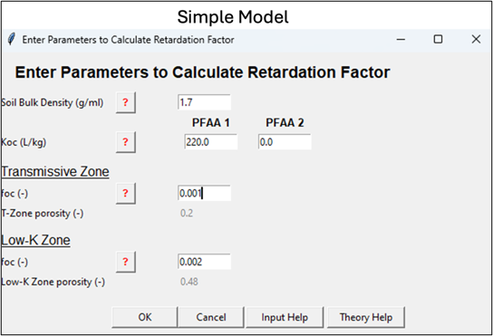
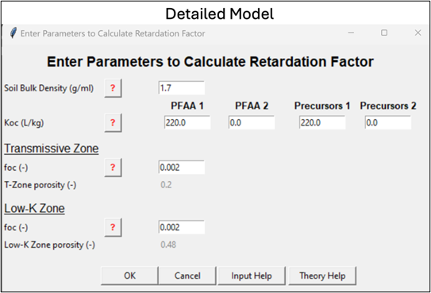
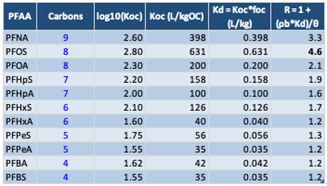
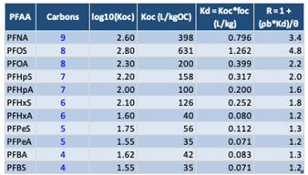
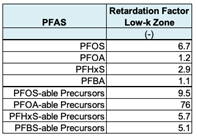
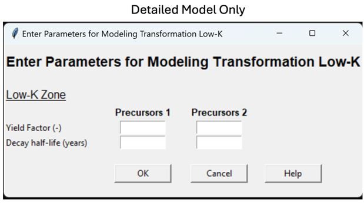
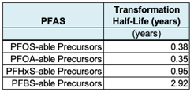
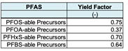

See these two appendices for more information:

-   ***[Appendix 5.1 Modeling PFAS Sorption in Native Aquifer Material:
    Key Input Data]***

-   ***[Appendix 5.2 Modeling PFAS Sorption in Native Aquifer Material:
    Theory]***

## Constituent

| **Parameter** | **Constituent** |
|---|---|
| **Description** | Constituent(s) of interest. |
| **How To Enter Data** | Enter directly or choose from drop-down list.  PFAA-1 is one of two PFAAs you can model. (PFAA: Perfluoroalkyl Acid like PFOS, PFOA, etc.). You can select from one of the five choices (which will generate a default Retardation Factor for the interface) or select "User Specified." At AFFF sites, PFOS is often selected for PFAA-1.  PFAA-2 is the second of two PFAAs you can model. You can select from one of the five options (which will fill in the Retardation Factor related data into the interface) or add your own text. PFOA or PFHxS are often chosen.  Guidelines for PFAA-1 and PFAA-2: &bull; When selecting one of the five PFAAs, the interface will provide suggested defaults for key Retardation parameters. You can change the Retardation Factors for PFAA-1 and PFAA-2 by selecting the "*Calculate Retardation Factor*" button. &bull; If "User Specified" is selected, the Retardation Factor cells will be blank and you will need to enter these by selecting the "*Calculate Retardation Factor*" button.  If you are running the "Detailed Version" of the model, you get default values for these two input variables below:  Precursor 1: PFAA-1-able precursors (note this is not a specific chemical, but the combined concentration of any PFAS precursors that can be transformed to PFAA-1. You cannot change this name (see Appendix 5.3).  Precursor 2: PFAA-2-able (note this is not a specific chemical, but the combined concentration of any PFAS precursors that can be transformed to PFAA-2. You cannot change this name).  To simulate other PFAAs and/or associated precursors, you can run the model multiple times. |

## Retardation Factor Calculations

See these two appendices for more info:

-   ***[Appendix 5.1 Modeling PFAS Sorption in Native Aquifer Material:
    Key Input Data]***

-   ***[Appendix 5.2 Modeling PFAS Sorption in Native Aquifer Material:
    Theory]***

### Constituent

| **Parameter** | **Constituent** |
|---|---|
| **Description** | Constituent(s) of interest. |
| **How To Enter Data** | For the "Simple Version" of REMFluor-MD, choose a PFAAs from the PFAA-1 left-hand drop-down list (e.g., "PFOS"), and if you would like, a second PFAA from the PFAA-2 left-hand drop-down list. (e.g., "PFOA").  For the "Detailed Version" of REMFluor-MD, you can activate the Precursor Transformation option for PFAA-1 by entering the precursor-related input data (decay rates, yields, source concentrations, and if available groundwater monitoring data to calibrate against).  Then select the "Calculate Retardation Factors" to fill in the black cells for the Retardation Factors for the Transmissive Zone and Low-k Zone.       |

### Retardation Factor in T-Zone (Transmissive Zone)

| **Parameter** | **Retardation Factor in T-Zone (Transmissive Zone)** |
|---|---|
| **Units** | Unitless. |
| **Description** | The retardation factor (R) is proportional to the ratio of the total (i.e., dissolved plus sorbed) constituent mass to the dissolved constituent mass in the aqueous phase in a unit volume of aquifer. It is a function of both transmissive zone soil type and constituent properties. |
| **Typical Values** | For transmissive zones, these retardation factors are commonly observed: &bull; R = 1 to 6 (typical for long-chained PFAAs) &bull; R = 1 to 2 (typical for short-chained PFAAs)  Calculated retardation factors (R) using Koc's from Brusseau's (2024) Figure 1 (18 laboratory studies) are shown at the far right column below assuming foc = 0.001, bulk density = 1.7 kg/L, and total porosity = 0.30.    One modeling study (Stockwell et al., 2026) reported the following retardation factors in the transmissive zone for the final calibrated model of a PFAS groundwater research site:    See these two appendices for more information: &bull; ***[Appendix 5.1 Modeling PFAS Sorption in Native Aquifer Material: Key Input Data]*** &bull; ***[Appendix 5.2 Modeling PFAS Sorption in Native Aquifer Material: Theory]*** |
| **Source Of Data** | Usually estimated from soil and chemical data using the following expression: *R* = 1 + *K~d~* ⋅ ρ~d~ */n* *K~d~* = *K~oc~* ⋅ *f~oc~* where ρ~d~ = dry bulk density (g/mL), *n* = porosity, *K~oc~* = organic carbon-water partition coefficient (mL/g), *K~d~* = distribution coefficient (mL/g), and f~oc~ = mass fraction organic carbon in unimpacted soil (unitless). Note: *K~d~* can be directly measured or obtained from *K~oc~* and *f~oc~* values described below. |
| **How To Enter Data** | 1\) Enter directly, or 2\) Calculate by filling in the other input data in the Retardation Factor pop-up box. |

### Retardation Factor in Low-k Media

| **Parameter** | **Retardation Factor in Low-k Media** |
|---|---|
| **Units** | Unitless. |
| **Description** | The retardation factor is proportional to the ratio of the total (i.e., dissolved plus sorbed) constituent mass to the dissolved constituent mass in the aqueous phase in a unit volume of aquifer.It is a function of both aquifer and constituent properties. |
| **Typical Values** | Some researchers suggest that retardation factors may be higher in low-k zones than transmissive zones. However, there are currently (2026) few sites where these values have been determined.  Calculated retardation factors (R) using Koc's from Brusseau's (2024) Figure 1 (18 laboratory studies) are shown at the far right column below assuming foc = 0.002, bulk density = 1.5 kg/L, and total porosity = 0.50.    One modeling study (Stockwell et al., 2026) reported the following retardation factors in the low-K zone for the final calibrated model of a PFAS groundwater research site:     |
| **Source Of Data** | Usually estimated from soil and chemical data using the following expression: *R* = 1 + *K~d~* ⋅ ρ~d~ */n* *K~d~* = *K~oc~* ⋅ *f~oc~* where ρ~d~ = dry bulk density (g/mL), *n* = porosity, *K~oc~* = organic carbon-water partition coefficient (mL/g), *K~d~* = distribution coefficient (mL/g), and *f~oc~* = mass fraction organic carbon in unimpacted soil (unitless). Note: *K~d~* can be directly measured or obtained from *K~oc~* and *f~oc~* values described below. |
| **How To Enter Data** | 1\) Enter directly, or 2\) Calculate by filling in the other input data in the Retardation Factor pop-up box. |

### Soil Dry Bulk Density

| **Parameter** | **Soil Dry Bulk Density** |
|---|---|
| **Units** | g/mL. |
| **Description** | Density of the aquifer material (referred to as "soil"), excluding soil moisture. |
| **Typical Values** | Although this value can be measured in the lab, in most cases estimated values are used. A value of 1.7 g/mL for sands is frequently used. The soil dry bulk density for silts and clays may be lower, such as 1.5 g/mL. |
| **Source Of Data** | Either from an analysis of soil samples at a geotechnical lab or, more commonly, estimated values such as 1.7 g/mL for sands are often used. This property can also be calculated based on total porosity and the density of soil particles. |
| **How To Enter Data** | Enter directly. |

### Fraction Organic Carbon in T-Zone

| **Parameter** | **Fraction Organic Carbon in T-Zone** |
|---|---|
| **Units** | Unitless (gram per gram). |
| **Description** | Fraction of the aquifer material comprised of natural organic carbon in unimpacted areas. More natural organic carbon means higher adsorption of organic constituents on the aquifer matrix. |
| **Typical Values** | 0.0002 - 0.02 for transmissive zones. For PFAS, a lower limit of foc may be used to approximate the effects of electrostatic attraction which are more significant when the fraction of organic carbon is low (e.g., see Schaefer et al., 2022). |
| **Source Of Data** | The fraction of organic carbon value should be measured, if possible, by collecting a sample of aquifer material from an unimpacted saturated zone and performing a laboratory analysis for transmissive zones (e.g., ASTM Method 2974-87 or equivalent). If unknown, a default value of 0.001 is often used (e.g., ASTM, 1995). |
| **How To Enter Data** | Enter directly. |

### Fraction Organic Carbon in Low-k Zone

| **Parameter** | **Fraction Organic Carbon in Low-k Zone** |
|---|---|
| **Units** | Unitless (gram per gram). |
| **Description** | Fraction of the aquifer material comprised of natural organic carbon in unimpacted areas.More natural organic carbon means higher adsorption of organic constituents on the aquifer matrix. |
| **Typical Values** | Although based on limited data, 0.0002 - 0.10 for low-K zones is a likely range. But some sites may be higher or lower.  Examples: At the Moffett Field site, the *f~oc~* of the clay fraction *f~oc~* was about 0.0066 (Roberts et al., 1990).  Domenico and Schwartz (1990) report these values: &nbsp;&nbsp;&nbsp;&nbsp;silt (Wildwood Ontario): 0.00102;  &nbsp;&nbsp;&nbsp;&nbsp;from Oconee River sediment: Coarse silt: 0.029;  &nbsp;&nbsp;&nbsp;&nbsp;Medium silt: 0.02; fine silt; 0.0226.   Chapman and Parker (2005) report a *f~oc~* of glaciolacustrine aquitard composed of varved silts and clays: 0.0024 to 0.00104 with an average of 0.00054.  Adamson (2012) reports *f~oc~* = 0.001 for a clay layer in Jacksonville Florida and *f~oc~* values for silts at the MMR site in Massachusetts ranging from \<0.0005 to 0.0022 (median value = 0.0014) for one core using a Leco carbon analyzer; a second core had *f~oc~* values \< 0.005 for 10 samples and two samples with 0.00067 and 0.00084 (gram per gram). Values for *f~oc~* using Walkley-Black wet oxidation method were generally higher than ASTM method by a factor of 2 to 3.  Values ranging from 0 to 0.078 have been reported for silts at the F.W. Warren site in Wyoming, with a median value of 0. |
| **Source Of Data** | The fraction organic carbon value should be measured, if possible, by collecting a sample of aquifer material from an unimpacted saturated zone and performing a laboratory analysis (e.g., ASTM Method 2974-87 or equivalent). If unknown, a default value of 0.002 could be used (twice the typical default of 0.001 value used for transmissive systems). |
| **How To Enter Data** | Enter directly. |

### Organic Carbon Partitioning Coefficient

| **Parameter** | **Organic Carbon Partitioning Coefficient** |
|---|---|
| **Units** | mL/g. |
| **Description** | Chemical-specific partitioning coefficient between soil organic carbon and the aqueous phase. Larger values indicate greater affinity of organic constituents for the organic carbon fraction of soil. This value is chemical specific and can be found in chemical reference books. |
| **Typical Values** | Representative Koc values for several PFAAs are shown in the Retardation Factor parameter tables above for either Transmissive Zone media or the separate table for Low-K units. |
| **Source Of Data** | Source of data for table above:  Brusseau, M., 2024. Field versus Laboratory Measurements of PFAS Sorption by Soils and Sediment. Journal of Hazardous Materials Advances. 16, , 100508. https://doi.org/10.1016/j.hazadv.2024.100508. |
| **How To Enter Data** | &nbsp;&nbsp;&nbsp;&nbsp;1.  PFAAs selected in the pull down menu will show the *K~oc~* from the table above as a default vale. &nbsp;&nbsp;&nbsp;&nbsp;2.  Alternatively, you can enter your own value directly.  For the Detailed Model, *K~oc~*'s are needed for the precursor group for PFAA-1 and PFAA-2 (if PFAA-2 is being modeled). There are little data in the literature on what are representative *K~oc~*'s for precursors, so as an approximation you can assume the precursor group *K~oc~* is similar to the PFAA they are degrading to Koc. |

### Molecular Diffusion Coefficient in Free Water (PFAS Info)

| **Parameter** | **Molecular Diffusion Coefficient in Free Water (PFAS Info)** |
|---|---|
| **Units** | m^2^/sec (even when system unit is in feet). |
| **Description** | A factor of proportionality representing the amount of substance diffusing across a unit area through a unit concentration gradient in unit time.  <b>Modeling Assumption:</b> REMFluor-MD applies a simplifying assumption in which **[all PFAS constituents]** (including PFAAs and precursor compounds) are assigned the same molecular diffusion coefficient. In practice, users should select a diffusion coefficient representative of the predominant PFAA being modeled. Based on available experimental data, the uncertainty introduced by applying a single diffusion coefficient across multiple PFAAs is expected to be minor relative to other model uncertainties. |
| **Typical Values** | For PFAAs &nbsp;&nbsp;&nbsp;&nbsp;*PFOS: 5.4 x 10^-10^ m²/s*  &nbsp;&nbsp;&nbsp;&nbsp;*PFOA: 4.9 x 10^-10^ m²/s*  &nbsp;&nbsp;&nbsp;&nbsp;*PFHpS: 6.4 x 10^-10^ m²/s*  &nbsp;&nbsp;&nbsp;&nbsp;*PFHpA: 9.3 x 10^-10^ m²/s*  &nbsp;&nbsp;&nbsp;&nbsp;*PFHxS: 4.5 x 10^-10^ m²/s*  &nbsp;&nbsp;&nbsp;&nbsp;*PFHxA: 7.8 x 10^-10^ m²/s*  &nbsp;&nbsp;&nbsp;&nbsp;*PFPeA: 1.2 x 10^-9^ m²/s*  &nbsp;&nbsp;&nbsp;&nbsp;*PFBS: 1.1 x 10^-9^ m²/s*  &nbsp;&nbsp;&nbsp;&nbsp;*PFBA: 2.5 x 10^-9^ m²/s*   
| **Source Of Data** | Schaefer, C. E., Andaya, C., Urtiaga, A., McKenzie, E. R., & Higgins, C. P. (2015). Electrochemical treatment of perfluorooctanoic acid (PFOA) and perfluorooctane sulfonic acid (PFOS) in groundwater impacted by aqueous film forming foams (AFFFs). Journal of Hazardous Materials, 295, 170-175. |
| **How To Enter Data** | 1\) PFAAs selected in the pull down menu will show the diffusion coefficient from the table above as a default vale. 2\) Alternatively, you can enter your own value directly. |

## (Section 5 Detailed Model Only) Precursor Transformation to PFAAs

See ***_Appendix 5.3 PFAS Precursor Transformation_*** for more information.

### Precursor Transformation Rate Constant

| **Parameter** | **Precursor Transformation Rate Constant** |
|---|---|
| **Units** | 1/yr. |
| **Description** | As of 2026, modeling transformation of PFAS precursors to PFAAs is still experimental. However, REMFluor-MD includes a general method for modeling precursor transformation to provide a high-level approximation of the style of precursor transformation effects (as opposed to a rigorous exact simulation of known processes). This method is described in Stockwell et al. (2026) and in Appendix 5.3. The method provided in Stockwell et al. (2026) utilizes non-target PFAS analytical results, which will likely not be available at the vast majority of PFAS sites. While precursor transformation modeling may be attempted using PFAS analytical results via USEPA Method 1633, care should be taken as USEPA Method 1633 will not identify any potential PFHxS or PFBS precursors, and may or may not identify the majority of PFOS and PFOA precursors. |
| **Typical Values** | REMFluor-MD can simulate transformation of one parent compound to one degradation product. Therefore, to be able to model precursor transformation in REMFluor-MD, a key simplifying assumption is to group precursors based on their potential transformation to specific PFAAs. Potential precursors for each PFAA can be defined as follows, similar to the approach originally taken by Ruyle et al. (2023) and used in Stockwell et al. (2026): 1.  "PFOS-able" precursors are PFSA precursors w/ 8 fully fluorinated carbons 2.  "PFOA-able" precursors are PFCA precursors w/ 7-8 fully fluorinated carbon 3.  "PFHxS-able" precursors are PFSA precursors w/ 6 fully fluorinated carbons 4.  "PFBS-able" precursors are PFSA precursors w/ 4 fully fluorinated carbons  This simplifying assumption is based on previous studies that show that PFSA precursor transformation generally yields PFSAs with the same chain length, whereas PFCA precursor transformation typically yields PFCAs with the same or n-1 chain length. See Appendix 5.3 for more details on modeling precursor transformation to PFAAs.    The Stockwell et al. (2026) method was designed to use a complete non-target PFAS analysis rather than USEPA Method 1633 data. However, at one research site described by Adamson et al. (2020), precursors measured by USEPA Method 1633 captured 85-99% of the total PFOS-able and PFOA-able precursors, but captured 0% of the PFHxS-able and PFBS-able precursors. Therefore, precursor transformation modeling of PFOS-able and PFOA-able precursors may be possible using USEPA Method 1633 data.  Using this method, Stockwell et al. (2026) reported the following precursor transformation half-lives for the final calibrated model of a PFAS groundwater research site:    See ***_Appendix 5.3 PFAS Precursor Transformation_*** for more information. |
| **Source Of Data** | See Appendix 5.3. |
| **How To Enter Data** | Select component and enter directly. |

### Yield Factor

| **Parameter** | **Yield Factor** |
|---|---|
| **Units** | Unitless. |
| **Description** | Mass of transformation product created by first order decay per mass of the parent component. Calculated based on molecular weight ratios using the following equation:  $$\frac{{MW}_{PFAA}}{{MW}_{Precursors}}$$  Where ${MW}_{PFAA}$ is the molecular weight of the PFAA, and ${MW}_{Precursors}$ is the average molecular weight of the respective precursors.  For PFOA only, the calculated precursor yield can be divided by two to account for precursor transformation to PFAAs other than PFOA (specifically shorter-chain PFCAs), as has been observed in other studies (Dasu et al., 2013; Dong et al., 2023; Hamid et al., 2020; Wang et al., 2009). |
| **Typical Values** | For PFAS:  &nbsp;&nbsp;&nbsp;&nbsp;&bull; PFOS: 0.70 to 0.93  &nbsp;&nbsp;&nbsp;&nbsp;&bull; PFOA: 0.32 to 0.40  &nbsp;&nbsp;&nbsp;&nbsp;&bull; PFHxS: 0.68 to 0.85  &nbsp;&nbsp;&nbsp;&nbsp;&bull; PFBS: 0.63 to 0.90   One modeling study (Stockwell et al., 2026) reported the following precursor yield factors for the final calibrated model of a PFAS groundwater research site:     |
| **How To Enter Data** | Use the "Enter Custom Yield Factor" button to overwrite the default values. |

