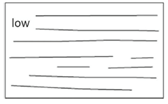
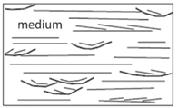
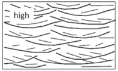

See **_Appendix 6.1 General Methods for Estimating Aquifer Dispersivity_** for more info.

## Longitudinal Dispersivity

| **Parameter** | **Longitudinal Dispersivity,** $\alpha\,_{L}$** |
|---|---|
| **Units** | ft (or m). |
| **Description** | Dispersion refers to the process whereby a dissolved solvent will be spatially distributed because of mechanical mixing and chemical diffusion in the aquifer. These processes contribute to the "plume" shape that is the spatial distribution of the dissolved solvent mass in the aquifer. |
| **Typical Values** | Users can estimate the appropriate longitudinal dispersivity at their site two different ways:  &nbsp;&nbsp;&nbsp;&nbsp;*Method 1.* Using a dispersion framework  &nbsp;&nbsp;&nbsp;&nbsp;developed by Zech et al. (2023) described below  &nbsp;&nbsp;&nbsp;&nbsp;(Recommended approach);  &nbsp;&nbsp;&nbsp;&nbsp;*Method 2*. Enter your own value (this includes  &nbsp;&nbsp;&nbsp;&nbsp;using traditional dispersivity-vs-plume length  &nbsp;&nbsp;&nbsp;&nbsp;estimates (e.g., Xu and Eckstein, 1995)  &nbsp;&nbsp;&nbsp;&nbsp;methods.   <b>Method 1:</b> The Zech et al. (2023) dispersion paradigm represents a significant advancement in estimating macrodispersivity for groundwater transport modeling by shifting away from the \"universal scaling\" approach toward a geologic heterogeneity-based classification system. This methodology classifies aquifers into three categories: Weak, Medium, and High heterogeneity, based on their depositional environment, sedimentological characteristics, and statistical properties of hydraulic conductivity. A simple method for estimating if your aquifer has Weak, Medium, or High heterogeneity is provided below, or see Appendix 6.1 for more **detailed qualitative and quantitate methods** to determine if your site has Weak, Medium, or High heterogeneity.  **Weak (Low) Heterogeneity Aquifers (Use α~L~ = 1.1 m)**    &nbsp;&nbsp;&nbsp;&nbsp;&bull; Predominantly sandy composition with uniform grain sizes  &nbsp;&nbsp;&nbsp;&nbsp;&bull; Minor fractions of silt/clay and/or gravel  &nbsp;&nbsp;&nbsp;&nbsp;&bull; Well-sorted sediments  &nbsp;&nbsp;&nbsp;&nbsp;&bull; Relatively continuous depositional units  &nbsp;&nbsp;&nbsp;&nbsp;&bull; Terms like \"glaciolacustrine,\" \"glacial  &nbsp;&nbsp;&nbsp;&nbsp;outwash,\" \"medium sand,\" \"uniform\"  &nbsp;&nbsp;&nbsp;&nbsp;&bull; Minimal mentions of clay or gravel; if  &nbsp;&nbsp;&nbsp;&nbsp;present, described as \"minor\" or \"some\"   **Medium Heterogeneity Aquifers (Use α~L~ = 3.2 m)**    &nbsp;&nbsp;&nbsp;&nbsp;&bull; Mixed grain sizes ranging from gravel to sand with some  &nbsp;&nbsp;&nbsp;&nbsp;silt/clay  &nbsp;&nbsp;&nbsp;&nbsp;&bull; Moderate sorting  &nbsp;&nbsp;&nbsp;&nbsp;&bull; Interbedded or layered units  &nbsp;&nbsp;&nbsp;&nbsp;&bull; Terms like \"alluvial,\" \"fluvial,\"  &nbsp;&nbsp;&nbsp;&nbsp;\"layered,\" \"interbedded,\" \"lenses\"  &nbsp;&nbsp;&nbsp;&nbsp;&bull; Clay described as \"lenses\" or \"minor  &nbsp;&nbsp;&nbsp;&nbsp;content\"   **High Heterogeneity Aquifers (Use α~L~ = 7.5 m)**    &nbsp;&nbsp;&nbsp;&nbsp;&bull; Wide variety of materials from gravel to silt/clay in  &nbsp;&nbsp;&nbsp;&nbsp;similar proportions  &nbsp;&nbsp;&nbsp;&nbsp;&bull; Poorly sorted sediments  &nbsp;&nbsp;&nbsp;&nbsp;&bull; Complex, discontinuous depositional units  &nbsp;&nbsp;&nbsp;&nbsp;&bull; Terms like \"poorly sorted,\" \"braided  &nbsp;&nbsp;&nbsp;&nbsp;river,\" \"variable,\" \"with inclusions  &nbsp;&nbsp;&nbsp;&nbsp;of,\" \"lenses of silt and clay\"  &nbsp;&nbsp;&nbsp;&nbsp;&bull; Similar proportions of multiple grain-size  &nbsp;&nbsp;&nbsp;&nbsp;classes   <b>Method 2:</b> Other methods for estimating longitudinal dispersivity are described in ***_Appendix 6.1 General Methods for Estimating Aquifer Dispersivity_***. |
| **Source Of Data** | Hydrogeologic conceptual model for a site. |
| **How To Enter Data** | 1\) Select "High", "Medium", or "Low" heterogeneity; or 2\) Select "Enter Your Own Values" and enter your own value in the data box. |

## Transverse Dispersivity

| **Parameter** | **Transverse Dispersivity** |
|---|---|
| **Units** | ft (or m). |
| **Description** | Transverse dispersivity is a parameter that describes the right-left spreading of a plume as it migrates under the advection-dispersion model. After their re-evaluation of dispersivity data, Zech et al. (2015, 2019) found no clear scale-dependency in transverse dispersivity (αT or "alpha-T" or "alpha-Y"), with values typically ranging from 1% to 10% of the longitudinal dispersivity for the most reliable data sets. |
| **Typical Values** | Recommended Approach: Zech et al. (2023) concluded that a value of **0.03 to 0.05 meters should be used for alphaT:** *"it is preferable to select an absolute value in the range of 3 to 5 cm, at least for aquifers of weak to medium heterogeneity."*  Previous methods typically employed a ratio approach (Aziz et al., 1999), such as: 
α~T~ = 0.10 × α~L~
  A default value of 0.04 meters will be populated if "High", "Medium", or "Low" heterogeneity is chosen. |
| **Source Of Data** | Use estimate above. |
| **How To Enter Data** | 1\) Select "High", "Medium", or "Low" heterogeneity; or 2\) Select "Enter Your Own Values" and enter your own value in the data box. |

## Vertical Dispersivity

| **Parameter** | **Vertical Dispersivity** |
|---|---|
| **Units** | ft (or m). |
| **Description** | Vertical dispersity is a parameter that describes the vertical spreading of a plume as it migrates under the advection-dispersion model. Vertical dispersivity is also referred to as αZ or "alpha-Z." |
| **Typical Values** | Recommended Approach: Zech et al. (2023) recommended the following approach for estimating alphaZ: α~Z~ = 0.1 x α~T~ Previous methods typically employed a ratio approach (Aziz et al., 1999), such as: α~Z~ = 0.05 × α~T~ A default value of 0.004 meters will be populated if "High", "Medium", or "Low" heterogeneity is chosen. |
| **Source Of Data** | Use estimate above. |
| **How To Enter Data** | 1\) Select "High", "Medium", or "Low" heterogeneity; or 2\) Select "Enter Your Own Values" and enter your own value in the data box. |

