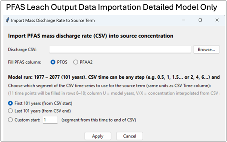

See **_Appendix 7.1 REMFluor-MD Source Concentrations_** for more info.

## Source Concentration

| **Parameter** | **Source Concentration** |
|---|---|
| **Units** | µg/L. |
| **Description** | Source zone concentration when the simulation starts (Simple Version) or source concentrations over time (Detailed Version). |
| **Typical Values** | 0.01 to 10,000 µg/L. |
| **Source Of Data** | &bull; This concentration represents the concentration in a vertical plane source leaving the source and forming the plume. &bull; The user has to translate the groundwater monitoring data from the source zone to a representative concentration of the high concentration plume core leaving the source. &bull; One practical approach for selecting the representative source concentration is to evaluate **plume maps with concentration contours** and identify a source-plane width that appears to capture **approximately 75% or more of the high-concentration zone** leaving the source area. &bull; There are three general options for modeling a PFAS source in groundwater in units of µg/L <b>over time:</b> 1.  A simple constant source term that is constant over time (this is the only selection for the "Simple Version").  2. A tool to upload concentration data from the PFAS-LEACH model ("Detailed Version" only).      3.  A flexible source term where the user enters their own concentration vs. time ("Detailed Version" only).  See *[Appendix 7.1 REMFluor-MD Source Concentrations]* for more information. |
| **How To Enter Data** | 1\) Enter directly into the first row, then select Option 1 "Assume Constant" to autofill the rest of the rows with the same value. 2\) Select Option 2 "Upload PFAS Concentrations from PFAS-LEACH" to link a PFAS-LEACH output file and autofill the rows with data from PFAS-LEACH. 3\) Enter directly into each row. |

