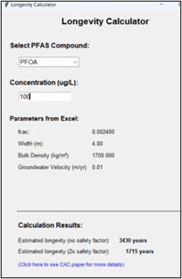
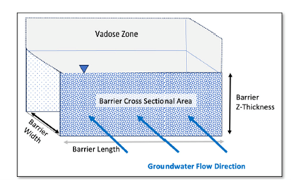

See these Appendices for more information:

- **_Appendix 9.1 Modeling Sorption In CAC Barriers with Freundlich Isotherms_** for more information.

- **_Appendix 9.2 PFAS Longevity Paper_**

## PSB Freundlich Exponent "a"

| **Parameter** | **PSB Freundlich Exponent "a"** |
|---|---|
| **Units** | (-) |
| **Description** | PFAS sorption to Colloidal Activated Carbon (CAC) is nonlinear, and Freundlich isotherms are most often used to describe sorption in a Permeable Sorption Barrier (PSB), a PFAS Enhanced Retention (PER) technology (Newell et al., 2022; Newell et al., 2024):  X~s~=f~cac~K~f~ c^a^  Here, *X~s~* is the PFAS mass sorbed to CAC per mass of dry soil in a unit volume of aquifer material (e.g., mg/kg or ug/kg), *C* is the aqueous concentration (e.g., mg/L or ug/L), *f~cac~* is the mass fraction of injected CAC in the formation, *K~f~* is the Freundlich capacity parameter (e.g., (mg/kg)(mg/L)^-a^ or (ug/kg)(ug/L)^-a^), and ***a* is the Freundlich exponent<b> (dimensionless)</b>.** |
| **Typical Values** | Typical values of "*a*" for long-chained PFAS range from 0.2 to 0.5. For screening type modeling, literature defaults have been incorporated in the interface from Carey et al. (2022) for these three PFAAs: &bull; PFOS "a" = 0.33  &bull; PFOA "a" = 0.25  &bull; PFHxS "a" = 0.24  &bull; 6:2 FtS "a" = 0.28  More detailed methods to estimate the Freundlich "a" for these and other PFAS are presented in ***[Appendix 9.1 Modeling Sorption In CAC Barriers with Freundlich Isotherms that can be accessed via this button:]***    *A simple screening method to estimate longevity from Newell et al., 2024 "Tool and Database for Estimating Potential Longevity of Colloidal Activated Carbon Barriers for PFAS in Groundwater" is provided in this button.*       |
| **Source Of Data** | Users can either use these default estimates or user-defined values. |
| **How To Enter Data** | Enter directly. |

## PSB Freundlich "Kf"

| **Parameter** | **PSB Freundlich "Kf"** |
|---|---|
| **Units** | (ug/kg)(ug/L)^-a^ |
| **Description** | PFAS sorption to Colloidal Activated Carbon (CAC) is nonlinear, and Freundlich isotherms are most often used to describe sorption in Permeable Sorption Barrier (PSB):  X~s~=f~cac~K~f~ c^a^  Here, *X~s~* is the mass sorbed to CAC per mass of dry soil (e.g., ug/kg), *C* is the aqueous concentration (e.g., ug/L), ***K~f~* is the Freundlich capacity parameter**, *f~cac\ ~*is the mass fraction of CAC added to the formation (e.g., (mg/kg)(mg/L)^-a^ or (ug/kg)(ug/L)^-a^), and *a* is the Freundlich exponent. |
| **Typical Values** | NOTE: ug (micrograms) are required for all mass-base units in the model.  The units of *K~f~* depend on the exponent *a*. REMFluor-MD uses units in terms of ug/L and ug/kg, so if *K~f\ ~*is given in (mg/kg)(mg/L)^-a^, it must be converted.to units of (ug/kg)(ug/L)^-a^. The *K~f~* conversion to go from mg concentration units to ug Kf units is: $$K_{f(ug)} = (1000)^{1 - a}K_{f(mg)}$$ For screening type modeling, literature defaults have been incorporated in the interface from Carey et al. (2022) for these four PFAAs:  &bull; PFOS „K~f~" = 1,230,000 $\frac{(ug/kg)}{{(ug/L)}^{0.33}}$  &bull; PFOA "K~f~" = 103,000 $\frac{(ug/kg)}{{(ug/L)}^{0.25}}$  &bull; PFHxS "K~f~" = 236,000$\ \frac{(ug/kg)}{{(ug/L)}^{0.24}}$  &bull; 6:2 FtS "K~f~" =980,000 $\frac{(ug/kg)}{{(ug/L)}^{0.28}}$  More detailed methods to estimate the Freundlich "*K~f~*" for these and other PFAS are presented in ***[Appendix 9.1 Modeling Sorption in CAC Barriers with Freundlich Isotherms]***. |
| **Source Of Data** | Users can either use these default estimates or user-defined values. |
| **How To Enter Data** | Enter directly. |

## Year PSB Barrier Installed

| **Parameter** | **Year PSB Barrier Installed** |
|---|---|
| **Units** | (-) |
| **Description** | This is the year that a PSB was installed to control a PFAS plume. |
| **Typical Values** | The first PSB for PFAS was installed in the mid-2010s. REMFluor-MD can be used to evaluate a PSB installed any time in the future. |
| **Source Of Data** | Based on cases being evaluated for Feasibility Studies or other remediation alternatives or PSB design studies. |
| **How To Enter Data** | Enter directly. |

## PSB Distance From Source

| **Parameter** | **PSB Distance From Source** |
|---|---|
| **Units** | ft (or m). |
| **Description** | This is the distance downgradient that a PSB has been installed. |
| **Typical Values** | For source control PSBs: 1-10 m For mid-plume PSBs: 200 to 800 m For edge-of-plume PSBs: 400 to 1,600 m |
| **Source Of Data** | Based on remediation design team PSB options. |
| **How To Enter Data** | Enter directly. |

## Total Width of PSB in X-Direction

| **Parameter** | **Total Width of PSB in X-Direction** |
| --- | --- |
| **Units** | ft (or m). |
| **Description** | This is defined here as the width of a PSB in the direction of groundwater flow (see figure below for PSB terminology used with REMFluor-MD). |
| **Typical Values** | Newell et al. (2025) (Appendix 9.2 for free download) reports barrier widths for 17 PSB's constructed using Colloidal Activated Carbon (CAC), providing these ranges: &bull; Minimum: 1.9 m  &bull; Median: 4 m  &bull; Maximum: 10 m     See ***[Appendix 9.2 PFAS Longevity Paper]*** for more information via free download. |
| **Source Of Data** | Based on cases being evaluated for Feasibility Studies or other remediation alternatives or PSB design studies. |
| **How To Enter Data** | Enter directly. |

## PSB Loading "fcac"

| **Parameter** | **PSB Loading "fcac"** |
|---|---|
| **Units** | Percent mass fraction. |
| **Description** | This is the mass fraction of Colloidal Activated Carbon (CAC) in soil ( f~cac~ ), expressed as dry weight in percent. A f~cac~ value of 0.24% means that about 2.4 pounds of CAC have been injected per 1,000 pounds of dry soil in the injection zone. This is equivalent to 1 pound of CAC being injected into about 420 pounds of dry soil. (Note dry soil is used in the definition even though the PSB injection zone is in groundwater.) |
| **Typical Values** | Newell et al. (2025) Appendix 9.2 for free download) reports f~cac~'s for 17 PSB's constructed using Colloidal Activated Carbon (CAC), providing these ranges: &bull; Minimum f~cac~ : 0.06 (%)  &bull; Median f~cac~ : 0.24 (%)  &bull; Maximum f~cac~ : 0.50 (%)  See ***[Appendix 9.2 PFAS Longevity Paper]*** for more info. via free download. |
| **Source Of Data** | Based on cases being evaluated for Feasibility Studies or other remediation alternatives or PSB design studies. |
| **How To Enter Data** | Enter directly. |

## Number of Grid Cells in X-Direction in the PSB

| **Parameter** | **Number of grid cells in x-direction in the PSB** |
|---|---|
| **Units** | Number of Cells. |
| **Description** | To model the transport of PFAS through a PSB, the width of the grid cells in the x-direction have to be smaller in the PSB zone than the zone where PFAS are flowing through natural aquifer materials. |
| **Typical Values** | You can choose up to 20 grid cells to represent the width of the PSB in the model (i.e., parallel to the direction of groundwater flow). To determine which to enter in the model, we recommend starting with a value of 20 grid cells, and you can try to reduce this to see if the longevity prediction changes - if it does change significantly, then use the number of 20 grid cells even if it slows down the simulation. |
| **Source Of Data** | Based on Dr. Falta's experience with running REMFluor-MD. |
| **How To Enter Data** | Enter directly. |

